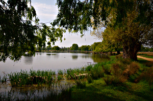
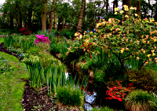
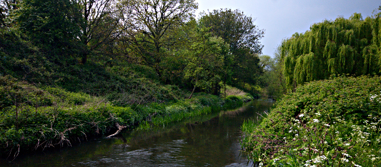
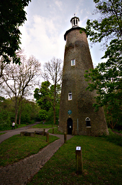
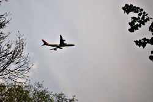

Walking the London LOOP - part 9
================================

.. articleMetaData::
   :Where: London, UK
   :Date: 2014-04-23 09:14 Europe/London
   :Tags: blog, theloop, walking
   :Short: loop9

Due to abysmal weather, we moved our walk to Monday this weekend. That was not
much of a problem as it was Easter Monday.

We traveled back to Kingston and crossed the bridge over the Thames. Just
before entering `Bushy Park`_, we passed a perculiar few trees... they had loads
of shoes in them! All a similar style as well. The first part through Bushy
Park were open fields, and a few ponds with birds nesting in the reeds around
it.

After a while we crossed a road and ended up at the `Woodland Gardens`_. They
consist of two plantations, the Pheasentry Plantation and the Waterhouse
Plantation. We had a few issues finding the entrance to the first one, as
they had slightly changed the gates. Of course, I have now fixed that in
OpenStreetMap_. Both "Plantations" are quite different. The first one has more
open spaces where the second one is much more dense woodland. In both
plantations, everything was very much in bloom.

When leaving the plantations we proceeded through Bushy Park and went the
wrong way. That wasn't really bad, as we ended up at the `Water Gardens`_,
which only recently opened the public. 

After Bushy Park we were a bit thirsty and made a little detour to find a pub,
`The Windmill`_. The original idea was to have a quick meal there as well, but
the menu was limited and the bar staff rather grumpy. We just stuck around for
a pint, and made *another* detour to find lunch—the local Sainsbury's.

After picking up lunch we followed a few residential streets and found the
`Crane River`_, past which we would walk for almost all of the rest of the
walk.

The park near the river had some good walking paths and it was also the place
where we enjoyed our bought sandwiches, crisps and drinks on a bench, in the
sun, with flocks of parakeets and airlines flying over.

After a while we came upon the `Shot Tower`_, where they previously made
"shot" for guns. Near the Shot Tower is also the entrance to the `Crane Park
Nature Reserve`_ which we probably should have visited as well, but didn't.

After another small stretch of road, we entered `Hounslow Heath`_ and from
there on we continued through Brazil Mill Woods, Donkey Wood and the
Causeway all the way to the Great South West Road. I think we were lucky that
it was a Sunday, as there was nearly no traffic.

The end of the walk was at Hatton Cross station, near the end of Heathrow's
runway 09R/27L. You would probably not be surprised that many planes flew
over!

The weather was warm with 16-18°C, but also muggy. We were a lot sweatier than
on previous walks.

The photos that I took on this section, as well as the photos of the
other sections of the LOOP, are available as a `Flickr set`_.

.. _LOOP: http://www.walklondon.org.uk/route.asp?R=5
.. _`Bushy Park`: http://www.royalparks.org.uk/parks/bushy-park
.. _`Woodland Gardens`: http://www.royalparks.org.uk/be-involved/volunteering-in-the-royal-parks/volunteering-opportunities/the-woodland-gardens-volunteers-bushy-park
.. _OpenStreetMap: http://www.openstreetmap.org/way/276126347
.. _`Water Gardens`: http://www.royalparks.org.uk/parks/bushy_park/restoration/completedprojects/watergardens.cfm
.. _`The Windmill`: http://www.thewindy.co.uk/
.. _`Crane River`: http://en.wikipedia.org/wiki/River_Crane,_London
.. _`Shot Tower`: http://en.wikipedia.org/wiki/Crane_Park
.. _`Crane Park Nature Reserve`: http://en.wikipedia.org/wiki/Crane_Park_Island
.. _`Hounslow Heath`: http://en.wikipedia.org/wiki/Hounslow_Heath
.. _`Flickr set`: http://www.flickr.com/photos/derickrethans/sets/72157636982853053/with/13964310102/
