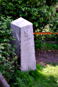
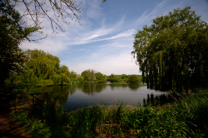
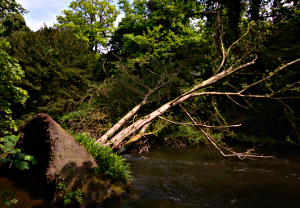
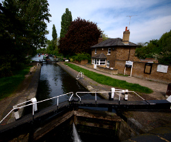
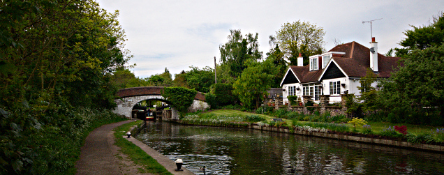
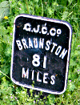

Walking the London LOOP - part 11 and 12
========================================

.. articleMetaData::
   :Where: London, UK
   :Date: 2014-05-08 09:16 Europe/London
   :Tags: blog, theloop, walking
   :Short: loop1112

Bank holiday Monday walking, I like it.

Section 11 
----------

We ended at West Drayton `last time`_, where we already sneakily had done part
of section 11. This to make the last walk a bit longer and this one a bit
shorter. 

Getting to West Drayton was quite straightforward as there are direct trains
from Paddington. From the station, we started along the Grand Union
canal and walked past a mega-Tesco. Leaving the Grand Union Canal we
continued along the `Slough Arm`_ and past a canal-boat marina. The paths
are all very easy going and soon we came upon the aqueduct that brings the
Slough Arm over the river Frays_. 

Just before we got to the river Colne (remember from last time!) we came upon
a granite marker indicating that tax (on coal) had to be paid while bringing
it into London. We crossed the canal and headed North towards the `Little
Britain Lake`_. Named after its sort-of likeness with the shape of Great
Britain. There was quite a bit of fishing going on as well, but we left the
anglers to their own and crossed the river Colne into Hampshire.

We stumbled upon a tree that had fallen into the river, and continued
following the river for a considerable amount of time, past industrial
estates, to finally get back to the Grand Union Canal near Uxbridge. In
Uxbridge section 11 ended, and we went for a well deserved pint at `The Good
Yarn`_, a typical Weatherspoon's pub. 

Section 12
----------

After our refreshments we headed back to the Grand Union Canal for 
section 12. Walking along the canal, we first we passed the `Uxbridge Lock`_,
crept under the A40 and after a mile and a half we came upon the `Denham Deep
Lock`_. Crossing a bridge, we left the side of the canal for a bit walking
past disused, and flooded quarries—one with a sailing school.

We had the leave the canal for another detour to get around the `Harefield
Marina`_, but joined it shortly after that at the `Widewater Lock`_. From
there we walked a few more miles on the towpath besides the canal
and made it to our last lock of the day: `Black Jack's Lock`_. From there it
would be another half mile until the end of the section, but we sneaked off
and climbed up the hill to `The Old Orchard`_ pub. Sections 11 and 12 were
mostly along canals. I also figured out that doing the stretch from West
Drayton to Harefield on foot is about as fast as by boat, especially when they
have to wait for locks to be in the right position. 

But let me get back to the pub. Unlike some of the dire pubs that we walked
past in Uxbridge, The Old Orchard is actually a really nice place. Good beers
and ciders, and very nice food. And the view was amazing too! Glad we stopped
here, and we promised each other to finish section 12 when we do 13 and 14 on
our next walk. We had to run to make our bus into Northwood, and the
Metropolitan line home. The pub was worth the run though :-)

The weather was again very good, with 14-16°C and few light clouds. I even
took my new walking shorts out! We took just under four hours for the two
sections that together were 18.5km long.

The photos that I took on this section, as well as the photos of the
other sections of the LOOP, are available as a `Flickr set`_.

.. _`last time`: /the-loop-part10.html
.. _`Little Britain Lake`: http://www.openstreetmap.org/way/4364811
.. _`Uxbridge Lock`: http://canalplan.eu/gazetteer/fjou
.. _`Denham Deep Lock`: http://canalplan.eu/gazetteer/2fs4
.. _`Widewater Lock`: http://canalplan.eu/gazetteer/ich4
.. _`Black Jack's Lock`: http://canalplan.eu/gazetteer/l2ir
.. _`Harefield Marina`: http://www.harefieldmarina.co.uk/
.. _Frays: http://en.wikipedia.org/wiki/River_Frays
.. _`The Good Yarn`: http://www.jdwetherspoon.co.uk/home/pubs/the-good-yarn
.. _`Slough Arm`: http://en.wikipedia.org/wiki/Slough_Arm
.. _`The Old Orchard`: http://www.brunningandprice.co.uk/oldorchard/
.. _LOOP: http://www.walklondon.org.uk/route.asp?R=5
.. _`Flickr set`: https://www.flickr.com/photos/derickrethans/sets/72157636982853053/with/13930759437
