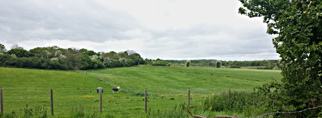
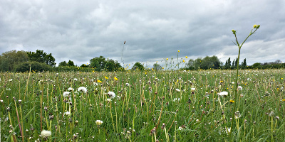
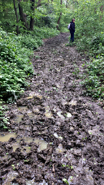
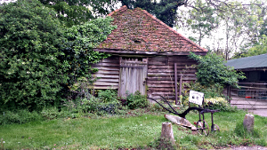

Walking the London LOOP - part 13 and 14
========================================

.. articleMetaData::
   :Where: London, UK
   :Date: 2014-05-15 15:19 Europe/London
   :Tags: blog, theloop, walking
   :Short: loop1314

Another Sunday, another walk. You know the drill. 

Because we cheekily stopped a little before the end of section 12 `last time`_,
we had to go back and do this last mile. So we set off for Harefield where I
discovered that I had forgotten my proper camera. So sadly, this walk's photos
are done on my phone.

Because we ended at `The Old Orchard`_ last time, we found it more than fitting
to start this walk at this same pub as well. After a half pint, we walked down
the hill to the Grand Union Canal for the last bit of section 12. The weather
wasn't as pleasant as the previous weekend, so there were not so many boats on
the canal.

There was only about a mile to go in the section and we soon found ourselves
at the start of section 13.

Section 13 
----------

This section started with a slightly steep path into the first of the woods.
After a short section we came out onto fields where there were friendly
horses, allotments and some stinky cows. The paths were easy going, with some
gravel and some fields. This unfortunately all changed once we got to our
first forest.

From this point on there was a lot of mud, sometimes half a foot deep. There
were a lot of grumps and it was very slow going. I guess we should have known
better after so much rain the past week.

There were plenty of nice parts of the walk as well, with fields and meadows.
We stopped at `Ye Olde Greene Manne`_ for a pint and some snacks, which made
us feel quite a lot better. The last stretch went mostly over easy going
public footpaths. We crossed underneath the Metropolitan Line near Moor Park
towards the end of section 13.

Section 14
----------

Section 14 started by going over `Sandy Lodge golf club`_ where we had to avoid
flying golf balls (not really). We had some fun with the elephpants_ in a
field full of buttercups. The LOOP continued through a few streets and back
into the woods, Oxhey Woods. But it could also have been named for Oxhey Mud
Bath. It was not as tough going as in section 13, but it was certainly no fun.

After a while we crossed another field, and continued walking along some
streets before getting into yet another muddy section. But luckily, most of
section 14 was alongside fields so that it was rather easy to wipe our boots
clean. We were happy to get to the end though of the mud. Finally, we dodged
through a bit of jungle to come upon a farm and back onto paved roads. We
walked straight to Hatch End station, forgoing our usual "we had made it"
pint.

The weather was overcast, with 14°C and a few short showers. We took nearly
five hours for the two sections that together were 22.5km long. The mud surely
slowed us down.

The photos that I took on this section, as well as the photos of the
other sections of the LOOP, are available as a `Flickr set`_.

.. _`last time`: /the-loop-part11-and-12.html
.. _`The Old Orchard`: http://www.brunningandprice.co.uk/oldorchard/
.. _`Ye Olde Greene Manne`: http://www.vintageinn.co.uk/yeoldegreenemannerickmansworth/
.. _`Sandy Lodge golf club`: http://www.sandylodge.co.uk/
.. _elephpants: https://www.flickr.com/groups/elephpants
.. _LOOP: http://www.walklondon.org.uk/route.asp?R=5
.. _`Flickr set`: https://www.flickr.com/photos/derickrethans/sets/72157636982853053/with/13977244037
