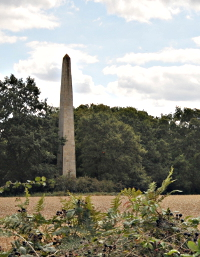
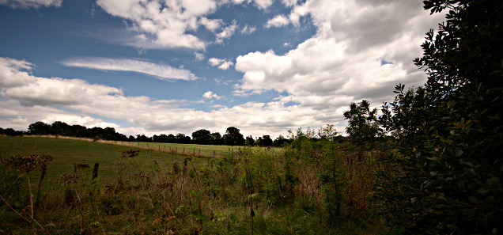
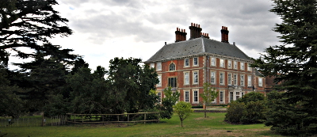

Walking the London LOOP - part 17
=================================

.. articleMetaData::
   :Where: London, UK
   :Date: 2014-09-19 09:22 Europe/London
   :Tags: blog, theloop, walking
   :Short: loop17

We walked section 17 of the LOOP_ nearly a month ago on August 17th. I've
procrastinated on writing about this section for way too long, so hopefully my
memory has not degraded too much.

We started off in Cockfosters at the end of the Piccadilly Line and after
turning on my GPS we headed straight into the woods to end up at `Trent
Park`_. We passed by a no longer used campus of Middlesex University, which
was barely visible behind the trees. This part also featured an obelisk which
we glimpsed after climbing up a steep hill into, and out of the forest. This
location was apparently also used in a Doctor Who episode__!

__ http://www.doctorwholocations.net/locations/trentparkobelisk

After crossing Hadley Road, we continued past corn fields, where the corn
was already harvested. After quite a bit more farm land, part of the `Enfield
Chase Estate`_ we climbed up another short hill and through newly created
Brooke Wood to get to the outskirts of of Enfield.

We did not enter the town, but instead went north over a very nice new paved
path, which continued onto an even nicer metalled path through woods and under
a bridge with the `Hertfordshire loop rail line`_ going overhead. The nice
path continued past friendly horses and green houses. Only a few of the
green houses remained of a once vast area full of them. After following more
paved paths we wandered into `Hilly Fields park`_ from where we started to hear
music. First fairly soft but constantly swelling. We abandoned our original
plan of having a pint and lunch at `The Rose and Crown`_, apparently linked to
the `Gunpowder Plot`_, as it was *way* too loud in, and around the pub. Instead
we continued onwards with `Turkey Brook`_ to our left, with the music slowly
getting less loud over the next mile.

We entered `Forty Hall estate`_ where we made a detour to have lunch at the
`nice green café`_. Nice it was, but the service was also incredibly slow. We
did get our lemonade and cake fix sorted though.

The section continued by crossing the foot bridge over the A10_ to King's Lynn,
and past the `Enfield Crematorium`_. After a short section through Enfield, we
finished the walk by going through Albany part. Crossing both the rail way and
Turkey Brook took us to the end at `Enfield Lock station`_.

So, remember that I said at the start of this post "turned on my GPS" — well, I
had. But it decided to not see the SD card, and hence not log to it ☹. I had
to use my wife's inaccurate "Moves" data, run some extrapolations with
gpsbabel_, and do some other magic to geo-reference the photos that I took.
Bah humbug. I am now making extra sure that the SD card is readable!

The weather was mostly cloudy. It was warm at 20°C and not nearly as humid as
we feared. I did not remember this at *all*, but handily, Wunderground_ has
nice historical data available for `August 16th, 2014`_. We took a little over
three and a half hours for the 10 miles (16.5km).

The photos that I took on this section, as well as the photos of the
other sections of the LOOP, are available as a `Flickr set`_.

.. _`Trent Park`: http://en.wikipedia.org/wiki/Trent_Park
.. _`Enfield Chase Estate`: http://en.wikipedia.org/wiki/Enfield_Chase
.. _`Hertfordshire loop rail line`: http://en.wikipedia.org/wiki/Hertford_Loop_Line
.. _`Hilly Fields park`: http://www.hilly.org.uk/
.. _`The Rose and Crown`: http://www.crewshill.com/roseandcrown.html
.. _`Gunpowder Plot`: http://en.wikipedia.org/wiki/Clay_Hill,_London#History
.. _`Turkey Brook`: http://en.wikipedia.org/wiki/Turkey_Brook
.. _`Forty Hall estate`: http://www.fortyhallestate.co.uk/
.. _`nice green café`: http://www.fortyhallestate.co.uk/about_forty_hall_estate/nice_green_cafe_at_forty_hall
.. _A10: http://en.wikipedia.org/wiki/A10_road_%28England%29
.. _`Enfield Crematorium`: http://www.haringey.gov.uk/cemeteries-crematorium.htm#enfield_crem_and_cem
.. _`Enfield Lock station`: http://www.nationalrail.co.uk/stations/ENL/details.html 
.. _Wunderground: http://www.wunderground.com/
.. _`August 16th, 2014`: http://www.wunderground.com/history/airport/EGLL/2004/8/16/DailyHistory.html?req_city=NA&req_state=NA&req_statename=NA
.. _gpsbabel: http://www.gpsbabel.org/
.. _LOOP: http://www.walklondon.org.uk/route.asp?R=5
.. _`Flickr set`: http://www.flickr.com/photos/derickrethans/sets/72157636982853053/with/14752910700
