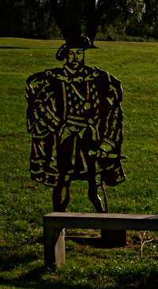
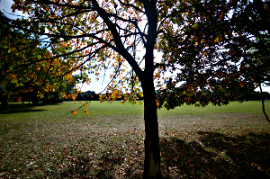

Walking the London LOOP - part 21 (part 2) and 22
=================================================

.. articleMetaData::
   :Where: London, UK
   :Date: 2014-10-01 09:21 Europe/London
   :Tags: blog, theloop, walking
   :Short: loop2122

We traveled to Noak Hill by various means of transport. We traveled to
Liverpool Street by tube, then train to Harold Wood and then by bus to the
point where we aborted last time. Or sorta, as the bus stopped 50 meters
short or so.

Section 21 (part 2)
-------------------

Just after we got off the bus, we spotted another couple doing the LOOP. They
were slightly faster than us, although we did catch up with them near the end
of section 22. The first few hundred meters were tough going, as it was near
a brook through some woods. With lots of fallen over trees and some very
narrow paths. But this didn't last very long and we walked a bit besides
Carter's Brook, a tributary of the Ingrebourne_ river, before entering `Central
Park`_. This Central Park is not nearly as large as the one in New York, but
it did have a bench with Henry VIII behind it.

After Central Park we followed the path besides Paines Brook and after a
while we walked past `The Old Brickworks`_ to get back to `Harold Hill`_
station to finish this short part of section 21. We skipped going to the pub
`The King Harold`_ as we've only been going for about ¾s of an hour. 

Usually at each section's start there is a nice brass plaque for that
section. Unfortunately, at Harald Wood Station, it was gone. Likely
vandalized.

Section 22
----------

Continuing past the `Archibald Road allotments`_ we soon came upon `Harold
Wood Park`_ with its cricket club and play ground. I attempted to take a nice
photo of a tree with coloured leaves with the Sun just behind it, but the
result wasn't as good as I would have hoped.

From Harald Wood Park we crossed into `Pages Wood`_, although, most of the wood
seemed to just have been planted. It was more of a walk through a meadow with
some small trees on the sides, than a "wood". It was quite pleasant though,
and because it was quite warm, we decided to have a little picnic just before
we left it. 

.. image:: images/loop22-d36_9655.jpg

Then came a rather nasty section of the walk, past a road, and across the
A127. Another mile later, we happily left the roads behind to go through some
fields, and we walked besides the `Emerson Park School`_'s playing fields
towards `Upminster Bridge station`_, where the walk ended.

------

We really didn't stop at any pub throughout this walk, but on the way home,
we called out our favourite cider pub, the `Euston Cider Tap`_ for some
refreshing drinks. This was nearly the warmest walk that we did, so we
thought we quite deserved our pints. Only one walk left now!

------

The weather was really warm and sunny at 25°C, although towards the end there
were more clouds. We took 2¼ hours for the 11km.

The photos that I took on this section, as well as the photos of the
other sections of the LOOP_, are available as a `Flickr set`_.

.. _Ingrebourne: http://en.wikipedia.org/wiki/River_Ingrebourne
.. _`Central Park`: https://www.havering.gov.uk/Pages/ServiceChild/CentralPark-LGSL-823.aspx
.. _`The Old Brickworks`: http://www.thomasbates.co.uk/propertydetail.asp?Site=4
.. _`Harold Hill`: http://en.wikipedia.org/wiki/Harold_Hill
.. _`The King Harold`: http://www.beerintheevening.com/pubs/s/10/10262/King_Harold/Harold_Wood
.. _`Archibald Road allotments`: https://www.havering.gov.uk/Pages/Services/Allotments.aspx
.. _`Harold Wood Park`: http://www.haveringactive.co.uk/harold.html
.. _`Pages Wood`: http://www.forestry.gov.uk/forestry/EnglandEssexNoForestThamesChaseCommunityForestPagesWood
.. _`Emerson Park School`: http://www.emersonparkacademy.org/
.. _`Upminster Bridge station`: http://en.wikipedia.org/wiki/Upminster_Bridge_tube_station
.. _`Euston Cider Tap`: http://www.eustontap.com/pages.php?navid=9
.. _LOOP: http://www.walklondon.org.uk/route.asp?R=5
.. _`Flickr set`: https://www.flickr.com/photos/derickrethans/sets/72157636982853053/with/15332976775
