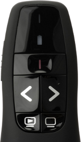

Tweaking the Logitech R400 presenter tool on Linux
==================================================

.. articleMetaData::
   :Where: London, UK
   :Date: 2014-10-08 09:21 Europe/London
   :Tags: blog, php, mongodb
   :Short: r400

This article is a updated version of `an earlier one`__, which describes how
to tweak the R400 on non-systemd systems.

__ /logitech-r400.html

In 2002, I received a `Logitech R400`_ presenter tool for Christmas as a
replacement for the `php|architect`_ pointer that has now fallen apart.
However, to use it
together with my presentation system—pres2, about which I previously_ wrote—I
need it to provide left and right arrow keypresses. By default its *left* and
*right* buttons generate *Prior* and *Next* events in X. It took me a while to
get this to work, so in short, this article sets out how I changed it.

First of all, I editted the file ``/lib/udev/hwdb.d/60-keyboard.hwdb`` as root.
I searched for ``R400`` and changed its entry to::

	# Logitech Presenter R400
	keyboard:usb:v046DpC52Dd*dc*dsc*dp*ic*isc*ip*in00*
	 KEYBOARD_KEY_070029=f11
	 KEYBOARD_KEY_07003e=f11
	 KEYBOARD_KEY_070037=f5
	 KEYBOARD_KEY_07004b=left
	 KEYBOARD_KEY_07004e=right

This maps the two scan codes that the *Play* button (lower-left) generates to
*f11*, the empty screen button to *f5* and the left and right buttons to the
left and right arrow keys. 

The first column represents the scancode, which I obtained by first looking up
with input event the device was tied to::

	stat -t /dev/input/by-id/usb-Logitech_USB_Receiver-event-kbd --printf "%N\n"

Which showed the following for me::

	‘/dev/input/by-id/usb-Logitech_USB_Receiver-event-kbd’ -> ‘../event19’

To find out the scan codes, I had to download a ``getscancodes`` tool, and
then compile it::

	wget 'http://downloads.sourceforge.net/project/keytouch/getscancodes/getscancodes%201.0/getscancodes-1.0.tar.gz?r=http%3A%2F%2Fkeytouch.sourceforge.net%2Fdl-getscancodes.php&ts=1412723944&use_mirror=kent' -O getscancodes-1.0.tar.gz
	tar -xvzf getscancodes-1.0.tar.gz
	cd getscancodes/
	make

With the new binary, and the ``event19`` from above, I ran::

	sudo ./getscancodes /dev/input/event19

Which showed::

	458807 (0x70037)
	458793 (0x70029)
	458814 (0x7003e)
	458827 (0x7004b)
	458830 (0x7004e)

With these numbers, I now had enough information to edit the
``/lib/udev/hwdb.d/60-keyboard.hwdb`` file that I mentioned earlier.

After that, I had to run::

	sudo udevadm hwdb --update

This consolidated the modified rules and made the keymapping active. My
presenter tool now sends the correct key codes again.

The changes will persist after rebooting as well.

.. _`Logitech R400`: http://www.amazon.co.uk/gp/product/B002L3TSLQ/ref=as_li_ss_tl?ie=UTF8&tag=derickrethans-21&linkCode=as2&camp=1634&creative=19450&creativeASIN=B002L3TSLQ
.. _`php|architect`: http://www.phparch.com/
.. _previously: /presentations.html
.. _MongoDB: http://mongodb.org
