Whisky Advent: part 2
=====================

.. articleMetaData::
   :Where: London, UK
   :Date: 2014-12-12 09:05 Europe/London
   :Tags: blog, whisky
   :Short: whiskyad2

December 5th: Blue Hanger, 8th Release
--------------------------------------

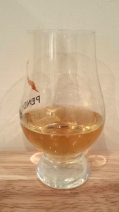

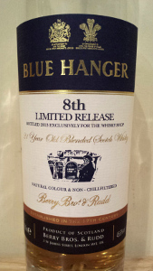

This `Blue Hanger`_ is the only blend on the calendar, but this is an unusual
blend so I am making an exception. This 8th release is a 21 year old blend,
bottled by Berry Bros. & Rudd. It is named after William Hanger, the 3rd Lord
Coleraine, a loyal customer of Berry Bros. & Rudd during the late 18th
century. He was renowned for the striking blue clothes he wore and gained the
soubriquet, "Blue Hanger".

It is bottled at 45.6% ABV, with natural colouring and it is not chill
filtered. It is exclusive to `The Whisky Shop`_. 

*Tasting notes*: Orange peel, vanilla, caramel. With a little bit of salt and
smoke.

.. _`Blue Hanger`: http://www.whiskybase.com/whisky/59436/blue-hanger-8th-release
.. _`The Whisky Shop`: https://www.whiskyshop.com/

December 6th: Springbank 12 Green
---------------------------------

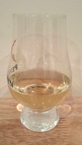

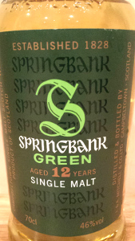

As this month's whisky of the month, I went to my favourite whisky shop in
London, `Cadenhead's`_. They are best known for their single cask whiskies,
and indeed many of the whiskies on this advent calendar come from them. 

This `Springbank 12 Green`_ whisky is not a single cask whisky. But it
is a very new whisky. So new, that I couldn't find it through Google
yet. The label on the bottle says it's one out of 9000 bottles. It is called
"Green" because it is distilled from organic barley.

It is matured entirely in bourbon casks and bottled at 46% ABV. The result is
creamy and sweet with classic Springbank peatiness giving depth and a hint of
coastal air. 

*Tasting notes*: Very pale. Sweet fruits and a little bit peaty. The whisky
lingers quite long with peat and a hint of sherry. 

.. _`Cadenhead's`: http://www.whiskytastingroom.com/
.. _`Springbank 12 Green`: http://www.whiskytastingroom.com/springbank-distillery-12-year-old-green-70cl-46-319.html

December 7th: Single Cask Ardmore 16
------------------------------------

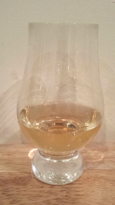

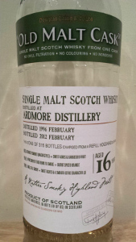

Tonight's dram is 16 years old, distilled in 1996 by Ardmore_ and bottled in
2012. It is one of 315 bottles from a refill Hogshead, selected by `Douglas
Laing`_. It forms part of Douglas Laing's Old Malt Cask range, and is now
`sold out`_.

*Tasting notes*: As an Ardmore_ it is quite peaty, with barley and all spice
flavours. Spices, smoke and peppers are its overtones. There are hints of wood
in the aftertaste.

.. _Ardmore: http://www.ardmorewhisky.com/
.. _`Douglas Laing`: http://www.douglaslaing.com/
.. _`sold out`: http://www.masterofmalt.com/whiskies/ardmore/ardmore-16-year-old-1996-cask-8020-old-malt-cask-douglas-laing-whisky/

December 8th: anCnoc 22
-----------------------

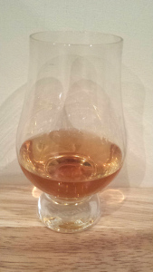

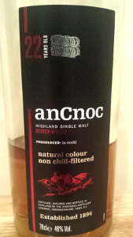

A typical winter warmer from anCnoc_. It is 22 years old, and as usual in a
natural colour and non-chill filtered. It is a standard whisky, made from many
different casks - but aged in both ex-bourbon casks and ex-sherry butts.

*Tasting notes*: Honey, sweet and a few hints of all spice. A bit like
Christmas cake. There is also a hint of smoke, and the whisky is general full
of flavours. The finish is spicy.

.. _anCnoc: http://ancnoc.com/

December 9th: Glenburgie 1994
-----------------------------

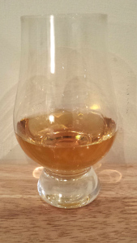

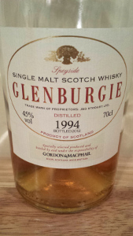

This `17 year old whisky`_ is distilled by Glenburgie, and bottled by Gordon &
MacPhail in 2012. It is specifically bottled for `La Maison du Whisky`_ `in
Paris`_, not far from Métro station Madeleine. It is in Paris that I bought
this whisky when I was there for `Forum PHP`_ last year. La Maison du Whisky is in my opinion
the best whisky shop outside of Scotland, and `Cadenhead's`_ in London.

As is common to many of my whiskies, this is again a non-chill filtered
natural colour single cask whisky—cask 10055 in case you care. It is 45% ABV
and matured in 1st fill sherry butts.

*Tasting notes*: The colour is slight red, and it is slightly oily on the
tongue. Hints of caramel and honey, but more stronger spices such as cardamom
and cloves. The after taste is a little bit zesty, and has hints of oak.

.. _`17 year old whisky`: http://www.whiskybase.com/whisky/35311/glenburgie-1994-gm
.. _`La Maison du Whisky`: http://www.whisky.fr/
.. _`in Paris`: http://www.openstreetmap.org/node/2538000591
.. _`Forum PHP`: http://afup.org/pages/forumphp2013/

December 10th: Tomintoul 16
---------------------------

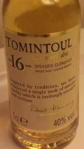

I spoke at `Glasgow PHP`_ this evening, which meant that I couldn't do my
regular bottle and a glass approach. I had to do with a miniature of a
`Tomintoul 16`_ that I had brought along. The organisers were so kind to gift
me a bottle of `Auchentoshan American Oak`_ though, but I am saving that for an
upcoming night.

*Tasting notes*: Overall quite bland, and I didn't pick out too many flavours.
It's a bit fruity sweet, but the flavour doesn't linger and in a few seconds I
had forgotten about it at all. 

.. _`Glasgow PHP`: http://glasgowphp.co.uk
.. _`Tomintoul 16`: http://www.whiskybase.com/whisky/51822/tomintoul-16-year-old
.. _`Auchentoshan American Oak`: http://www.whiskybase.com/whisky/45865/auchentoshan-american-oak

December 11th: Mannochmore 12
-----------------------------

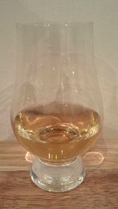

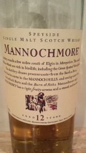

This latest whisky comes from the Mannochmore_ distillery, which produces for
twelve months and then has a break of twelve months alternating with the nearby
Glenlossie_ distillery, with which it shares the employees. A rather unusual
arrangement if you ask me.

In one of the years, they did manage to distill the spirits that now end up as
the `Mannochmore 12`_, which I am enjoying tonight. It is part of Diageo's
`Flora and Fauna`_ range. 

*Tasting notes*: Honey and a hint of pepper? There is quite a lot of flavours
coming into play after a while. And even a hint of ginger in the long
lingering finish.

.. _Mannochmore: http://www.whiskybase.com/distillery/133/mannochmore
.. _Glenlossie: http://www.whiskybase.com/distillery/72/glenlossie
.. _`Mannochmore 12`: http://www.whiskybase.com/whisky/31292/mannochmore-12-year-old
.. _`Flora and Fauna`: http://www.whiskydesignaward.com/2012/01/flora-fauna-series-bottlings-by-united-distillers-now-diageo/
