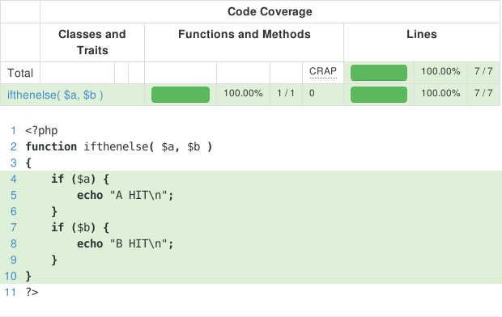
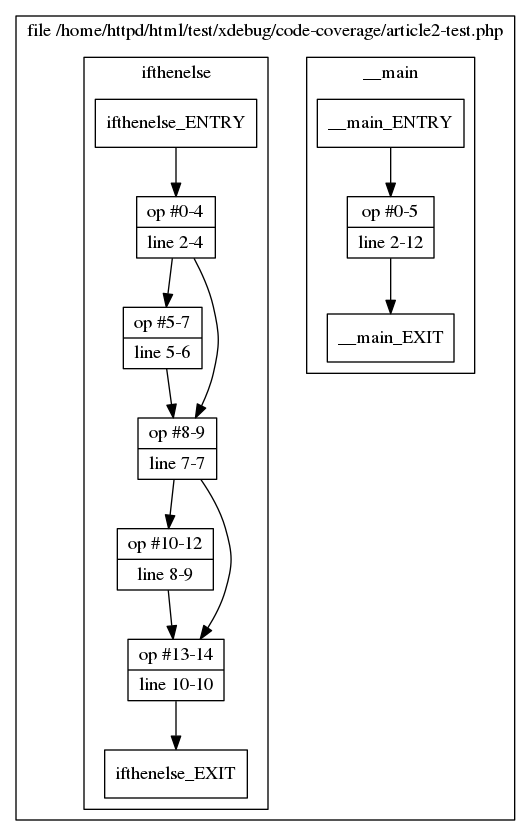
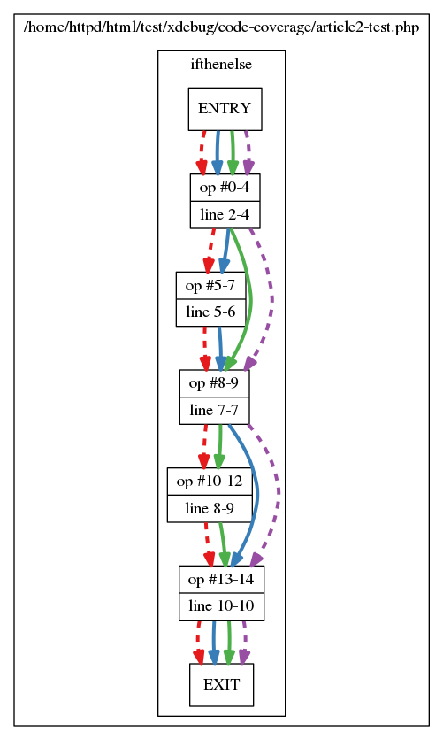
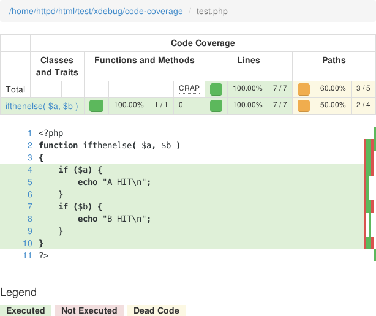

Code Coverage: Finding Paths
============================

.. articleMetaData::
   :Where: London, UK
   :Date: 2015-01-07 09:44 Europe/London
   :Tags: blog, php
   :Short: pathcoverage

Picking up from where we left `last time`_, in this second article we will
look at some upcoming functionality in Xdebug_. Sebastian has been pressuring
me for years to add branch and path coverage to Xdebug, with issue `#1034`_. In
the post I will show you what "branch and path coverage" is, and how it helps.

In the previous post, I showed you a trivial script as an example for code
coverage. Let's have a look at a different script this time
(``article2-test.php``)::

	<?php
	function ifthenelse( $a, $b )
	{
		if ($a) {
			echo "A HIT\n";
		}
		if ($b) {
			echo "B HIT\n";
		}
	}

We now run this through `PHP CodeCoverage`_ (``article2.php``)::

	<?php
	require 'vendor/autoload.php';
	include 'article2-test.php';

	$coverage = new PHP_CodeCoverage;

	$coverage->start('coverage1');
	ifthenelse( true, false ); 
	$coverage->stop();

	$coverage->start('coverage2');
	ifthenelse( false, true );
	$coverage->stop();

	$writer = new PHP_CodeCoverage_Report_HTML;
	$writer->process($coverage, '/tmp/code-coverage-article');
	?>

Which outputs:

And this nicely tells you that all your lines have been executed. However, you
have not *tested* everything. With two ``if`` statements, there are four
possible paths through your code:

===== =====
$a    $b
===== =====
false false
false true
true  false
true  true
===== =====

But we have only tested for the second and the third cases. Because we are
doing *line* coverage, this sort of coverage issues don't show up. In order to 
address this, we need to do branch and path coverage.

I wrote in the previous article that Xdebug follows all branches to find dead
code during code coverage, but it never did really more with that. So, again,
I started experimenting through VLD_ to see how I could get it to list all
possible branches (easy) and paths through a function or method.

So now VLD_ would say the following (besides dumping the opcodes) about the
code::

	filename:       /home/httpd/html/test/xdebug/code-coverage/article2-test.php
	function name:  ifthenelse

	…

	branch: #  0; line:     2-    4; sop:     0; eop:     4; out1:   5; out2:   8
	branch: #  5; line:     5-    6; sop:     5; eop:     7; out1:   8
	branch: #  8; line:     7-    7; sop:     8; eop:     9; out1:  10; out2:  13
	branch: # 10; line:     8-    9; sop:    10; eop:    12; out1:  13
	branch: # 13; line:    10-   10; sop:    13; eop:    14; out1:  -2
	path #1: 0, 5, 8, 10, 13, 
	path #2: 0, 5, 8, 13, 
	path #3: 0, 8, 10, 13, 
	path #4: 0, 8, 13, 
	End of function ifthenelse

It's a bit difficult to see what goes on here, but in general there are five
branches and four paths. The first two branches (``0`` and ``5``) are for the
first ``if`` statement, the second two branches (``8`` and ``10``) are for the
second ``if`` statement and the last branch (``13``) is the end of function,
with an implicit return to the calling function. Branches are named after the
opcode entry that forms the start of a branch.

Seeing the different branches is probably easier to see in a graph, which VLD
can also produce (using the ``vld.save_paths=1`` php.ini setting). This
produces a ``paths.dot`` file in ``/tmp`` which we can convert to an image
with `GraphViz'`_ ``dot`` tool::

	dot -Tpng /tmp/paths.dot > /tmp/paths.png

And then this graph looks like:

With the functionaly added to VLD_, the next step was adding this code to
Xdebug. Xdebug needs to know about all the paths, but also need figure out
which branches and paths are actually followed. It needs to overload every
opcode (PHP's smallest execution unit) handler, as any of them could be at the
start of a branch. Overloading each opcode handler makes running your code,
a lot slower unfortunately when with branch/path coverage is enabled. 

Although PHP_CodeCoverage_ does not support it yet, it is possible to
visualize the new path coverage with help from some helper scripts in Xdebug's
contrib_ directory. As a similar example as above, the test script would look
like::

	<?php 
	require '/home/derick/dev/php/xdebug-xdebug/contrib/branch-coverage-to-dot.php';
	include 'article2-test.php';

	xdebug_start_code_coverage( 
		XDEBUG_CC_DEAD_CODE | 
		XDEBUG_CC_UNUSED | 
		XDEBUG_CC_BRANCH_CHECK 
	);

	ifthenelse( true, false );

	ifthenelse( false, true );

	$info = xdebug_get_code_coverage(); 
	file_put_contents('/tmp/paths.dot', branch_coverage_to_dot( $info ) );
	?>

This again creates a ``paths.dot`` file that we can convert to an image just
like above::

    dot -Tpng /tmp/paths.dot > /tmp/paths-covered.png

And then this graph looks like:

This clearly shows we have only covered two of the four possible paths through
this particular function. PHP_CodeCoverage_ has not been updated yet to
include this new functionality, so I made a mock-up in the mean while:

Now it's just waiting until Sebastian_ (or somebody else) has time to upgrade
PHP_CodeCoverage_ to show the branch and path coverage. Happy hacking!

.. _`last time`: /code-coverage.html
.. _`#1034`: http://bugs.xdebug.org/view.php?id=1034
.. _Xdebug: http://xdebug.org
.. _VLD: http://derickrethans.nl/projects.html#vld
.. _`PHP CodeCoverage`: https://packagist.org/packages/phpunit/php-code-coverage
.. _`GraphViz'`: http://www.graphviz.org/
.. _contrib: https://github.com/derickr/xdebug/tree/master/contrib
.. _Sebastian: http://sebastian-bergmann.de
