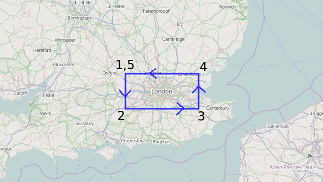
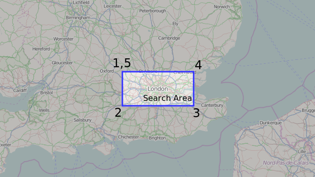
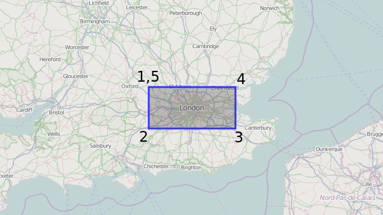
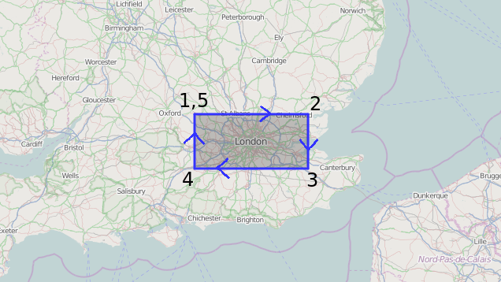

MongoDB 3.0 features: Big Polygon
=================================

.. articleMetaData::
   :Where: London, UK
   :Date: 2015-02-17 09:07 Europe/London
   :Tags: blog, php, mongodb
   :Short: bigpolygon

MongoDB has supported geospatial_ queries for quite some time now. For finding
objects in a specific area (polygon) it allows to run a query like::

	<?php
	$c = (new MongoClient())->demo->points;

	$c->find( [
		'loc' => [
			'$geoWithin' => [
				'type' => 'Polygon',
				'coordinates' => [ [
					[ -0.91, 51.74 ], 
					[ -0.91, 51.27 ],
					[  0.67, 51.27 ],
					[  0.67, 51.74 ],
					[ -0.91, 51.74 ]
				] ]
			]
		]
	] );
	?>

The polygon is define as five coordinate pairs, with the start and end pair
being the same to form a closed ring. As an image, this looks like:

The GeoJSON_ format specification does not mention anything about the
direction of the points, and it is basically up to an application to determine
what is *inside*, and what is *outside*. Both of the following images are
possibilities when just taking the GeoJSON spec into account:

Because GeoJSON is not specific here, sometimes applications make 
`wrong decisions`_.

.. _geospatial: http://docs.mongodb.org/v3.0/applications/geospatial-indexes/
.. _GeoJSON: http://geojson.org/geojson-spec.html
.. _`wrong decisions`: https://github.com/mapbox/tilemill/issues/2110

MongoDB picks the area that is the "smallest of the two". That means, that it
prefers to pick the "inside". That means, that it would pick the first of the
two interpretations as shown in the above images.

This works for most applications, but it falls apart when you want to find
objects on a globe within a polygon that spans more than half of the Earth's
surface. 

When the polygon is larger than half of the Earth's surface, the "smallest of
the two" is the part that you would **not** want to find objects in. To solve
that, a way to more specifically specify which area is the *inside* or
*outside*. KML_, and `WKT/WKB`_ pick the counter clockwise rule to decide
what is inside the polygon. This results in the following two possibilities:

.. image:: images/bigp-london3a.png

.. _KML: http://en.wikipedia.org/wiki/Keyhole_Markup_Language
.. _`WKT/WKB`: http://en.wikipedia.org/wiki/Well-known_text

To force the counter clockwise rule with MongoDB, you need to use a specific
extra option to your ``$geoWithin`` or ``$geoIntersects`` queries::

	<?php
	$c = (new MongoClient())->demo->points;

	$c->find( [
		'loc' => [
			'$geoWithin' => [
				'type' => 'Polygon',
				'coordinates' => [ [
					[ -0.91, 51.74 ], 
					[ -0.91, 51.27 ],
					[  0.67, 51.27 ],
					[  0.67, 51.74 ],
					[ -0.91, 51.74 ]
				] ],
				'crs' => [
					'type' => 'name',
					'properties' => [
						'name' => 'urn:x-mongodb:crs:strictwinding:EPSG:4326'
					]
				]
			]
		]
	] );
	?>

This is however only really important when searching for an area that is
larger than half of the Earth's surface. In most cases, you will not need to
specify the extra ``crs`` property.
