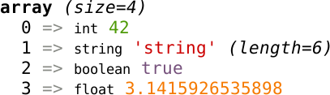
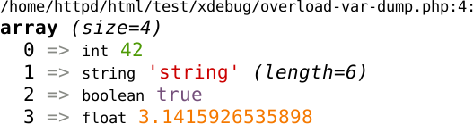
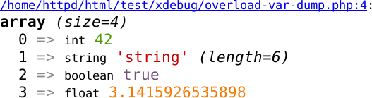

Xdebug 2.3: Moar var_dump()
===========================

.. articleMetaData::
   :Where: London, UK
   :Date: 2015-02-27 08:57 Europe/London
   :Tags: blog, php, xdebug
   :Short: vardump23

This is the first article in a series about the new features in Xdebug_ 2.3,
which was first released_ on February 22nd. 

One of the new features relates to one of the first things that I added in the
original Xdebug_: making the `var_dump()`_ output "pretty". Xdebug replaces
PHP's standard ``var_dump()`` function with its own version, as long as the
`xdebug.overload_var_dump`_ setting is not set to ``0``.

Which means that instead of::

	array(4) { [0]=> int(42) [1]=> string(6) "string" [2]=> bool(true) [3]=> float(3.1415926535898) }

You get:

Nothing new so far. 

Xdebug 2.3 enhances the overloading of ``var_dump()`` with the inclusion of
the file name and line number where ``var_dump()`` is called at. This has been
a long standing `feature request`_. 

You can include this information, by setting ``xdebug.overload_var_dump`` to
``2``. If the ``xdebug.overload_var_dump`` setting is set to ``2``, the
overloaded ``var_dump()`` output now looks like:

As you can see, the file name and line number of where ``var_dump()`` were
called are prepended to the output. 

An already existing setting, `xdebug.file_link_format`_, allows you to format
file name and line number information so that Xdebug generates a link. This
same setting is also respected by the inclusion of the file name and line
number in the enhanced ``var_dump()`` output. Setting
``xdebug.file_link_format`` to ``xdebug://%f:%l`` will then link the file name
to ``xdebug:///home/httpd/html/test/xdebug/overload-var-dump.php:4``. If we
look at this as an image, we will see:

In a future version of Xdebug, it is likely that I will either wrap in the
file name/line number information in the overloaded ``var_dump()``, or
change the default value of the setting to ``2``.

.. _Xdebug: http://xdebug.org
.. _released: http://xdebug.org/updates.php#x_2_3_0
.. _`var_dump()`: http://docs.php.net/var_dump
.. _`xdebug.overload_var_dump`: 
.. _`feature request`: http://bugs.xdebug.org/bug_view_page.php?bug_id=304
.. _`xdebug.file_link_format`: http://xdebug.org/docs/all_settings#file_link_format
