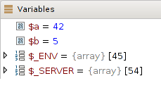
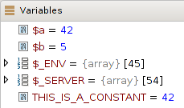
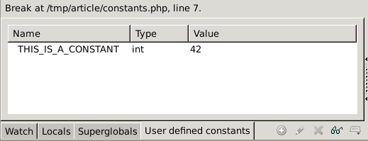
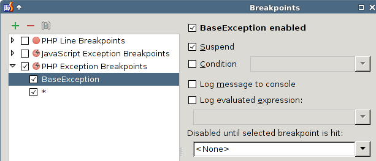

Xdebug 2.3: Improvements to Debugging
=====================================

.. articleMetaData::
   :Where: London, UK
   :Date: 2015-03-25 09:12 Europe/London
   :Tags: blog, php, xdebug
   :Short: debugs23

This is the fourth article in a series about new features in Xdebug_ 2.3,
which was first released_ on February 22nd.

.. _Xdebug: http://xdebug.org
.. _released: http://xdebug.org/updates.php#x_2_3_0

In this article we are looking at the improvements towards "remote" debugging.

----

The first improvement is the addition to view the values of user defined
constants. In Xdebug this works by defining another context. Existing contexts
are local variables, and super globals. In PhpStorm_, they show up in the same
"Variables" box:

Xdebug 2.3 defines a third context, "User defined constants". This new third
context also shows up in PhpStorm's "Variables" box:

However, if you have lots of constants, that becomes annoying. Follow (or
comment on) issue WI-21691_ if you want to see this changed.

Other IDEs, such as Komodo_, handle this by having a separate tab for
constants:

It is actually clever enough to create a new tab for every new context that I
come up with, as they haven't hard coded it.

.. _PhpStorm: https://www.jetbrains.com/phpstorm/
.. _WI-21691: https://youtrack.jetbrains.com/issue/WI-21691
.. _Komodo: http://komodoide.com/

----

Another new debugging feature is to be able to set an exception breakpoint on
all exceptions, by using ``*`` as the exception name. Xdebug 2.3 also breaks
on exception classes that are inherited from the ones you set a breakpoint
on. With the following code::

	<?php
	class BaseException extends Exception {}
	class ChildException extends BaseException {}

	echo "start\n";

	try
	{
		echo "first try\n";
		throw new ChildException("No noes!");
	}
	catch ( ChildException $e )
	{
		echo "eat it\n";
	}

	echo "end\n";
	?>

And the following exception breakpoints configured in PhpStorm_:

Xdebug will now interrupt the script when it hits line 11 because an exception
breakpoint for both ``BaseException`` (the parent of the exception that we are
throwing) and ``*`` are configured.

----

The third feature that I would like to highlight is related to the additions
to debugging exceptions. Xdebug now includes the exception's error code in the
reply to the IDE. However, it does not seem that PhpStorm allows me to see
which exception it broke on, and what its message and error code are. 

For now, you will have to do with the raw XML result (after formatting)::

	-> run -i 6
	<?xml version="1.0" encoding="iso-8859-1"?>
	<response
		xmlns="urn:debugger_protocol_v1"
		xmlns:xdebug="http://xdebug.org/dbgp/xdebug" 
		command="run" transaction_id="6"
		status="break" reason="ok"
	>
		<xdebug:message
			filename="file:///tmp/xdebug-dbgp-test.php" lineno="28"
			exception="FooBarException" code="43"
		>
			<![CDATA[this should still break]]>
		</xdebug:message>
	</response>

I have created issue WI-26880_ in their issue tracker as a feature request.

.. _WI-26880: https://youtrack.jetbrains.com/issue/WI-26880

----

And the last thing that has changed with debugging in Xdebug 2.3 is that now
Xdebug will try to log when you do not have sufficient permissions to create a
socket. For example when you have SELinux_ turned on but not properly
configured. The new message is:

	E: No permission connecting to client. This could be SELinux related. :-(

.. _SELinux: http://en.wikipedia.org/wiki/Security-Enhanced_Linux

----

Other parts in this series:

 - `Xdebug 2.3: Moar var_dump()`_
 - `Xdebug 2.3: Enhanced xdebug_debug_zval()`_
 - `Xdebug 2.3: Munging errors`_

.. _`Xdebug 2.3: Moar var_dump()`: /xdebug-2.3-overload-vardump.html
.. _`Xdebug 2.3: Enhanced xdebug_debug_zval()`: /xdebug-2.3-xdebug-debug-zval.html
.. _`Xdebug 2.3: Munging errors`: /xdebug-2.3-error-munging.html
