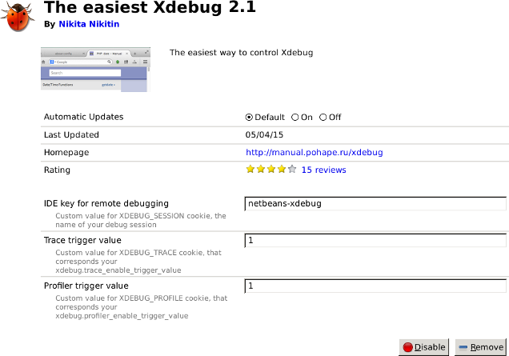

Xdebug 2.3: Shared Secret to Enable Tracing or Profiling
========================================================

.. articleMetaData::
   :Where: London, UK
   :Date: 2015-04-07 09:13 Europe/London
   :Tags: blog, php, xdebug
   :Short: sharedsecret23

This is the sixth article in a series about new features in Xdebug_ 2.3,
which was first released_ on February 22nd.

.. _Xdebug: http://xdebug.org
.. _released: http://xdebug.org/updates.php#x_2_3_0

Xdebug's profiling and trace file capabilities can both be triggered by a
cookie, GET or POST variable, as long as you have enabled
`xdebug.profiler_enable_trigger`_ and/or `xdebug.trace_enable_trigger`_.
With these triggers enabled, basically anybody could initiate
a profile run, or trace file, by simply sending the ``XDEBUG_PROFILE`` or
``XDEBUG_TRACE`` cookies with an HTTP request.

.. _`xdebug.profiler_enable_trigger`: http://xdebug.org/docs/profiler#profiler_enable_trigger
.. _`xdebug.trace_enable_trigger`: http://xdebug.org/docs/execution_trace#trace_enable_trigger

Although you should not really run Xdebug in production, you can see that this
is not an optimal solution.

Xdebug 2.3 adds supports for shared secrets for the trace file and profiler
triggers through the `xdebug.trace_enable_trigger_value`_ and
`xdebug.profiler_enable_trigger_value`_. If these settings are changed from
their default (empty string), then the value of ``XDEBUG_PROFILE`` needs to
match the value of ``xdebug.profiler_enable_trigger_value``, and the value of
``XDEBUG_TRACE`` needs to match the value of
``xdebug.trace_enable_trigger_value`` in order for the profiling to start, or
the trace file to be generated. 

.. _`xdebug.profiler_enable_trigger_value`: http://xdebug.org/docs/profiler#profiler_enable_trigger_value
.. _`xdebug.trace_enable_trigger_value`: http://xdebug.org/docs/execution_trace#trace_enable_trigger_value

Often users would use one of the browser extensions for triggering profile
runs or enabling tracing, these extensions need to be updated. The author of
`The easiest Xdebug`_, Nikita Nikitin, managed to get an updated version out
before I could complete this article. It now has support for supplying your
own values for ``XDEBUG_TRACE`` and ``XDEBUG_PROFILE``:

.. _`The easiest Xdebug`: https://addons.mozilla.org/en-us/firefox/addon/the-easiest-xdebug/

The other two browser helpers have not been updated yet. I have emailed the
author of Chrome's `Xdebug helper`_, and I have filled an issue_ for Safari's
`xdebug-helper-for-safari`_ on Github. Let's hope they get updated soon too.

.. _`Xdebug helper`: https://chrome.google.com/webstore/detail/xdebug-helper/eadndfjplgieldjbigjakmdgkmoaaaoc?hl=en
.. _issue: https://github.com/mac-cain13/xdebug-helper-for-safari/issues/11
.. _`xdebug-helper-for-safari`: https://github.com/mac-cain13/xdebug-helper-for-safari

----

Other parts in this series:

 - `Xdebug 2.3: Moar var_dump()`_
 - `Xdebug 2.3: Enhanced xdebug_debug_zval()`_
 - `Xdebug 2.3: Munging errors`_
 - `Xdebug 2.3: Improvements to Debugging`_
 - `Xdebug 2.3: Improvements to Tracing`_

.. _`Xdebug 2.3: Moar var_dump()`: /xdebug-2.3-overload-vardump.html
.. _`Xdebug 2.3: Enhanced xdebug_debug_zval()`: /xdebug-2.3-xdebug-debug-zval.html
.. _`Xdebug 2.3: Munging errors`: /xdebug-2.3-error-munging.html
.. _`Xdebug 2.3: Improvements to Debugging`: /xdebug-2.3-debugging-improvements.html
.. _`Xdebug 2.3: Improvements to Tracing`: /xdebug-2.3-tracing-improvements.html
