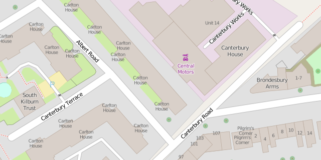
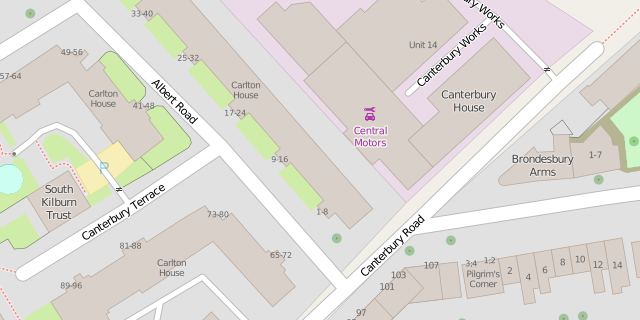

Adressing Flats
===============

.. articleMetaData::
   :Where: London, UK
   :Date: 2015-07-21 09:11 Europe/London
   :Tags: blog, openstreetmap
   :Short: flats

I recently moved into a new area in London, and that means, a new area to map.
That means drawing in all the buildings, but also adding shops and addresses.
Unlike my old area, the new neighbourhood has lots of buildings with flats.
In OpenStreetMap_, you can tag addresses on flats with the `addr:flats`_ tag.
In most cases, the addresses of the flats are formed by a flat number,
building name (`addr:housename`_) and street name (`addr:street`_). Only
occasionally the address consists of flat number, house number, and street
name. 

When I started tagging a nearby collection of flat blocks, and the flat
number/house name/street name on their entrance nodes, I noticed that it
rendered as:

As you can see, it ignored the `addr:flats`_ tag, and instead just rendered
the `addr:housename`_ tag over and over again. Not particularly useful.

So I thought, why not "fix" the rendering. In the past, I already added a
basic rendering for `natural=tree_row`_ to the "default" rendering style. So I
had another look on how to make `addr:flats`_ render and show up instead of
the house name 20 times.

OpenStreetMap's style sheet is developed through the Git repository at
``git@github.com:gravitystorm/openstreetmap-carto.git``. I cloned the
repository and searched after the places where I needed to make modifications
to add the flat numbers. The style sheets first require a "style" file to tell
which data to import from the main database (or ``.xml`` file). Only fields
that are copied into the rendering database are available for use in the style
sheets. OpenStreetMap Carto stores these definitions in the ``project.mml``
file. But that's a nasty JSON file, so instead, you add the definition into
the ``project.yaml`` file. There is a script to convert the YAML file into the
``project.mml`` file which the ``carto`` tool can use to generate a Mapnik_
stylesheet. Mapnik is then responsible for rendering the map.

In ``project.yaml``, just above the ``- id: "housenumbers"`` line, I added the
following section::

  - id: "flatnumbers"
    name: "flatnumbers"
    class: ""
    geometry: "point"
    <<: *extents
    Datasource:
      <<: *osm2pgsql
      table: |-
        (SELECT
            way,
            "addr:flats",
            way_area/NULLIF(!pixel_width!::real*!pixel_height!::real,0) AS way_pixels
          FROM planet_osm_polygon
          WHERE "addr:flats" IS NOT NULL
            AND building IS NOT NULL
        UNION ALL
        SELECT
            way,
            "addr:flats",
            NULL AS way_pixels
          FROM planet_osm_point
          WHERE "addr:flats" IS NOT NULL
          ORDER BY way_pixels DESC NULLS LAST
        ) AS flatnumbers
    properties:
      minzoom: 17
    advanced: {}

It basically instructs the stylesheet to run an extra query to obtain
information on ``addr:flats`` and make that information available to the
actual styles.

It requires an extra column in the database (``addr:flats``), the
import "style" needs to include this data while importing from the data source
into the rendering database. The file containing the import definitions is
``openstreetmap-carto.style``. I added the following line in between the
definitions for ``access`` and ``addr:housenumber``::

	node,way   addr:flats   text         linear

Adding an extra column into the "style" means that it is necessary to reimport
the data from the main database (or XML file) into the rendering database. My
original source is the ``openstreetmap.osm`` file, which I re-imported with::

	/home/derick/install/osm2pgsql/osm2pgsql \
		-S openstreetmap-carto.style --slim -d gis -C 2400 openstreetmap.osm

To render the flat numbers, and attach a style to them, I had
to add a section to the ``addressing.mss`` file which is a sub-stylesheet that
deals with address information. This stylesheet is linked from the project
file. I added the following lines in between the ``#interpolation`` and
``#housenumbers`` sections::

	#flatnumbers {
	  [zoom >= 17] {
		text-name: "[addr:flats]";
		text-placement: interior;
		text-min-distance: 1;
		text-wrap-width: 0;
		text-face-name: @book-fonts;
		text-fill: #666;
		text-size: 8;
	  }
	}

I picked the same style as for standard house numbers, but one size smaller.

With all the sections added to the right files I had to regenerate the
``project.mml`` file from ``project.yaml`` with::

	./scripts/yaml2mml.py < project.yaml > project.mml

And generate a Mapnik_ stylesheet from the ``project.mml`` file with::

	carto project.mml > mapnik.osm

With all that in place, I re-rendered the area. The flat numbers are now
visible on the map:

I have packaged up all the changes, and prepared a `pull request`_ for
``openstreetmap-carto``. With some luck, the changes will make it to the
OpenStreetMap website at some point in the future.

.. _OpenStreetMap: http://openstreetmap.org
.. _`addr:flats`: http://wiki.openstreetmap.org/wiki/Key:addr:flats
.. _`addr:housename`: http://wiki.openstreetmap.org/wiki/Key:addr:housename
.. _`addr:street`: http://wiki.openstreetmap.org/wiki/Key:addr:street
.. _`natural=tree_row`: http://wiki.openstreetmap.org/wiki/Tag:natural%3Dtree_row
.. _Mapnik: http://mapnik.org/
.. _`pull request`: http://github.com/gravitystorm/openstreetmap-carto/pull/1665
