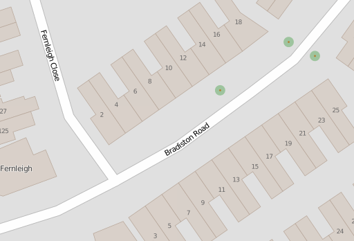

Terracing Buildings
===================

.. articleMetaData::
   :Where: London, UK
   :Date: 2015-08-05 09:25 Europe/London
   :Tags: blog, openstreetmap
   :Short: bldngs

Following up from the previous_ article on addressing flats, in this article
we deal with drawing buildings. The new area has lots of similarly looking
buildings, and they're not exactly square. They do however all (broadly) share
the same shape:

.. _previous: /flats.html

JOSM_ has a terracer_ plugin, which allows you to draw a rectangle,
and then quickly convert it to a row of terraced houses and at the same time
add house numbers to the generated houses. 

You do the following steps with the plugin:

================================ =========================================
Image                            Action
================================ =========================================
.. image:: images/terrace01.png  1. Find a spot that needs buildings added
.. image:: images/terrace02.png  2. Draw the outline
.. image:: images/terrace03.png  3. Add the ``building=residential`` tag
.. image:: images/terrace04.png  4. Select road and outline, and press
                                 ``Shift-T`` to run the terracer plugin.
.. image:: images/terrace05.png  5. Select every other middle node at the back
.. image:: images/terrace06.png  6. Use JOSM's Way Accuracy Tool ``w`` to add
                                 in the other nodes for the back
.. image:: images/terrace07.png  7. Repeat for the other 5 buildings
.. image:: images/terrace08.png  8. Select all buildings and use the
                                 Orthogonalise Shape tool ``Q`` to "square"
                                 the buildings.
================================ =========================================

Having to do step 6 and 7 for every building, especially when there are a lot
of them, is a very tedious, and inaccurate process. It is sometimes even
faster to draw all the building outlines by hand, select them all, and
orthogonalise them.

.. _JOSM: http://josm.openstreetmap.de
.. _terracer: http://wiki.openstreetmap.org/wiki/JOSM/Plugins/Terracer
