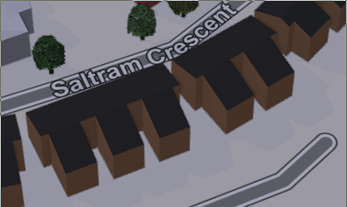
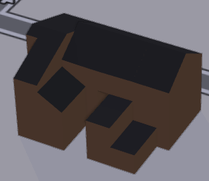

Terracing Buildings
===================

.. articleMetaData::
   :Where: London, UK
   :Date: 2015-08-05 09:25 Europe/London
   :Tags: blog, openstreetmap
   :Short: bldngs

Following up from the previous_ article on addressing flats, in this article
we deal with drawing buildings. The new area has lots of similarly looking
buildings, and they're not exactly square. They do however all (broadly) share
the same shape:

.. image:: images/buildings.png

.. _previous: /flats.html

JOSM_ has a terracer_ plugin, which allows you to draw a rectangle,
and then quickly convert it to a row of terraced houses and at the same time
add house numbers to the generated houses. 

You do the following steps with the plugin:

================================ =============================================
Image                            Action
================================ =============================================
.. image:: images/terrace01.png  Find a spot that needs buildings added
.. image:: images/terrace02.png  Draw the outline
.. image:: images/terrace03.png  Add the ``building=residential`` tag
.. image:: images/terrace04.png  Select road and outline, and press
                                 ``Shift-T`` to run the terracer plugin.
.. image:: images/terrace05.png  Select every other middle node at the back
.. image:: images/terrace06.png  Use JOSM's Way Accuracy Tool ``w`` to add
                                 in the other nodes for the back
.. image:: images/terrace07.png  Repeat for the other 5 buildings
.. image:: images/terrace08.png  Select all buildings and use the
                                 Orthogonalise Shape tool ``Q`` to "square"
                                 the buildings.
================================ =============================================

Having to do step 6 and 7 for every building, especially when there are a lot
of them, is a very tedious, and inaccurate process. It is sometimes even
faster to draw all the building outlines by hand, select them all, and
orthogonalise them.

But the terracer does already save a lot of work, so what if I could make it
better and make it support the type of buildings that are common in my new
neighbourhood?

I had a look into the plugin, and it seems that I have to use Java to update
it. I don't really use Java, and hardly ever written any code in it. It also
sadly lives on some SVN repository, so pull requests against it are difficult
too. Instead, I pushed my version of the repository to
https://github.com/derickr/josm-plugin-uberterrace — and called my version
Überterrace. Oh, and I learned some Java.

After a while of figuring out some ... syntax issues, and figuring out how to
build this stuff, I managed to improve the plugin with another option. The new
option is "fancy outline" and automatically draws in the "extensions at the
back". The new work flow is now:

================================ =============================================
Image                            Action
================================ =============================================
.. image:: images/terrace01.png  Find a spot that needs buildings added
.. image:: images/terrace10.png  Draw the outline, including the backends
.. image:: images/terrace11.png  Add the ``building=residential`` tag
.. image:: images/terrace12.png  Select road and outline, and press
                                 ``Shift-T`` to run the terracer plugin with
                                 the "fancy outline" checkbox set.
.. image:: images/terrace13.png  Drag the selected middle nodes to the right
                                 position.
.. image:: images/terrace14.png  Press ``Shift-E`` to select all buildings,
                                 and press ``q`` to orthogonalise them.
================================ =============================================

As you can see, this makes it much faster to draw such building outlines.
When you look at it in 3D however, you can see there is still a problem
though:

The 3D image that is being drawn does not take into account that the
"extension" at the back, isn't part of the gabled roof nor that it is only two
instead of three levels. There are various possibilities of building layouts:

So the next versions of Überterrace are going to support (some of) these as
well!

.. _JOSM: http://josm.openstreetmap.de
.. _terracer: http://wiki.openstreetmap.org/wiki/JOSM/Plugins/Terracer
