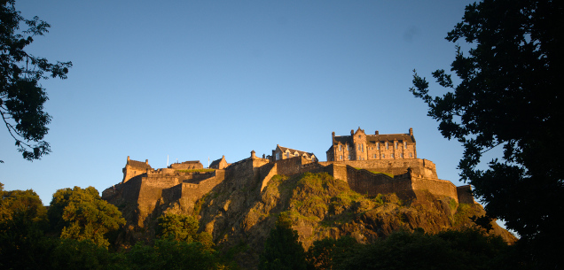
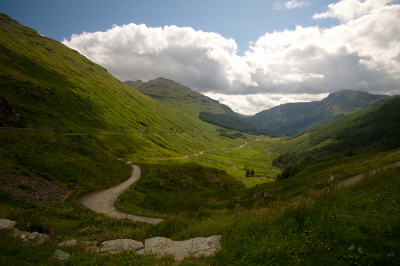
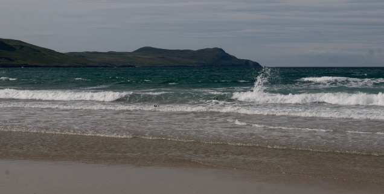
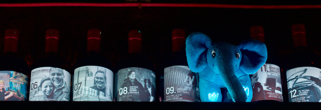
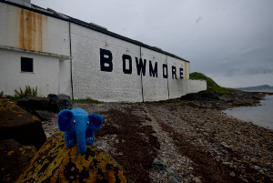
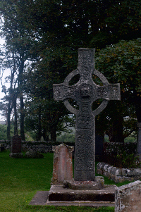
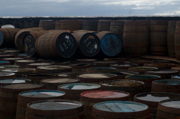
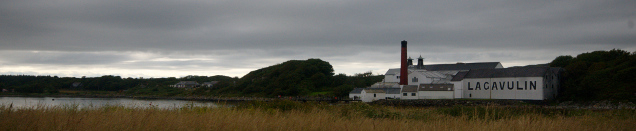
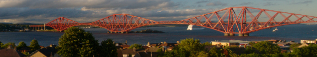

Islay: All the Peat
===================

.. articleMetaData::
   :Where: London, UK
   :Date: 2015-08-18 09:02 Europe/London
   :Tags: photography, whisky
   :Short: islay

Two years ago Morag and I went on a whisky tasting tour with `Rabbie's`_ to
visit a few of `Speyside's distilleries`_. Now, this August we left the smooth
and sweeter whiskies a side, and instead we headed over to Islay. Again with
`Rabbie's`_.

Day 0: Edinburgh
----------------

Our train up to Edinburgh was nothing special, except that Eastcoast has now
been replaced with `Virgin Trains East Coast`_. No real changes, except for
the name. This time however, we got into Edinburgh just as the Fringe_ was
starting. And that made *staying* in Edinburgh quite a bit more expensive. We
thought to be clever and book a hotel near Rabbie's pick-up point, but I had
failed to realize that they actually moved it—right next to the hotel we
stayed in last time.

The afternoon before the tour started, we had some free time in Edinburgh. We
promptly headed to `BrewDog's`_ pub to have a beer and play some
connect-four, before we headed to `The Edinburgh Larder`_ for a nice meal. On
the way back, we caught the last Sun rays hitting `Edinburgh Castle`_.

.. _`Rabbie's`: https://www.rabbies.com/
.. _`Speyside's distilleries`: /the-day-i-saved-whisky.html
.. _`Virgin Trains East Coast`: http://www.virgintrains.co.uk/
.. _Fringe: https://www.edfringe.com/
.. _`BrewDog's`: https://www.brewdog.com/bars/uk/edinburgh
.. _`The Edinburgh Larder`: http://www.edinburghlarder.co.uk/
.. _`Edinburgh Castle`: http://www.edinburghcastle.gov.uk/

Day 1: From Edinburgh to Islay
------------------------------

The next morning we got up quite early, had some breakfast at the hotel and
headed towards our pick up point at Rabbie's Cafe. With a tour like this,
it is always a bit of a guess on what sort of group you get. This time, we
were touring with two Swiss, two Slovenians, three Indians, three Canadians
and a very loud Australian. On the way to Islay we also picked up two
Japanese in Glasgow. On the last tour, we had a few people that didn't like
whisky, but this time one of the Canadians was actually **allergic** to whisky
(and beer).

It is quite a trip to Islay, but luckily we stopped at many places on the way
there. The first stop was at Luss_, in the `Loch Lomond and The Trossachs
National Park`_. From there on, we travelled to Islay with a stop at `The Rest
and Be Thankful`_  on the A83_. The slightly funny name comes from the time
where you had armies going down the Glen and having to climb up to the pass.
They could only rest when they got to the top - and clearly they were thankful
for that!

For lunch we stopped at the `Royal Burgh Cafe`_ in Inveraray_. I had to try
one of my favourite Scottish dishes, `Cullen Skink`_, a thick soup made of
smoked haddock, potatoes and onions. Inveraray itself is a small town on the
coast of `Loch Fyne`_. It has a pretty nice castle for which we didn't have
time, and apparently an old jail that you can visit.

After lunch we drove for a fair bit and stopped for a quick wee pint in
Kilmartin_ at the `Kilmartin Hotel`_ across from the parish church, before
having a good look at a set of standing stones. After another short drive, we
took some time to walk up Dunadd_, a hillfort and suspected capital of the
ancient kingdom of `Dál Riata`_.

We made one last stop to stretch our legs at Tarbert_ on our way to the
`Kennacraig Ferry Terminal`_ from where we took our ferry to Islay. After
about half an hour's drive we finally arrived at our accommodation in one of
`Bowmore distillery's cottages`_. On the dining table was a bottle of `Bowmore
12`_ waiting for us! We ignored the bottle and headed straight to the
`Lochside hotel`_ to taste different whiskies instead. We sampled:

 - `Tullibardine 228`_: Hints of dark red wine. But too young and sharp. *66*
 - `Tullibardine 500`_: Sweet smell. Toffee/fudge, and sweet woody sherry
   notes. *72*
 - Amrut_: Young and unrefined. Marzipan, vanilla, nutty. *70*
 - Kavalan_: Light fresh grassy sweetness. Perhaps some tropical notes and
   some vanilla. *73*
 - Royal Lochnagar Muscat Finish: A little watery. Very light fresh
   berries with nuts. And of course a muscat finish. *78*
 - `Bunnahabhain 25`_: Very complex peaty whisky. Rich berries, but I think I
   like the `Bunnahabhain 18`_ better. Not worth £220 a bottle! *82*

.. _Luss: https://en.wikipedia.org/wiki/Luss
.. _`Loch Lomond and The Trossachs National Park`: https://en.wikipedia.org/wiki/Loch_Lomond_and_The_Trossachs_National_Park
.. _`The Rest and Be Thankful`: http://www.arrocharheritage.com/HistoryOfRABT.htm
.. _A83: https://en.wikipedia.org/wiki/A83_road
.. _`Royal Burgh Cafe`: http://www.tripadvisor.co.uk/Restaurant_Review-g186500-d1747818-Reviews-Royal_Burgh_Cafe-Inveraray_Argyll_and_Bute_Scotland.html
.. _Inveraray: https://en.wikipedia.org/wiki/Inveraray
.. _`Cullen Skink`: https://en.wikipedia.org/wiki/Cullen_skink
.. _`Loch Fyne`: https://en.wikipedia.org/wiki/Loch_Fyne
.. _Kilmartin: https://en.wikipedia.org/wiki/Kilmartin
.. _`Kilmartin Hotel`: http://www.kilmartin-hotel.com/
.. _Dunadd: https://en.wikipedia.org/wiki/Dunadd
.. _`Dál Riata`: https://en.wikipedia.org/wiki/D%C3%A1l_Riata
.. _Tarbert: https://en.wikipedia.org/wiki/Tarbert,_Argyll_and_Bute
.. _`Kennacraig Ferry Terminal`: https://en.wikipedia.org/wiki/Kennacraig
.. _`Bowmore distillery's cottages`: http://cottages.bowmore.co.uk/
.. _`Bowmore 12`: https://www.whiskybase.com/whisky/35151/bowmore-12-year-old
.. _`Lochside hotel`: http://lochsidehotel.co.uk/Islay_Lochside/Home.html
.. _`Tullibardine 228`: https://www.whiskybase.com/whisky/55916/tullibardine-228
.. _`Tullibardine 500`: https://www.whiskybase.com/whisky/40745/tullibardine-500
.. _Amrut: https://www.whiskybase.com/whisky/13662/amrut-40
.. _Kavalan: https://www.whiskybase.com/whisky/18006/kavalan-single-malt-whisky
.. _`Bunnahabhain 25`: https://www.whiskybase.com/whisky/27789/bunnahabhain-xxv
.. _`Bunnahabhain 18`: https://www.whiskybase.com/whisky/14007/bunnahabhain-xviii

Day 2: Touring distilleries on Islay, part 1
--------------------------------------------

We had some spare time in the morning, as we were only going to be picked up
at 09:30. That meant we had some time to run in the morning. There are not
many paths around Bowmore, but I had scouted a nice route_ up to a local hill,
and back. I ran quite a bit slower, as clearly it was hillier than my normal
runs besides the canal.

After the morning run, shower and breakfast we were picked up for our first
distillery visit. But before we started the tour and tasting at Kilchoman_ we
spend some time relaxing on the beach at Machir Bay. After getting our
"fresh nose", we headed to the distillery.

Kilchoman_ is Islay's newest distillery at just 10 years old. It's so new that
it misses on many of the maps we spotted all over Islay indicating where the
8 distilleries are. It is a "farm distillery" and by far the smallest. They
malt some of their own barley, which goes into their `Kilchoman 100% Islay`_
expression. After our tour two years ago we did know nearly everything about
whisky production, but it was good to get things freshened up as well as
having a look at a malting floor. But of course we really came for a tasting,
and lunch. We sampled the following whiskies:

 - `Kilchoman 100% Islay`: Fruity, made with ingredients from Islay only. 25
   ppm [#]_. *73*
 - `Kilchoman Machir Bay`: A little salty and matured in a bourbon and sherry
   cask. *71*
 - `Kilchoman Loch Gorm`: Winter sweet with sherry. *79*

We also had lunch at the Kilchoman distillery. I think everybody from our
group had `Cullen Skink`_ :-)

After lunch we popped by Bruichladdich_ for a quick tasting. They are also
fairly new, but quite less traditional than most of the other distilleries.
They call themselves "progressive". Of course, Bruichladdich_ is responsible
for getting me into whisky in the first place, as they sponsored an evening
event at WhiskyWeb many years ago.

At Bruichladdich_, we tried the following whiskies (sorry, no notes as the
stop was so short!):

 - `Classic Laddie 10`_
 - `Port Charlotte Scottish Barley`_
 - `Octomore 06.1`_ - 167 ppm

As I already tried an `Octomore 06.3`_ and the `Classic Laddie 10`_, I also
managed to get a wee dram of a Valinch, of which I did buy a bottle. We also
had a sip of the Botanist_ gin.

On our way back to Bowmore, we stopped at `Islay House Square`_ to visit the
`Islay Ales`_ brewery. We picked up some local beers to take home with us.

The tour at Bowmore_ started with a film after which we went through yet
another distillery. The tour started with eyeing a `£100.000 bottle`_ of
whisky, and ended with the most interesting part: the whisky tasting. This
time, we tried four expressions:

 - `Bowmore 100 degrees proof`_
 - `Bowmore 10 Tempest`_: A little hint of banana, but only after a drop of
   water.
 - `Bowmore 15 Darkest`_: Bourbon and a little sharper than the first fill sherry
   butt *77*
 - `Bowmore 12, cask strength`_: First fill sherry butt

After the last tasting we dropped by the local Spar_, which has a wall full of
whisky. I guess that's why "Spar" was tagged onto the big sign saying "The
Islay Whisky Shop". We bought a `Classic Laddie 10`_ to share with the group.
Some of it made it home.

For dinner we had booked at the `Bowmore Hotel`_. The food was good, and there
was plenty of it. Actually, there was so much that we went straight to bed
afterwards, **without** another dram!

.. _route: https://graphhopper.com/maps/?point=55.75453%2C-6.285081&point=55.74784%2C-6.246715&point=55.754627%2C-6.286798&point=55.756945%2C-6.288643&vehicle=foot&locale=en-US&elevation=true&layer=TF%20Cycle
.. _Kilchoman: http://kilchomandistillery.com/
.. _`Kilchoman 100% Islay`: https://www.whiskybase.com/whisky/34145/kilchoman-100-islay
.. _`Kilchoman Machir Bay`: https://www.whiskybase.com/whisky/67739/kilchoman-machir-bay-2015
.. _`Kilchoman Loch Gorm`: https://www.whiskybase.com/whisky/66054/kilchoman-loch-gorm-2015
.. _`Bruichladdich`: http://bruichladdich.com/
.. _`Classic Laddie 10`: https://www.whiskybase.com/whisky/25087/bruichladdich-the-laddie-ten
.. _`Port Charlotte Scottish Barley`: https://www.whiskybase.com/whisky/43466/port-charlotte-scottish-barley
.. _`Octomore 06.1`: https://www.whiskybase.com/whisky/43463/octomore-edition-061-167
.. _`Octomore 06.3`: https://www.whiskybase.com/whisky/45178/octomore-edition-063-258
.. _Botanist: http://www.bruichladdich.com/the-botanist-islay-dry-gin
.. _`Islay House Square`: http://www.islayhouse.co.uk/#!islay-house-square/cv0j
.. _`Islay Ales`: http://www.islayales.co.uk/
.. _Bowmore: https://en.wikipedia.org/wiki/Bowmore_distillery
.. _`£100.000 bottle`: http://money.aol.co.uk/2012/10/09/worlds-most-expensive-whisky-to-fetch-150-000/
.. _`Bowmore 100 degrees proof`: https://www.whiskybase.com/whisky/30380/bowmore-100-degrees-proof
.. _`Bowmore 10 Tempest`: https://www.whiskybase.com/whisky/18493/bowmore-tempest
.. _`Bowmore 15 Darkest`: https://www.whiskybase.com/whisky/8238/bowmore-darkest
.. _`Bowmore 12, cask strength`: https://www.whiskybase.com/whisky/68560/bowmore-2002
.. _Spar: http://www.islaywhiskyshop.com/
.. _`Bowmore Hotel`: http://bowmorehotel.co.uk/
.. _Phenol: https://en.wikipedia.org/wiki/Phenol

Day 3: Touring distilleries on Islay, part 2
--------------------------------------------

We had to get up a little bit earlier today for our pick-up, and slightly
longer drive for our visit to the Whisky Coast. But first, a stop at the
`Kildalton Cross`_ and church, for some history. The `Kildalton Cross`_ is a
Celtic cross over 1200 years old. The weather was rather gloomy though, and
there was a bit of rain. We were quite happy to get back on the bus and head
back towards the Whisky Coast. On the way there we saw `two peacocks on a
fence`_.

The first distillery of the day was Ardbeg_. The distillery is 200 years old
this year, and they had "upgraded" their visitors centre for this event.
Everything looked brand spanking new. During the tour it was not allowed to
take photos because of "health and safety". The tour at the distillery was
certainly the best one. Instead of the (now boring) process, our guide told
lots of stories - even throughout the whisky tasting. Come clearly made up.
During the tasting itself, we tried five whiskies:

 - `Ardbeg 10`_: Very light, but slightly peppery and a little "burnt". A
   little peat, and a little sweet. 10-15 years in a Bourbon cask, 46%. *77*
 - `Ardbeg Uigeadail`_: Toffee, plum and raisins. It is aged 8 years in a
   Bourbon cask, and 2-7 years in a sherry cask. Apparently it goes will with
   dark chocolate *or* cheese. 54.2% *83*
 - `Ardbeg Corryvreckan`_: A lot of vanilla because it is finished in a new
   French oak cask. "Ice cream soda". 8 years in a Bourbon cask and 2-7 in a
   new French Oak Cask. 57.1%
 - `Ardbeg Perpetuum`_: This year's festival whisky. It is a combination of
   many different casks to commemorate their 200th anniversary. Complex, light
   fruity. Would go well with cheese cake. 47.4%. *79*
 - `Ardbeg Auriverdes`_: Aged in Bourbon casks with heavily charred ends. It
   is dark and sugary and made with the football world cup in mind. It is a
   bit oily, and there is light hints of vanilla. 49.9% *82*

After lunch at Ardbeg_ we headed down the coast towards the next distillery,
Lagavulin_, for a tasting only. We tried:

 - `Lagavulin 16`_: Their standard bottling.
 - `Lagavulin Distiller's edition double matured`: Finished with a Pedro
   Ximinez sherry cask. *79*
 - `Lagavulin 12`: Lighter and the peat does not linger long. 54.4% *83*

Just a few kilometres down the coast we can find Laphroaig_. We did another tour
there, and it was clearly the largest operation that we have been too. Lots of
more automation than Kilchoman_ for sure! You can just rock up for a tasting,
but I failed to write down notes this time. If I remember correctly, we tried the
following whiskies:

 - `Laphroaig Select`_: "Entry" level whisky. It is meant to get people into
   Laphroaig and peatier whiskies, but frankly, it had the flavour and texture
   of water. There was very little to it. *63*
 - `Laphroaig Quarter Cask`
 - `Laphroaig 18`_: Clearly the best, but I don't remember much of the actual
   flavours!

After all the tastings, we made a little side trip to walk up the old castle
of Dunnyvaig_, with lovely views over the bay and Lagavulin_. Back in Bowmore,
we tried another run along the beach. But this was not such a great success as
the pebbles were a bit too large to run on.

We had booked at the `Harbour Inn`_ for our "date-night". A posh dinner
looking out over `Loch Indaal`_ with the Sun setting. Before bed, we nipped
into the `Lochside Hotel`_ for a last dram on Islay.

.. _`Kildalton Cross`: https://en.wikipedia.org/wiki/Kildalton_Cross
.. _`two peacocks on a fence`: https://www.flickr.com/photos/derickrethans/20309277579/in/album-72157656705830870/
.. _Ardbeg: http://www.ardbeg.com/ardbeg/
.. _`Ardbeg 10`: https://www.whiskybase.com/whisky/306/ardbeg-ten
.. _`Ardbeg Uigeadail`: https://www.whiskybase.com/whisky/331/ardbeg-uigeadail
.. _`Ardbeg Corryvreckan`: https://www.whiskybase.com/whisky/10550/ardbeg-corryvreckan
.. _`Ardbeg Perpetuum`: https://www.whiskybase.com/whisky/68711/ardbeg-perpetuum
.. _`Ardbeg Auriverdes`: https://www.whiskybase.com/whisky/54178/ardbeg-auriverdes
.. _Lagavulin: http://www.discovering-distilleries.com/lagavulin/
.. _`Lagavulin 16`: https://www.whiskybase.com/whisky/4594/lagavulin-16-year-old
.. _`Lagavulin Distiller's edition double matured`: https://www.whiskybase.com/whisky/59417/lagavulin-1998
.. _`Lagavulin 12`: https://www.whiskybase.com/whisky/58219/lagavulin-12-year-old-14th-release
.. _Laphroaig: http://www.laphroaig.com/
.. _`Laphroaig Select`: https://www.whiskybase.com/whisky/54930/laphroaig-select
.. _`Laphroaig Quarter Cask`: https://www.whiskybase.com/whisky/42887/laphroaig-quarter-cask
.. _`Laphroaig 18`: https://www.whiskybase.com/whisky/7255/laphroaig-18-year-old
.. _Dunnyvaig: https://en.wikipedia.org/wiki/Dunyvaig_Castle
.. _`Harbour Inn`: http://www.harbour-inn.com/
.. _`Loch Indaal`: https://en.wikipedia.org/wiki/Loch_Indaal

Day 4: Back to Edinburgh
------------------------

On our last day, we had to get up the earliest so that we could make the ferry
out of `Port Ellen`_ back to the mainland. We were plenty of time for the
ferry, so we stopped for a photo op at the old `Port Ellen distillery`_ and
the `Port Ellen maltings`_, where Diageo produces malted barley for most of
Islay's distilleries.

The ferry itself was uneventful, but extra tasty due to the availability of
Bunnahabhain 12 on offer. The drive was quite long, with not much spare time.
We stopped at Oban for an excellent lunch at `Ee Usk`_ and a *quick* trip to
the `Oban Distillery`_ to taste a dram. We borrowed a tasting glass for the
good reason to be able to taste a few extra drams on the bus back.

We made another stop at the `The Green Wellie Stop`_, after which we had to
make a *long* detour because of some accident. We dropped off the Japanese at
`Balloch station`_, saw the battlefield at Bannockburn_, `The Kelpies`_, and the
`Forth Bridge`_.

We arrived in Edinburgh just on time for our dinner at the Skerries_
restaurant at our hotel, `The Dunstane`_. We finished the day with a last dram
at their extensive whisky bar before retreating for the night, exhausted from
another great trip to Scotland.

.. _`Port Ellen`: https://en.wikipedia.org/wiki/Port_Ellen
.. _`Port Ellen distillery`: https://en.wikipedia.org/wiki/Port_Ellen_distillery
.. _`Port Ellen maltings`: http://www.islayinfo.com/islay_portellen_maltings.html
.. _`Ee Usk`: http://www.eeusk.com/
.. _`Oban distillery`: http://www.discovering-distilleries.com/oban/
.. _`The Green Wellie Stop`: http://www.thegreenwellystop.co.uk/
.. _`Balloch station`: https://en.wikipedia.org/wiki/Balloch,_West_Dunbartonshire#Transport
.. _Bannockburn: https://en.wikipedia.org/wiki/Battle_of_Bannockburn
.. _`The Kelpies`: https://en.wikipedia.org/wiki/The_Kelpies
.. _`Forth Bridge`: https://en.wikipedia.org/wiki/Forth_Bridge
.. _Skerries: http://dunstane-hotel-edinburgh.co.uk/dining/skerries-restaurant/
.. _`The Dunstane`: http://dunstane-hotel-edinburgh.co.uk/

*You can find high-resolution and more photos on my Flickr_ set*.

.. _Flickr: https://www.flickr.com/photos/derickrethans/sets/72157656705830870

.. [#]: ppm stands for Phenol_ parts per million, a measurement to indicate
   how peaty a whisky is
