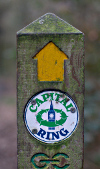
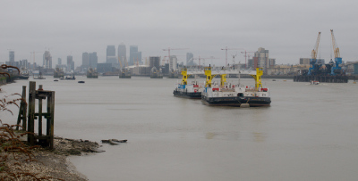
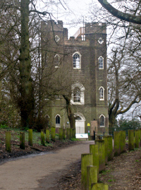
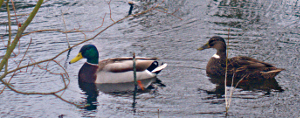

Walking the Capital Ring - Section 1
====================================

.. articleMetaData::
   :Where: London, UK
   :Date: 2016-03-30 09:23 Europe/London
   :Tags: blog, capitalring
   :Short: cr01

Another year, another walk. After taking last year off due to buying a flat,
and being generally busy, we decided that it was time for another of the big
`Walk London`_. Two years ago we did the London LOOP_, and this year we are
walking the `Capital Ring`_, its smaller cousin.

We started our walk with two Tubes and the DLR to the start at Woolwich
Arsenal; at the bottom end of the foot tunnel. From here we walked a little
bit along the Thames, looking out over the skyline and, just of reach, the
`Thames Barrier`_. We'll have to visit that another time.

After crossing the moderately busy Woolwich Road at the wrong point, we went
into Maryon Park, and up the hill over some steep steps through `Maryon Wilson
Park_`. We went the wrong way around `Charlton Park`_, but that did not add
much to the length of the walk; but it probably wasn't as pleasant. Going
across another park (`Hornfair Park`_) and `Woolwich Common`_ we found
ourselves having to cross a busy road. 

We then climbed up through Castlewood_ to `Severndroog`_ castle. An
interesting triangular castle, which also features a café. We decided to leave
this café behind and after passing through `Jack Wood`_ we climbed another
small hill. At the top, we stopped for tea and cake (yum!) at the Oxleas Wood
Café. Besides tea and cake, they also seem to offer a nice menu for breakfast
and lunch. Free WiFi too!. After our restorative tea we walked back down the
hill. A little bit of a spray wouldn't spoil the fun.

At the bottom we saw some ducks, and then the
end of Section 1 was reached near Falconwood station. If the weather would
have been better, and we hadn't been invited for "Soup" in the evening, we
could easily have done the next section too. But that will have to wait for
another weekend.

================== =======================================================================================
Route (with GPX)   `Waymarked Trails <http://hiking.waymarkedtrails.org/#route?type=relation&id=6080321>`_
Time               1h 55m 42s
Distance           9.10 km
Average Heart Rate 108 bpm
Calories Burned    1170 cal
================== =======================================================================================

For the full photo series, see my `Flickr set`_.

.. _`Walk London`: https://tfl.gov.uk/modes/walking/top-walking-routes
.. _LOOP: https://tfl.gov.uk/modes/walking/loop-walk
.. _`Capital Ring`: https://tfl.gov.uk/modes/walking/capital-ring
.. _`Thames Barrier`: https://www.gov.uk/guidance/the-thames-barrier
.. _`Maryon Wilson Park`: https://en.wikipedia.org/wiki/Maryon_Park
.. _`Charlton Park`: https://en.wikipedia.org/wiki/Charlton_Park,_Greenwich
.. _`Hornfair Park`: http://www.royalgreenwich.gov.uk/directory_record/3774/hornfair_park
.. _`Woolwich Common`: https://en.wikipedia.org/wiki/Woolwich_Common
.. _Castlewood: http://www.royalgreenwich.gov.uk/directory_record/3779/oxleas_woods_castle_wood_and_jack_wood
.. _Severndroog: https://en.wikipedia.org/wiki/Severndroog_Castle
.. _'Jack Wood`: http://www.royalgreenwich.gov.uk/directory_record/3779/oxleas_woods_castle_wood_and_jack_wood
.. _`Flickr set`: https://www.flickr.com/photos/derickrethans/albums/72157666426977111

