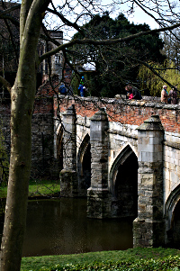
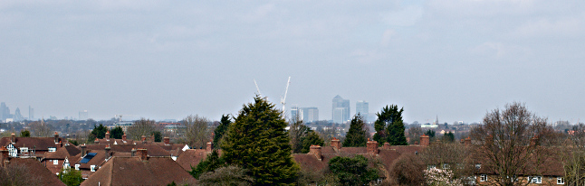
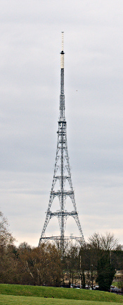

Walking the Capital Ring - Section 2 and 3
==========================================

.. articleMetaData::
   :Where: London, UK
   :Date: 2016-04-06 09:23 Europe/London
   :Tags: blog, capitalring, walking
   :Short: cr02-03

Another weekend, another walk. As we did not have anything else to do, and the
weather forecast looked promising, we decided to do two sections. A whopping
20km. We got up early, so that we could start the walk early as well. At
least, that was the plan. However, there were no trains to Falconwood and the
start of the section due to weekend engineering work. Two tubes, and
Overground, and a 45 minute bus ride later we found ourselves on the route—but
a mile too far down. As we wanted to walk the **whole** Ring, we started of
towards the start of the section, even though we had to double back on
ourselves to redo that extra mile.

Section 2
---------

We started at the pleasant `Eltham Park`_, with lots of dogs. Not surprising
as it was a gorgeous Sunday morning. After coming down the hill, we passed
through the Southern part of Eltham itself, avoiding the High Street nicely.
A loop around a roundabout brought us to North Park, with plenty of 1
million+ houses (we checked on Zoopla_). We then crossed into Tilt Yard
Approach, named after a Tiltyard_, a traditional place for jousting. The
name signalled that we were close to a palace. And we were: `Eltham Palace`.

After we quick peek through the fence, and making a note that they had a café,
we continued through the former estate along King John's Walk. Its
surroundings mostly involved horses. Big and small.

We passed by Eltham College's playing fields to come to the end of Section 2
at `Grove Park`_. This was one of the shorter sections, at only 6km.

.. _`Eltham Park`: http://www.royalgreenwich.gov.uk/directory_record/3769/eltham_park_south
.. _Zoopla: http://www.zoopla.co.uk/house-prices/london/north-park/
.. _`Tiltyard`: https://en.wikipedia.org/wiki/Tiltyard
.. _`Eltham Palace`: https://en.wikipedia.org/wiki/Eltham_Palace
.. _`Grove Park`: https://en.wikipedia.org/wiki/Grove_Park,_Lewisham

================== =======================================================================================
Route (with GPX)   `Waymarked Trails <http://hiking.waymarkedtrails.org/#route?type=relation&id=6080322>`_
Time               1h 17m 16s
Distance           6.36 km
Average Heart Rate 107 bpm
Calories Burned    643 cal
================== =======================================================================================

Section 3
---------

Continuing with section 3, the first thing we did was crossing the railways
near the station. And a massive cemetery. Through the green and leafy
residential streets, and through the Downham Woodland Walk we made our way
further along to the large `Beckenham Place Park`. Instead of taken the
quickest route to the associated golf club's clubhouse, we wandered around it
a little bit, by going over another railway, up the hill, down the hill, and
up a hill again to finally make it to the club house.

We were definitely ready for a break. Keeping the walks booze free, we opted
for tea, with sweet potato fries. After this break enjoying the tea, sun, and
view over the golf course, we continued our walk. The first thing we hit was
the sprawling grounds of the `Kent County Cricket Club`_ in Beckenham. 

With the `Crystal Palace transmitting station`_ to lead us, we spend several
twists going through parks. First `Cator Park`_ and then the `Alexandra
Park`_. After crossing over the railway at Penge East, and passing the closed
down Hollywood East pub, we saw the antenna getting closer and closer. After a
little stretch along the busy Penge High Street we finally made it to Crystal
Palace, were we had to make a choice: either following the route through the
`Dinosaur Park`_, or the longer route along the outside of `Crystal Palace
Park`_. We opted to go for the walk through the Dinosaur Park, as signage
indicated that that was the *official* route, and the other one the
alternative one in case the Dinosaur Park was closed.

The Dinosaur Park is a Victorian oddity, with statues of how they thought that
several types of dinosaurs would look like. But they did mix some species up,
and one only shows it's bottom as they hadn't found the skulls yet. It's worth
a visit if you're in the neighbourhood. As we gad previously visited it, we
did not spend a lot of time there, but instead headed to the end of section 3
at Crystal Palace station.

From there we went home, stopping at several pubs (`The Rake`_ and the new
`Waterloo Tap`_) before collapsing at home from the slightly over 20km that we
walked that day.

.. _`Beckenham Place Park`: https://en.wikipedia.org/wiki/Beckenham_Place_Park
.. _`Kent County Cricket Club`: http://www.kentcricket.co.uk/
.. _`Crystal Palace transmitting station`: https://en.wikipedia.org/wiki/Crystal_Palace_transmitting_station
.. _`Cator Park`: http://www.bromley.gov.uk/directory_record/1212676/cator_park
.. _`Alexandra Park`: http://www.friendsofcatorandalexandra.com/
.. _`Dinosaur Park`: https://en.wikipedia.org/wiki/Crystal_Palace_Dinosaurs
.. _`Crystal Palace Park`: https://en.wikipedia.org/wiki/Crystal_Palace_Park
.. _`The Rake`: http://www.utobeer.co.uk/the-rake/
.. _`Waterloo Tap`: http://www.waterlootap.com/

================== =======================================================================================
Route (with GPX)   `Waymarked Trails <http://hiking.waymarkedtrails.org/#route?type=relation&id=6084014>`_
Time               2h 20m 38s
Distance           11.66 km
Average Heart Rate 114 bpm
Calories Burned    1515 cal
================== =======================================================================================

For the full photo series, see my `Flickr set`_.

.. _`Walk London`: https://tfl.gov.uk/modes/walking/top-walking-routes
.. _LOOP: https://tfl.gov.uk/modes/walking/loop-walk
.. _`Capital Ring`: https://tfl.gov.uk/modes/walking/capital-ring
.. _`Thames Barrier`: https://www.gov.uk/guidance/the-thames-barrier
.. _`Maryon Wilson Park`: https://en.wikipedia.org/wiki/Maryon_Park
.. _`Charlton Park`: https://en.wikipedia.org/wiki/Charlton_Park,_Greenwich
.. _`Hornfair Park`: http://www.royalgreenwich.gov.uk/directory_record/3774/hornfair_park
.. _`Woolwich Common`: https://en.wikipedia.org/wiki/Woolwich_Common
.. _Castlewood: http://www.royalgreenwich.gov.uk/directory_record/3779/oxleas_woods_castle_wood_and_jack_wood
.. _Severndroog: https://en.wikipedia.org/wiki/Severndroog_Castle
.. _'Jack Wood`: http://www.royalgreenwich.gov.uk/directory_record/3779/oxleas_woods_castle_wood_and_jack_wood
.. _`Flickr set`: https://www.flickr.com/photos/derickrethans/albums/72157666426977111

