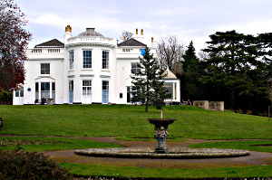
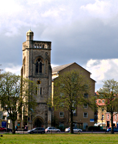
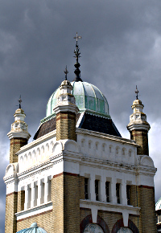
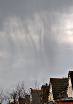

Walking the Capital Ring - Section 4 and 5
==========================================

.. articleMetaData::
   :Where: London, UK
   :Date: 2016-04-14 09:19 Europe/London
   :Tags: blog, capitalring
   :Short: cr04-05

We found ourselves walking another few sections of the Capital Ring last
weekend. We picked up some lunch to eat on the train at Victoria and traveled
to Crystal Palace to start. The weather looked reasonable, but some light rain
was forecasted for later in the day.

Section 4
---------

The first kilometer of the section was nearly fully up hill. Luckily, that
meant that there were some pretty good views towards the West from `Westow
Park`_. Although we were pretty sweaty by this point. You can also see the 
results of this exertion back in the higher average heart rate for this
section.

From there on, after a steep(er) hill down into `Biggin Wood`_ we
quickly came up to Norwood Grove with its stately home. We admired the
gardens, a blue plaque, and got slightly lost due to confusing signs.
Apparently dogs are not allowed near the house. From Norwood Grove, we gently
descended again around `The Rookery`_, a formal garden, where we had a quick
stop, before continuing across `Streatham Common`_. After half a mile, we
already found ourselves at the end of the hilliest section near Streatham
Common station.

.. _`Westow Park`: http://www.londongardensonline.org.uk/gardens-online-record.asp?ID=CRO093
.. _`Biggin Wood`: http://www.woodlandtrust.org.uk/visiting-woods/wood/33146/biggin-wood/
.. _`The Rookery`: http://www.lambeth.gov.uk/places/the-rookery
.. _`Streatham Common`: https://en.wikipedia.org/wiki/Streatham_Common

================== =======================================================================================
Route (with GPX)   `Waymarked Trails <http://hiking.waymarkedtrails.org/#route?id=6084023>`_
Time               1h 19m 47s
Distance           6.70 km
Average Heart Rate 115 bpm
Calories Burned    794 cal
================== =======================================================================================

Section 5
---------

We didn't stop for a break, but continued our walk by going under some railway
tracks and found ourselves staring at the pretty `Streatham Pumping Station`_.
We had a snack, and continued along to get to `Tooting Bec Common`_. There
were plenty of other walkers and runners about, and many people seemed to be
playing some sportsbal on the pitches. We made a slight "detour" to checkout
the Balham Boxing Club (really we went the wrong way) and came out of the
Common to walk among the residential areas of Tooting and Balham.

Only a short while later we came to another common: `Wandsworth Common`_.
Perhaps not as large as Tooting Bec Common, but certainly as pleasant. Less
pleasant were the few drops of rain failing on our heads. The rain didn't set
in properly just yet, and we continued past `Wandsworth Prison`_ and the
massive `Wandsworth Cemetery`_. At the end of the cemetery lies Earlsfield.
Unfortunately, the rain became more intense here, and we were happy to have
our rain coats with us. Then again, walking in the UK without one **is**
rather silly.

After Earlsfield town centre we walked along Mount Road, where I stayed with a
classmate at a guest family for a few days all the way when I was in high
school. We found that the official route got blocked by a (new) private
playground at `Durnsford Road Recreation Ground`_ and took a (tiny) detour.
After a short walk up the hill, we arrived at Wimbledon Park station to
conclude section 5.

.. _`Streatham Pumping Station`: http://www.28dayslater.co.uk/streatham-pumping-station-london-december-2014.t93428
.. _`Tooting Bec Common`: https://en.wikipedia.org/wiki/Tooting_Commons
.. _`Wandsworth Common`: https://en.wikipedia.org/wiki/Wandsworth_Common
.. _`Wandsworth Prison`: https://en.wikipedia.org/wiki/HM_Prison_Wandsworth
.. _`Wandsworth Cemetery`: http://www.wandsworth.gov.uk/info/200032/funerals_and_cremations/86/cemeteries_and_crematorium/2http://www.wandsworth.gov.uk/info/200032/funerals_and_cremations/86/cemeteries_and_crematorium/2
.. _`Durnsford Road Recreation Ground`: http://www.merton.gov.uk/environment/openspaces/parks/parks_in_the_wimbledon_area/durnsford_recreation_ground.htm

================== =======================================================================================
Route (with GPX)   `Waymarked Trails <http://hiking.waymarkedtrails.org/#route?id=6118565>`_
Time               1h 48m 28s
Distance           9.47 km
Average Heart Rate 110 bpm
Calories Burned    1018 cal
================== =======================================================================================

For the full photo series, see my `Flickr set`_.

.. _`Flickr set`: https://www.flickr.com/photos/derickrethans/albums/72157666426977111
