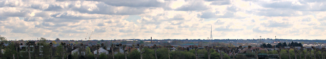
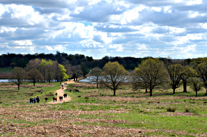
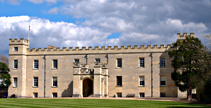
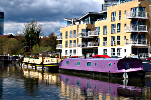

Walking the Capital Ring - Section 6 and 7
==========================================

.. articleMetaData::
   :Where: London, UK
   :Date: 2016-04-21 09:19 Europe/London
   :Tags: blog, capitalring
   :Short: cr06-07

New weekend, same drill. The weather was forecasted to be a little chilly, but
sunny. After our tube rides to Wimbledon Park, we could begin our walk.

Section 6
---------

Wimbledon Park, as the name suggests is close to the Wimbledon Tennis Club.
Although they officially want you to go through Southfields station, the walk
from Wimbledon Park station would go through `Wimbledon Park`_ (the park, not the
station). And that's where our first bit of the walk passed through. It was a
little bit busy in the park and after walking by the lake with swans, we soon
left it towards the tennis fields. We never quite made it there though, and
instead, we entered `Wimbledon Common`_. After a few "rough tracks" with a little
bit of mud, we encountered its main attraction: the Wimbledon Windmill (or
perhaps the accompanying tea rooms?). After crossing the Wimbledon Common
Golf Club we had to wait ages to cross the A3_ to get to the Robin Hood
Gate and `Richmond Park`_. It had a funny Pegasus crossing too.

Richmond Park is the largest of London's Royal Parks. After finding our way
around the car park, we started the walk up a hill: Spankers Hill, and then
back down again to pass in between the two Pen Ponds. After going up another
hill, and "avoiding" a short cut, we spotted one of the UK's oldest trees. At
apparently more than 750 years old, the `Richmond Royal Oak`_ is quite a sight.

From here on it was mostly downhill into Richmond. After going around St
Peter's and its church yard, and crossing a farm and a field, we ended up at
the river Thames_. We broke for lunch at the end of section 6, at the `White
Cross`_, for a pint and some fish and chips.

Section 6 is so far my favourite. With the beautiful weather helping, the
views at Richmond Park where a definite pleasure to look at. We didn't spot
deer, or Fenton_ though.

.. _`Wimbledon Park`: https://en.wikipedia.org/wiki/Wimbledon_Park
.. _`Wimbledon Common`: https://en.wikipedia.org/wiki/Wimbledon_Common
.. _A3: https://en.wikipedia.org/wiki/A3_road_%28Great_Britain%29
.. _`Richmond Park`: https://en.wikipedia.org/wiki/Richmond_Park
.. _`Pegasus`: https://en.wikipedia.org/wiki/Pegasus_crossing
.. _`Richmond Royal Oak`: http://geobrit.uk/2767057311-richmond-royal-oak-tree-c1260-tree-richmond-upon-thames-tq193731
.. _Thames: https://en.wikipedia.org/wiki/River_Thames
.. _`White Cross`: http://thewhitecrossrichmond.com/
.. _Fenton: https://www.youtube.com/watch?v=bmpONxJ7JSw

================== =======================================================================================
Route (with GPX)   `Waymarked Trails <http://hiking.waymarkedtrails.org/#route?id=6118618>`_
Time               2h 10m 18s
Distance           10.9 km
Average Heart Rate 106 bpm
Calories Burned    1106 cal
================== =======================================================================================

Section 7
---------

With the weather being so perfect, we continued our hike along the river.
After a short while we crossed it on the Richmond Lock footbridge to continue
on the North side. We had to leave the river to get around a new development
for a bit, to come back, but only for a short time. After about a kilometer we
left the river to walk through `Syon Park`_, with its manor house and garden
centre.

After leaving the park, we found ourselves at Brentford, where the river
Brent_ meets the Thames. The `Grand Union Canal`_ and the river Brent_ share a
few stretches of water here too. We set off along the canal along the tow
path. There was a nice contrast between the locks, colourful canal boats, and
GSK's modern HQ. It was quite nice going on the tow path, but the sound of the
M4_ was a little distracting. We passed two sets of locks, crossed the
canal/river on Gallow's Bridge, and ended our walk near Boston Manor just
before getting to `Osterley Lock`_.

.. _`Syon Park`: http://www.syonpark.co.uk/
.. _Brent: https://en.wikipedia.org/wiki/River_Brent
.. _`Grand Union Canal`: https://en.wikipedia.org/wiki/Grand_Union_Canal
.. _M4: https://en.wikipedia.org/wiki/M4_motorway
.. _`Osterley Lock`: http://canalplan.eu/gazetteer/imc6

================== =======================================================================================
Route (with GPX)   `Waymarked Trails <http://hiking.waymarkedtrails.org/#route?id=6143525>`_
Time               1h 12m 54s
Distance           6.28 km
Average Heart Rate 110 bpm
Calories Burned    728 cal
================== =======================================================================================

For the full photo series, see my `Flickr set`_.

.. _`Flickr set`: https://www.flickr.com/photos/derickrethans/albums/72157666426977111
