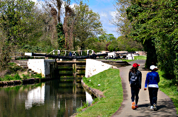
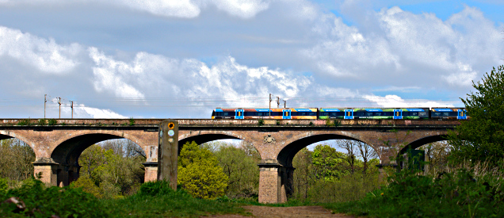
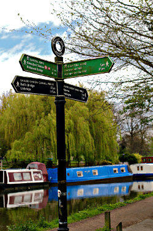
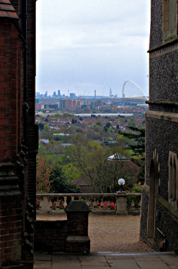

Walking the Capital Ring - Section 8 and 9
==========================================

.. articleMetaData::
   :Where: London, UK
   :Date: 2016-04-28 09:11 Europe/London
   :Tags: blog, capitalring
   :Short: cr08-09

Another nice weekend for a walk. Again, it was a little chilly, but nice
weather. The tube ride to Boston Manor was uneventful. After a quick walk to
the start of the section, we started our walk.

Section 8
---------

Just as we ended the last walk wandering along the Grand Union canal, this
walk started with a little bit of the same. After passing by `Osterley Lock`_ we
soon however left the canal, just before getting to the triple locks of
`Hanwell Lock`_. Instead of the canal, we started following the river Brent
through a meadow. Near Uxbridge road, the original Ring went under the bridge,
but it has now been diverted. The incredible amount of stinking mud under the
bridge was probably the reason. Good thing that I can't smell really. After
figuring out the diversion, we ended up on a grassy field with a Heathrow
Express train going over the `Wharncliffe Viaduct`_.

Passing underneath the Victorian structure brought us to Brent Lodge Park,
also called "`Bunny Park`_". I think I prefer the latter name. We followed the
river through the park for a bit, and spotted some parakeets. Literally every
single park we have come through seem to be full of them. Apparently they
thrive well in the London parks! The park also features the `Millennium
Maze`_, but that is something for another time. After leaving the bunnies, we
cross over the `Brent Valley Public Golf Course`_, and were nearly hit by a
flying golf ball (not really).

From there on we continued past Bittern Field (a format garbage dump).
Crossing Ruislip Road brought us to `Perivale Park`_ with its open spaces and
playing fields. From there on we crossed the busy `Western Avenue (A40)`_
over the footbridge and past the tube railway to end up at Greenford. The end
of section 8.

.. _`Osterley Lock`: http://canalplan.eu/gazetteer/imc6
.. _`Hanwell Lock`: https://canalrivertrust.org.uk/places-to-visit/destination/65/hanwell-lock-flight
.. _`Wharncliffe Viaduct`: https://en.wikipedia.org/wiki/Wharncliffe_Viaduct
.. _`Bunny Park`: https://www.ealing.gov.uk/info/201136/parks_in_the_borough/664/hanwell_parks/2
.. _`Millennium Maze`: https://www.ealing.gov.uk/info/201136/parks_in_the_borough/664/hanwell_parks/2
.. _`Brent Valley Public Golf Course`: http://bvgc.org/
.. _`Perivale Park`: https://www.ealing.gov.uk/info/201136/parks_in_the_borough/666/perivale_parks
.. _`Western Avenue (A40)`: https://en.wikipedia.org/wiki/Western_Avenue,_London

================== =======================================================================================
Route (with GPX)   `Waymarked Trails <http://hiking.waymarkedtrails.org/#route?id=6143526>`_
Time               1h 31m 50s
Distance           8.08 km
Average Heart Rate 110 bpm
Calories Burned    798 cal
================== =======================================================================================

Section 9
---------

Right at the start of section 9 is the `Westway Cross Retail Park`_, with some
shops and fast food outlets. Not knowing what would come, we decided we wanted
some proper food, like an upcoming café. We left the retail park behind and
crossed through the `Paradise Fields`_ nature reserve to end up at the `Grand
Union Canal_` again, but this time the `Paddington Branch`_. Technically, we
can follow this all the way home, near Little Venice. Instead we left it
behind at `Ballot Box Bridge`_ to get some well deserved tea and cake at the
`Horsenden Hill Visitors' Centre`_. Unfortunately, it was closed. Or rather,
there was hardly any sign that there *is* normally a visitors centre. The loos
were locked too.

So *without* the cake and tea, we had to climb `Horsenden Hill`_. The view
wasn't spectacular, and we were getting a little bit grumpy due to no food.
Luckily at the bottom of the bill would be a pub, the Ballot Box. After
descending through a path of mud (we got more grumpier), we finally ended up
at the pub, only to find it closed as it was being refurbished/changed into a
`Hungry Horse`_. The parade across the road wasn't particularly useful either
for food. More grumps. The next possibility to get some food would be in
Sudburry Hill, but that required another climb. It's called Sudburry *Hill*
for a reason. Sadly, when getting there we found nothing to our taste. 

Our last chance for lunch would be `Harrow-on-the-Hill`_. As the name suggests
*again*, it was up a hill. But here we finally found a lunch place to our
liking. The little creperie/art gallery Battels_ does wonderful crêpes, albeit
with a little wait. Service wasn't great, and slow, but the food was good, and
frankly we really deserved it after all these hills!

From here on, it would be only another two miles hike to the end of section 9.
The first bit was through the grounds of `Harrow School`_, and the last bit
past the `Northwick Park Hospital`_ and the `Northwick Park golf course`_.
Arriving at `South Kenton`_, it was only a short tube ride back home for a
well deserved pint.

.. _`Westway Cross Retail Park`: http://completelyretail.co.uk/portfolio/RoyalLondon/scheme/Westway-Cross-Shopping-Park-London/index
.. _`Paradise Fields`: http://www.kidsfunlondon.co.uk/days-out/ealing/park/paradise-fields.html
.. _`Grand Union Canal`: http://www.grandunioncanal.co.uk/
.. _`Paddington Branch`: http://www.grandunioncanal.co.uk/Paddington-Arm.html
.. _`Ballot Box Bridge`: http://canalplan.eu/gazetteer/051o
.. _`Horsenden Hill Visitors Centre`: http://hidden-london.com/gazetteer/horsenden-hill/
.. _`Horsenden Hill`: https://en.wikipedia.org/wiki/Horsenden_Hill
.. _`Hungry Horse`: http://www.hungryhorse.co.uk/
.. _`Harrow-on-the-Hill`: https://en.wikipedia.org/wiki/Harrow_on_the_Hill
.. _Battels: https://www.facebook.com/BattelsHarrow/
.. _`Harrow School`: https://en.wikipedia.org/wiki/Harrow_School
.. _`Northwick Park Hospital`: http://www.lnwh.nhs.uk/patients-visitors/locations-of-our-services/northwick-park-and-st-marks-hospitals/
.. _`Northwick Park golf course`: http://www.northwickpark.com/
.. _`South Kenton`: https://en.wikipedia.org/wiki/South_Kenton_station

================== =======================================================================================
Route (with GPX)   `Waymarked Trails <http://hiking.waymarkedtrails.org/#route?id=6143527>`_
Time               1h 59m 23s
Distance           9.37 km
Average Heart Rate 118 bpm
Calories Burned    1600 cal
================== =======================================================================================

For the full photo series, see my `Flickr set`_.

.. _`Flickr set`: https://www.flickr.com/photos/derickrethans/albums/72157666426977111
