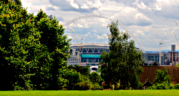
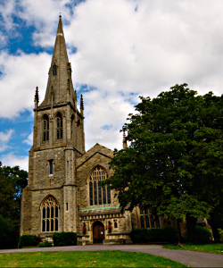
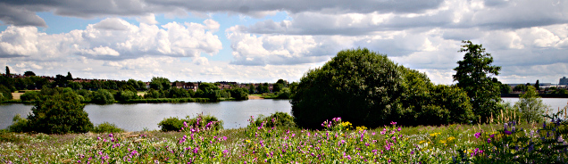

Walking the Capital Ring - Section 10
=====================================

.. articleMetaData::
   :Where: London, UK
   :Date: 2016-08-30 09:11 Europe/London
   :Tags: blog, capitalring
   :Short: cr10

I'm way behind typing these up. About two months!

Section 10
----------

What should have been a quick tube ride up to South Kenton, ended up taking
nearly 2 hours. You guess it, Sunday Rail Engineering Works. On top of that,
we got a replacement bus, with a driver that had no idea where to go.
Initially he went the wrong direction along the line. As it was a bit unclear
whether it would actually stop at South Kenton, we got off one stop earlier at
North Wembley, and walked to the start instead.

Once we started with the walk, we quickly realized that it was unlikely that
we were going to walk two stages (10 and 11). The first 10 minutes made it
very clear it was going to be warm, and very sweaty.

We quickly came through `Preston Park`_, and upon Preston "High" Road, which
we crossed to walk through a few residential streets to start up our climb up
the hill through the `Barn Hill Open Space`_. We had a quick water break at
the stop—it was really warm and humid—for some relaxing. The Ring then goes
around the little lake on the top of the hill, where you can find a trigpoint
and a lovely view of Wembley Stadium.

After crossing a road, we had another small climb in `Fryent Country Park`_.
It was a bit tricky to follow the route there with vague signing, and the
presence of lots of little rows of trees, making navigating quite tricky. As
this `section of the Capital Ring`_ was mapped well on OpenStreetMap_, we find
our way out, and assisted a local to find her way out of the maze_ as well.

We continued among more residential streets and ended up circling `St.
Andrew's Kingsbury`_ church. After having a look at its cemetery we walked
around the `Welsh Harp Sailing Association`_. The name comes from nearby
`Welsh Harp`_, which is a large water reservoir to supply London homes with
drinking water. A large part of the rest of Section 10 goes past this
reservoir. We stopped again for a little water break.

After crossing the narrow bridge over the Silk Stream we shortly came upon
West Hendon Broadway. Section 10 goes all the way to `Hendon Park`_, but we
chickened out early here. I ended up `extensively mapping`_ many of the shops
along the Broadway. From here on, it was a straight bus down to Kilburn.

.. _`Preston Park`: https://www.brent.gov.uk/services-for-residents/sport-leisure-and-parks/parks/park-finder/preston-park/
.. _`Barn Hill Open Space`: http://www.bhcg.btck.co.uk/
.. _`Fryent Country Park`: https://en.wikipedia.org/wiki/Fryent_Country_Park
.. _`section of the Capital Ring`: http://www.openstreetmap.org/relation/6473820
.. _OpenStreetMap: https://www.openstreetmap.org
.. _maze: http://www.openstreetmap.org/relation/6473820#map=17/51.57726/-0.27170
.. _`St. Andrew's Kingsbury`: http://www.standrewskingsbury.org.uk/
.. _`Welsh Harp Sailing Association`: http://www.welshharp.org.uk/
.. _`Welsh Harp`: https://en.wikipedia.org/wiki/Brent_Reservoir
.. _`Hendon Park`: https://en.wikipedia.org/wiki/Hendon_Park
.. _`extensively mapping`: http://www.openstreetmap.org/changeset/41407283

================== =======================================================================================
Route (with GPX)   `Waymarked Trails <http://hiking.waymarkedtrails.org/#route?id=6473820>`_
Time               1h 52m 37s
Distance           8.73 km
Average Heart Rate 103 bpm
Calories Burned    970 cal
================== =======================================================================================

For the full photo series, see my `Flickr set`_.

.. _`Flickr set`: https://www.flickr.com/photos/derickrethans/albums/72157666426977111
