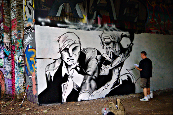
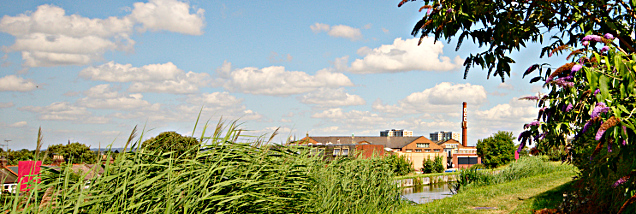
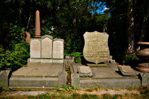

Walking the Capital Ring - Section 12
=====================================

.. articleMetaData::
   :Where: London, UK
   :Date: 2016-09-06 09:11 Europe/London
   :Tags: blog, capitalring, walking
   :Short: cr12

Section 12
----------

We started at Highgate, and the first part of the walk was through `Parkland
Walk`_ `Local Nature Reserve`_. Probably for a good 2 miles. It used to be the
site of an old railway line, and near Crouch End, you can still find the
remains of former platforms. It is a lovely sheltered part, and where there
are bridges, there is also graffiti. Some of it illegal and shit, but mostly
pieces of art. When we came past, there were artists creating new pieces.

At the end of the Parkland walk, we crossed into `Finsbury Park`_. The breeze
there was very welcome, as it was another warm and humid day. I hadn't
realized that it was such a large park! 

Coming out of the park we followed the course of the `New River`_: an
artificial water way meant to supply London with fresh drinking water. Parts
of it are lovely, but there was also a **lot** of rubbish floating around in
it.

After crossing Seven Sisters Road, the walk looped back towards Finsbury Road
and along the East and West Reservoirs. There were many new developments along
this stretch, which resulted in the path (and Capital Ring) being diverted
along some shiny new footpaths. There was also a `shiny ball`_.

At the end of the path around the reservoirs, and before entering `Clissold
Park`_, we passed by a strange looking building — in the shape of a castle.
This later turned out to be the `Castle Climbing Centre`_. The park was very
busy, which was no surprise as it was a lovely day.

The last part of the walk started out with a tedious stroll along Stoke
Newington High Street, which I also ended up `mapping in great detail`_.
Leaving the busy High Street, we entered `Abney Park`_. One of London's
`Magnificent Seven`_ cemeteries_. Unfortunately it's lovely chapel_ was hidden
behind scaffolding. 

The section ends when we got out of the park. A quick walk later we ended up
at Stoke Newington station, to find our way home.

.. _`Parkland Walk`: https://en.wikipedia.org/wiki/Parkland_Walk
.. _`Local Nature Reserve`: https://www.parkland-walk.org.uk/
.. _`Finsbury Park`: https://en.wikipedia.org/wiki/Finsbury_Park
.. _`New River`: https://en.wikipedia.org/wiki/New_River_(England)
.. _`shiny ball`: http://www.openstreetmap.org/node/4344790759
.. _`Clissold Park`: https://en.wikipedia.org/wiki/Clissold_Park
.. _`Castle Climbing Centre`: https://www.castle-climbing.co.uk/
.. _`mapping in great detail`: http://www.openstreetmap.org/changeset/41375104
.. _`Abney Park`: http://www.abneypark.org/
.. _`Magnificent Seven`: https://en.wikipedia.org/wiki/Magnificent_Seven_cemeteries
.. _cemeteries: https://en.wikipedia.org/wiki/Abney_Park_Cemetery
.. _chapel: https://en.wikipedia.org/wiki/Abney_Park_Chapel

================== =======================================================================================
Route (with GPX)   `Waymarked Trails <http://hiking.waymarkedtrails.org/#route?id=6474994>`_
Time               1h 47m 16s
Distance           8.90 km
Average Heart Rate 104 bpm
Calories Burned    863 cal
================== =======================================================================================

For the full photo series, see my `Flickr set`_.

.. _`Flickr set`: https://www.flickr.com/photos/derickrethans/albums/72157666426977111
