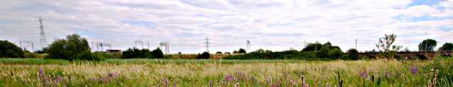
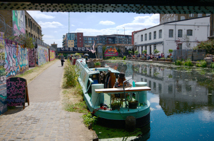

Walking the Capital Ring - Section 13
=====================================

.. articleMetaData::
   :Where: London, UK
   :Date: 2016-09-08 09:11 Europe/London
   :Tags: blog, capitalring, walking
   :Short: cr13

Section 13
----------

This section starts at Stoke Newington going along some residential streets.
After coming through `Springfield Park`_, it follows the river Lea_ for the
rest of the walk.

.. image:: images/cr-d37_7560.jpg
   :align: right

When crossing the bridge over the river, you have a fine view of the `Lee
Valley Marina`_, as well as the river itself. At the point where we crossed,
there were many canal boats moored.

*Note: I didn't misspell Lea or Lee. There is a naming confusion (caused by
parliament in the 1760s). The distinction is made between natural features
(Lea) or artificial features (Lee).*

With the river Lea on the right, and the Walhamstow Marshes on the left, we
had a pleasant stroll along the tow path, although it was rather busy.
Combined with some inconsiderate cyclists it wasn't particularly a relaxing
walk. As there is space enough, it would be better if there were two separate
paths - one for cyclists, and one for pedestrians.

We walked underneath the `A. V. Roe Arches`_, named after A.V. Roe, who
built his first powered air planes here to fly over the nearby marshes. There
is a blue plaque to dedicate this event. It is however slightly hidden, and
you need to cross patches with nettles.

After the Lee Canal split off from the River Lea, the Walthamstow Marches were
replaced by the Hackney Marches on our left. Apparently they are in the
Guinness Book of Records as having the largest collection of football pitches.

The walk ends at the Olympic Park, or rather now, `The Queen Elizabeth Olympic
Park`_. It is still very much under development, but at least the park is open
now. The section itself stops right at the `Crate Brewery`_. Unfortunately we
only found out after having left the canal, while enjoying a pint at `Tap
East`_.

.. _`Springfield Park`: https://en.wikipedia.org/wiki/Springfield_Park_(London)
.. _Lea: https://en.wikipedia.org/wiki/River_Lea
.. _`Lee Valley Marina`: https://www.visitleevalley.org.uk/en/content/cms/outdoors/marinas/springfield-marina/
.. _`A. V. Roe Arches`: https://en.wikipedia.org/wiki/Alliott_Verdon_Roe
.. _`The Queen Elizabeth Olympic Park`: http://queenelizabetholympicpark.co.uk/
.. _`Crate Brewery`: http://cratebrewery.com/
.. _`Tap East`: http://www.tapeast.co.uk/

================== =======================================================================================
Route (with GPX)   `Waymarked Trails <http://hiking.waymarkedtrails.org/#route?id=6490278>`_
Time               1h 08m 52s
Distance           6.35 km
Average Heart Rate 106 bpm
Calories Burned    571 cal
================== =======================================================================================

For the full photo series, see my `Flickr set`_.

.. _`Flickr set`: https://www.flickr.com/photos/derickrethans/albums/72157666426977111
