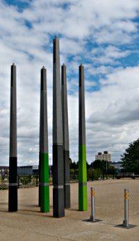
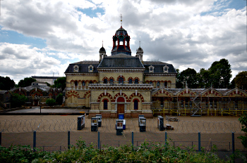

Walking the Capital Ring - Section 14
=====================================

.. articleMetaData::
   :Where: London, UK
   :Date: 2016-09-13 09:11 Europe/London
   :Tags: blog, capitalring, walking
   :Short: cr14

Section 14
----------

Upon setting off on the penultimate section, we quickly looped around the
Olympic Station, now the London Station, home of `West Ham`_. There is a lot of
new landscaping, that's not *quite* finished yet around here. We left the Lee
soon enough, and walked towards Stratford High Street. There Crossrail_ work
near Pudding Mill Lane station, where the Ring was diverted along an
industrial estate. This was badly signposted. I've updated OpenStreetMap_ with
the current route, but it will have to be redone once the works are over.
Once they are, it should be easy enough to navigate from Victoria Walk to the
Greenway.

In our case, we had to spend a little bit of time to fine the Greenway, but
once we got there it was a **very** easy route. In fact, for 80% of this
section, you walk in a straight line over the Greenway.

Near the start of the Greenway, the walk goes past the `Abbey Mills Pumping
Station`_, which has been pumping sewage around since the 1860s. As a matter
of fact, the Greenway that we were walking on, is actually a long footpath and
cycleway on top of the `Northern Outfall Sewer`_. This then also explained the
nice fragrances along this stretch of the route...

It was a long and monotonous walk along the Greenway, and we were pleased once
we left it and could walk the last bit of this section through `Beckton
District Park`_. When coming out of the park, we had concluded this section.
One more to go!

.. _`West Ham`: http://www.whufc.com/
.. _Crossrail: https://en.wikipedia.org/wiki/Crossrail
.. _OpenStreetMap: https://www.openstreetmap.org
.. _Greenway: https://en.wikipedia.org/wiki/Greenway,_London
.. _`Abbey Mills Pumping Station`: https://en.wikipedia.org/wiki/Abbey_Mills_Pumping_Station
.. _`Northern Outfall Sewer`: https://en.wikipedia.org/wiki/Northern_Outfall_Sewer
.. _`Beckton District Park`: https://en.wikipedia.org/wiki/Beckton_District_Park_North

================== =======================================================================================
Route (with GPX)   `Waymarked Trails <http://hiking.waymarkedtrails.org/#route?id=6490317>`_
Time               1h 37m 38s
Distance           8.24 km
Average Heart Rate 108 bpm
Calories Burned    836 cal
================== =======================================================================================

For the full photo series, see my `Flickr set`_.

.. _`Flickr set`: https://www.flickr.com/photos/derickrethans/albums/72157666426977111
