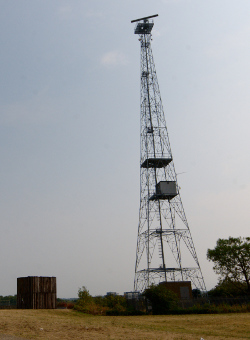
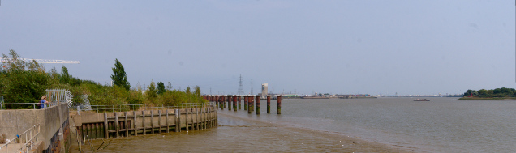
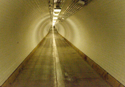

Walking the Capital Ring - Section 15
=====================================

.. articleMetaData::
   :Where: London, UK
   :Date: 2016-09-13 09:11 Europe/London
   :Tags: blog, capitalring
   :Short: cr15

Section 15
----------

In this last section, we walked around `London City airport`_. Well, sorta.
Starting off at Beckton Park, and its Jake Russell Walk we started the last
section of the Capital Ring. After Beckton Park, we walked through new Beckton
Park as well, before coming to Cyprus DLR station.

The Capital Ring as mapped on OpenStreetMap, diverged from the route on the
TFL site, and the signage on the ground. Instead of following the Royal Albert
Way, it no goes through the `University of East London` and along the Royal
Albert Dock for a while. I can imagine this being a little nicer than a dual
carriage way. 

At the end of the path along the dock, we had a little stint through an
industrial estate, with a radar mast in sight at the end. The radar mast was
straight on the Thames, and that point ended up being the furthest East on the
Capital Ring: `Galleons Point`_. The tide on the Thames was low, exposing
loads of shopping trolleys and other rubbish.

From there, we crossed two sets of locks. A small one, and the much larger
King George the 5th lock. Galleons Point is another new development. Now along
the Thames, we passed by the `Royal Victoria Gardens`_ and ended up at North
Woolwich.

The old station at North Woolwich at one time housed a museum, but that is now
closed. Close behind it are Crossrail works, where a tunnel under the Thames
for the new railway starts.

At this point, we could have taken the ferry across to Woolwich, and the end
of the Capital Ring. Instead, we decided to walk through the `Woolwich Foot
Tunnel`_. This and the Greenwich Foot Tunnel are the only two pedestrian only
tunnels under the Thames, built in the early 1900s. Apparently, photography is
forbidden, but I only found that out while writing up this blog post!

At the other end of the tunnel, we walked the last 50 meters to the end of the
section, and with that, the Capital Ring!

.. _`London City Airport`: https://www.londoncityairport.com/ 
.. _`University of East London`: https://www.uel.ac.uk/
.. _`Galleons Point`: http://gallionspointmarina.co.uk/
.. _`Royal Victoria Gardens`: http://www.londongardensonline.org.uk/gardens-online-record.asp?ID=NEW027
.. _`Woolwich Foot Tunnel`: https://en.wikipedia.org/wiki/Woolwich_foot_tunnel

================== =======================================================================================
Route (with GPX)   `Waymarked Trails <http://hiking.waymarkedtrails.org/#route?id=6490318>`_
Time               1h 12m 14s
Distance           5.88 km
Average Heart Rate 105 bpm
Calories Burned    659 cal
================== =======================================================================================

For the full photo series, see my `Flickr set`_.

.. _`Flickr set`: https://www.flickr.com/photos/derickrethans/albums/72157666426977111
