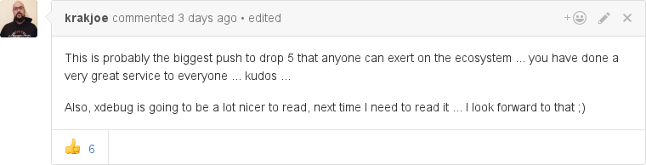

Good Bye PHP 5
==============

.. articleMetaData::
   :Where: London, UK
   :Date: 2017-01-11 09:44 Europe/London
   :Tags: blog, php, xdebug
   :Short: byephp5

A few days ago I merged a patch into Xdebug_ that removes support for PHP 5 in
Xdebug's master branch `on GitHub`_. Maintaining PHP 5 and PHP 7 support in
one code base is not particularly easy, and even more complicated for
something like Xdebug, with its deep interactions with PHP's internals.

As PHP 5.6's active support has ended on December 31st, I also felt it no
longer needed to support PHP 5 with Xdebug any more. It saves more than 5000
lines of code:

Many people people were quite positive about that:

Others were less keen:

.. image:: images/xdebug-php5-Nabbeshin.png
   :alt: https://twitter.com/Nabbeshin/status/818881779788615681

Removing PHP 5 support from Xdebug's master branch does not mean that Xdebug
suddenly stops working for PHP 5 installations. Xdebug 2.5, which was recently
released supports PHP 5.5 and 5.6, and is not going to go away.

Right now, Xdebug will no longer receive new features in the branch that also
supports PHP 5. New features will only go into master (to become Xdebug 2.6).
However, Xdebug 2.5 continues to `receive bug fixes`_ until Xdebug 2.6 comes
out.

Once Xdebug 2.6 comes out, the Xdebug 2.5 branch will no longer get bug fixes,
and hence support for PHP 5 goes away. That **still** does not mean that you
can no longer use Xdebug with PHP 5. The releases of the 2.5 branch will still
be available.

On the positive side, not having to implement lots of code twice, also means
that new features can be added faster, as less work is required. Xdebug 2.6
has already have some `new features lined up`_.

.. _Xdebug: https://xdebug.org
.. _`on GitHub`: https://github.com/xdebug/xdebug
.. _`receive bug fixes`: https://bugs.xdebug.org/changelog_page.php?version_id=42
.. _`new features lined up`: https://bugs.xdebug.org/roadmap_page.php?version_id=43
