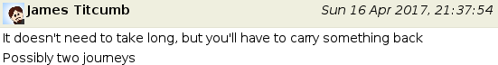

15 years of Xdebug
==================

.. articleMetaData::
   :Where: London, UK
   :Date: 2017-05-09 14:00 Europe/London
   :Tags: blog, php, xdebug
   :Short: xdebug-10

This article was going to be about some upcoming features in the 2.6 release.
Or rather, I was hoping to announce at least a beta release of Xdebug 2.6.
Unfortunately, I couldn't find enough time to work on all the issues_ that I
wanted, although I've made a little progress.

.. _issues: https://bugs.xdebug.org/roadmap_page.php?version_id=43

What I can write about, is a little mystery. About 3 weeks ago, I got a
mysterious invitation to meet up with James Titcumb, right outside my (and
James's!) favourite `whisky shop`_ in London. And that I must bring some
carrying capacity:

At that time I had had put together that with Xdebug's 15th anniversary
looming, and me having an Amazon wishlist_ full of whisky, James would be kind
enough to buy me something less "standard".

.. _`whisky shop`: https://www.whiskytastingroom.com/
.. _wishlist: https://www.amazon.co.uk/gp/registry/registry.html?ie=UTF8&type=wishlist&id=SLCB276UZU8B

I however had not quite expected what actually happened. During the day of
meeting, I saw some tweets going on about a little (secret) fundraiser.
Apparently I wasn't to know, but it is difficult to keep things a secret I
suppose. In any case, because I had thought it'd have something to do with
meeting James later that day, I didn't really read much of it, as it would
likely spoil a surprise.

And what a surprise it was!

So I show up at 5, and there is James with his phone trying to figure out how
Periscope works. We go in and the manager, has a story to tell about 8 quite
amazing whiskies, which I then get to take home. With amazing, I mean, amazing
and special and rare whiskies from closed down distilleries, and a few more
approachable whiskies. I quickly realized that they are not, erm, cheap
either:

- Balvenie 21 Portwood
- Dalmore King Alexander
- Dallas Dhu 27
- Springbank 25 - 2017 edition 
- Caperdonich 20 - (Demolished Distillery) 2016 release
- Glenlochy 1979 - (Demolished Distillery) Rare Old Label 2016 
- St.Magdalane 26 - (Demolished Distillery) Rare Archive bottle from 2006
- Banff 1974 18 year old 40% - (Demolished Distillery) Rare Archive bottle from 1992 Gordon & Macphails

I have tried the `Balvenie Portwood 21`_ and `Dalmore King Alexander`_ before,
but certainly not the others!

.. _`Balvenie Portwood 21`: https://dram.io/checkins/NTgxMjc5ODcxOWUwYjY3M2NkMWI0ZTkx
.. _`Dalmore King Alexander`: https://dram.io/checkins/NTc4MDI0YTYxOWUwYjY2ZTMzM2FkZjEz

So yeah, after borrowing a suitcase I managed to get these great bottles home,
and while doing so, James explains what hat happened. PHP's "godfather", `Cal
Evans`_, had originally intended to raise money to buy the most expensive
bottle from his local whisk(e)y shop - at 4699 USD. James (luckily) managed to
convince him that in the whisky world, price doesn't always equal quality.
There is a bit of a limit at perhaps £125 for "normal" bottles, but of course
quite a bit more for "rare" whiskies. They managed to raise slightly more,
through the generous donation of many people and companies that find Xdebug
useful. I saw the list, and there were many lovely messages in there as well,
a few of them I am including here:

.. _`Cal Evans`: https://blog.calevans.com/2017/04/26/thank-derick-rethans-15-years-xdebug/

	"XDebug is hugely important for our team. Thank you for all you have done!"

	"var_dump($scotch);"

	"Thanks Derick! Such a critical part of day-to-day PHP dev life =)"

	"Xdebug has helped me solving numerous bugs, thanks!"

	"Because every good developer knows that great code begins with great debugging tools!"

	"xdebug helps me to *not* drink... ashnazg"

	"Thank you for your efforts in the community!"

	"Xdebug has made my development life immeasurably easier over the last 15 years. Here's to the next 15, and a massive thank you! :-)"

	"For one of the most used and usefully tools in a professionals day to day live beside a good editor."

	"It's people like you that make this such an amazing community! Thank you for giving yourself so freely for so long!"

	"I can barely remember what coding was like before discovering XDebug. Thank you Derick for making our lives easier!"

Thanks for these lovely messages, and thanks for donating to my whisky fund
Aaron Saray, Accent Interactive, Adam Culp, Adam Kammeyer, Adrián Cárdenas,
Alain Schlesser, Alex Ross, Alexander Marinov, Andreas Heigl, Andrew Caya,
Andrew Millington, Antonis Pavlakis, Barry Hughes, Bart Reunes, Ben Ramsey,
Bernhard Breytenbach, Bill Condo, Boone Gorges, Boyan Djumakov, Boyan Yordanov,
Chris Brookins, Chris Hartjes, Chris Sherry, Chris Spruck, Chuck Burgess,
Code4Hire Kft, Cristiano Diniz da Silva, Damien Seguy, Daniel Abernathy, Dave
Hall, David Alger, David Lundgren, Diana Espino, Doug Johnson, Dougal Campbell,
Enrico Zimuel, Eric Hogue, Ferenc Kovács, Fran Novo, Frank de Jonge, Frederic
Dewinne, Freek Van der Herten, Gilbert Pellegrom, Goran Mitrovic, Gordon
Forsythe, Guillaume Rossolini, Iain Poulson, Ian H, Ian Littman, J.T. Grimes,
Jake Smith, Jakub Gadkowski, James LaChance, James Titcumb, Jeff Carouth, Jeff
Kolesnikowicz, Jeff Rupert, Jeremy Emery, Jeremy Lindblom, Jeroen Boersma,
Jeroen de Jong, JetBrains sro, Joey Fowler, Josh Butts, Josh Holmes, Joshua
Thijssen, Juliette Reinders Folmer, Kara Ferguson, Kathryn Reeve, Ken Sherman,
Kevin Schroeder, Lance Cleveland, Laura Folco, Liam Wiltshire, Lucas van
Lierop, Luke Stokes, Mark Baker, Matt Trask, Matthew Weier O'Phinney, Max
Griffin, Merlijn Tishauser, Michael Babker, Michael Butler, Michael Dyrynda,
Michael Moussa, Michael Pearson, Michael Stowe, Michael Williams, Mihail
Irintchev, Milan Popovic, Modern Tribe, Nate Ritter, Navarr Barnier, Nikolay
Ignatov, Nils Preuss, Noah Heck, Omni Adams, Paul McGrane, Paul Sohier, Paul
Yasi, Peter Breuls, Pádraic Brady, Rafael Dohms, Rich Sage, Richard Bairwell,
Richard Hagen, Rob Allen, Robert Basic, Robert Landers, Rodrigo Capilé, Russell
Barnhart, Ryan Weaver and Leanna Pelham, Samantha Quiñones, Sammy Powers, Sandy
Smith, Scott Arciszewski, Sebastian Feldmann, Shaun Hare, SitePoint PHP
Channel, Stefan Koopmanschap, Stephan Hochdörfer, Steve Grunwell, Steven Wade,
Svetlozar Stoyanov, Team Enrise, Tim Stamp, Tom Cruickshank, Tom De Wit, Toni
Vega, Ulf Wandschneider, Willem-Jan Zijderveld, Wim Godden, Youri Thielen,
Zeke Farwell, and the anonymous donors!*

**What's next?**

I'll be publishing the tasting notes for the whiskies on the https://dram.io —
one of the few places where I actually use Xdebug myself. I might not open all
of them (yet) though.

And on the Xdebug front, there are plenty of bugs to fix, features to add
for Xdebug 2.6, and undoubtedly Dmitry will be "breaking" some things
in PHP 7.2 that I need to support in Xdebug as well.

**Slàinte!**
