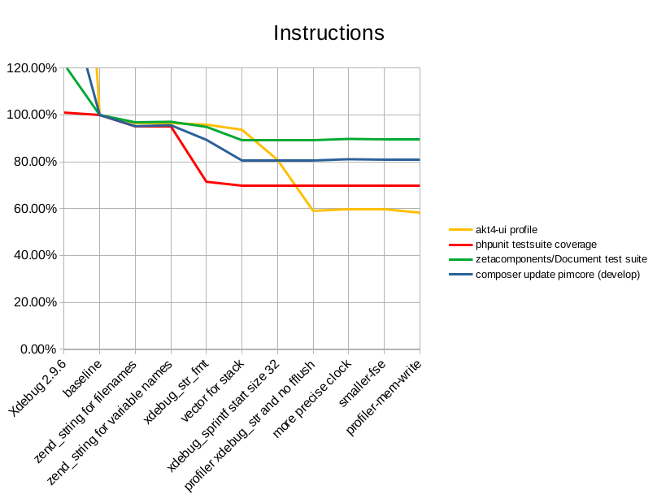
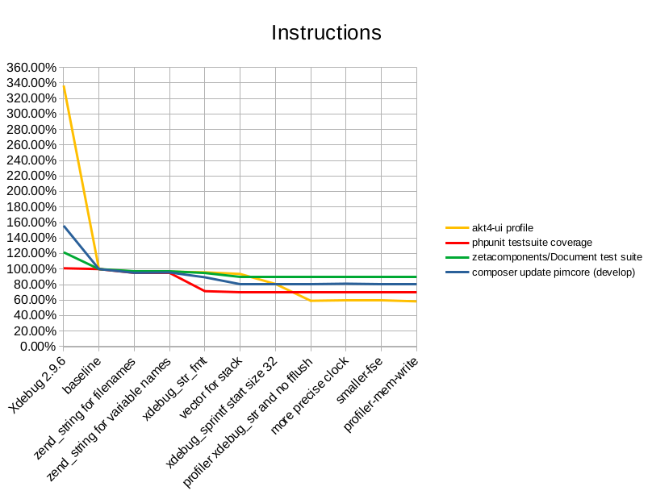

Xdebug Update: July 2020
========================

.. articleMetaData::
   :Where: London, UK
   :Date: 2020-08-11 09:11 Europe/London
   :Tags: blog, php, xdebug
   :Short: xdebug-20jul

Another monthly update where I explain what happened with Xdebug development
in this past month. These will be published on the first Tuesday after the 5th
of each month. `Patreon <https://www.patreon.com/derickr>`_ and `GitHub
<https://github.com/sponsors/derickr/>`_ supporters will
get it earlier, on the first of each month. You can `become a patron
<https://www.patreon.com/bePatron?u=7864328>`_ to support my work on Xdebug.
If you are leading a team or company, then it is also possible to support
Xdebug through `a subscription <https://xdebug.org/support>`_.

In July, I worked on Xdebug for about 100 hours, with funding being around 70
hours. I worked mostly on the following things:

Xdebug 3
--------

I spend nearly all of my time improving performance this month, with some help
by Michael Voříšek for the profiler feature. Some of this work I have done
live through `Twitch <https://twitch.tv/DerickRethans>`_ where I stream
(almost) every Monday at 15:30 BST (14:30 UTC/10:30 EDT). Past sessions are
available on `Vimeo <https://vimeo.com/showcase/6307228>`_.

In order to find out what can be improved I profiled Xdebug running various
workloads. I have selected the following workloads per Xdebug `mode
<https://3.xdebug.org/docs/all_settings#mode>`_

- off: `zetacomponents Document <https://packagist.org/packages/zetacomponents/document>`_ test suite
- develop: "composer update" for Pimcore, "composer update" for ShopWare
- coverage: `PHPUnit <https://github.com/sebastianbergmann/phpunit>`_ test suite coverage
- profiling: `akt-ui <https://github.com/atk4/ui>`_

If you have any specific one you'd like to see added, please let me know and
I'll see whether I have CPU cycles for it—running `composer update` for
Pimcore under the C profiler Valgrind takes 2½ hours per run!

In any case, the profiling found out the following possible improvements:

Use `zend_string` for filenames and variable names
~~~~~~~~~~~~~~~~~~~~~~~~~~~~~~~~~~~~~~~~~~~~~~~~~~

Most of Xdebug was written before PHP 7, and when updating Xdebug to work with
both PHP 5 and PHP 7 certain PHP 5 APIs, wrapped in macros to make it work
with PHP 7, remained in use by Xdebug. When dropping PHP 5 support, I did not
update these APIs to use the PHP 7 variant. One of these APIs is that in PHP
5, strings were often passed around as a `char *string, size_t len` pair. PHP
7 introduced a new data type `zend_string *str` which encapsulates both
elements of the pair, and also introduced reference counting for
`zend_string` s, which reduces the need for duplication of memory. This gave
about a ~2% performance boost to Wall Time (the time passage as indicated by a
clock), and about a 5% reduction in CPU instructions.

Switch `xdebug_sprintf` to a new `xdebug_str_add_fmt`
~~~~~~~~~~~~~~~~~~~~~~~~~~~~~~~~~~~~~~~~~~~~~~~~~~~~~

Xdebug often needs to convert data into a single string, for either writing to
file or network, storing function names with arguments in memory, or display
purposes. It uses an API `xdebug_sprintf` which allocates new memory and
formats the string according to `format specifiers
<https://www.php.net/sprintf>`_. Often it needs to add this to a `xdebug_str`
buffer that makes up a longer piece of text. After it has added it to that
buffer, it frees the allocated memory again.

By creating a new API that can add a formatted string to an `xdebug_str`
buffer, I managed to reduce the amount of memory allocations and frees
dramatically. This gave a 10-15% Wall Time performance boost, and a 10-25%
reduction in CPU instructions.

Use a vector instead of a list for the stack
~~~~~~~~~~~~~~~~~~~~~~~~~~~~~~~~~~~~~~~~~~~~

Xdebug's internals contain a stack of all the functions that are called. Every
time a new function is called, a new stack level is allocated, and when the
function ends this stack element is freed up. In applications which call a lot
of small functions, such as Composer, this repeated allocation and freeing of
memory, as well as the maintenance of the links in the list, is expensive.

I switched this list approach to use a Vector, which is a continuous amount of
allocated memory, without the need for an allocation and free for every
function that is being called. This gave a 2-6% Wall Time performance boost,
most notably with Composer, and a 3-10% reduction in CPU instructions.

Buffering for the profiler
~~~~~~~~~~~~~~~~~~~~~~~~~~

Most of the work on Xdebug's profiler were initiated by Michael Voříšek. The
main performance boost was to use the new `xdebug_str_add_fmt` API, but also
changing the initial size of `xdebug_str` buffers from `1` to `32`, as most of
the strings are of that length. This will use a bit more memory.

The other big part of the performance improvements for profiling is to no
longer use `fprintf` and `fflush` a lot. Instead Xdebug now uses an
`xdebug_str`, the new `xdebug_str_add_fmt` API, and also a new API function to
format a number to an `xdebug_str` without having to use the `xdebug_sprintf`
API call. 

These, as well as the other mentioned changes reduced Wall Time, as well as
CPU instructions, for profiling by about 40%. 

I will continue to work on improving performance in September, but here are
some graphs:

.. image:: images/2020-07-improvements-wall-time.png

You might notice that the Xdebug 2.9.6 data is off the chart, here are they
with Xdebug 2.9.6 included ;-)

.. image:: images/2020-07-improvements-wall-time-296.png

Xdebug Cloud
------------

The only time I spend in August on Xdebug Cloud is some further conversations
with JetBrains. I am going to work on Xdebug Cloud returns in August, starting
with a introductionary stream on Xdebug Cloud **today** at 15:30 BST on
`Twitch <https://twitch.tv/DerickRethans>`_.

If you want to be kept up to date with Xdebug Cloud, please sign up to the
`mailinglist <http://cloud.xdebug.com>`_ I'll let you know as soon as
something can be tried-out. 

Business Supporter Scheme and Funding
-------------------------------------

In July, no new supporters signed up.

If you, or your company, would also like to support Xdebug, head over to the
`support <https://xdebug.org/support>`_ page!

Besides business support, I also maintain a `Patreon
<https://www.patreon.com/derickr>`_ page and a profile on `GitHub sponsors
<https://github.com/sponsors/derickr>`_.
