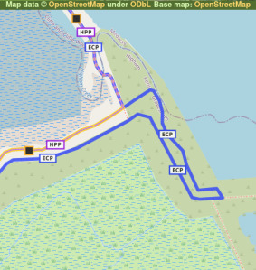

Walking: England Coast Path (part 2)
====================================

.. articleMetaData::
   :Where: London, UK
   :Date: 2022-02-15 14:30 Europe/London
   :Tags: walking, nature
   :Short: ecp2

The weekend after my `first walk </england-coast-path-1.html>`_ along the new
section of the England Coast Path, I set off to Kent again to walk the second
stage, from Greenhithe to Cliffe.

The day was *January 22nd, 2022*. It was another overcast day and the tide was
out.

.. image:: https://live.staticflickr.com/65535/51851326482_0ceae4c301_c_d.jpg
   :title: River Living

As it was reasonably early, there were not a lot of people about yet, and I
had the path mostly to myself. In the distance I saw a massive electricity
pylon, which I ended up walking `straight underneath
<https://www.flickr.com/photos/derickrethans/51852294756/in/album-72177720296328303/>`_,
although that wouldn't be for another 20 minutes.

First I peaked through a whole in the whole, neatly outlining the `Ingress
Abbey <https://en.wikipedia.org/wiki/Ingress_Abbey>`_ at Greenhithe, a
building and site with a rich history.

From Greenhithe the path leads North East for a while to round the Broadness
Salt March, before turning near South where you have to divert from the river
Thames to go around concrete factories and aggregate terminals.

I walked past the Ebbsfleet United football grounds and then headed for the
river again. Here was the first diversion of the signed route. Instead of
going along public footpaths, the ECP path was directed around the North side
of a building-clearance site. I was very much told to keep out of the
restricted area.

.. image:: https://live.staticflickr.com/65535/51852949050_0507c02e5b_c_d.jpg
   :title: Restricted Area

When leaving the building site there was a large queue of HGVs near Lidl's
Distribution Warehouse, seemingly not having anything to do at the moment with
regards to moving goods around. Soon after that there was another diversion
around a building site, where Gravesend is creating a new neighbourhood near
Rosherville. This diversion was up quite a steep hill, but and there
were many steps to climb, over a hundred.

After having returned to the Thames by going down the hill, I started to
approach Gravesend, where the bright orange `LV21
<https://lv21.co.uk/about/>`_ could hardly be missed. On the East side of
Gravesend there are the Gorden Gardens, with loads of people about enjoying
the river side.

.. image:: https://live.staticflickr.com/65535/51851332687_5f23d5daa3_c_d.jpg
   :title: Water Breaks

Progressing East again from the Gardens there was another diversion. Instead
of going through an industrial estate, I had to skirt it on its South side to
avoid some leaking tires. I don't know what would have been nicer to walk
through, as the "detour" was not great, with inadequate footpaths, but when I
peeked through the estate it didn't look too nice either.

What was however interesting to see was the beginning (or end) of the now
disused `Thames and Medway Canal
<https://en.wikipedia.org/wiki/Thames_and_Medway_Canal>`_.

Having returned back to the river, I looked West to see one of the many
jetties that lines this part of the river Thames.

.. image:: https://live.staticflickr.com/65535/51852375378_699db7175c_c_d.jpg
   :title: Loading and Unloading

The last section of the walk, after having left industrious Gravesend, became
quiet and a lot more deserted. I started to enjoy the walk more now. Although
perhaps not as interestingly busy as the first part, I like walking to get out
from behind my computer and clear my head. Industrial estate and town centres
do not really help with that much.

.. image:: https://live.staticflickr.com/65535/51852626614_65c32def93_w_d.jpg
   :title: It's This Way
   :align: left

From here on, it is just the Thames to the North, and marshes to the South.
Occasional small detours of the dike are necessary. Sometimes to avoid big
puddles, and sometimes to avoid ponies.

Occasionally there were way pointers, although I don't quite know which other
way the path could have gone!

It is quite exposed on the dike, and I was happy that I had enclosed myself in
a warm and windproof coat. Although grey, there was no rain.

The Shorne and Higham marshes on the right hand side of the dike (i.e., the
dry side) are a `Site of Specific Scientific Interest
<https://en.wikipedia.org/wiki/Site_of_Special_Scientific_Interest>`_. They
have a fairly stable water level, and are apparently an important habitat for
water voles.

Before turning North at the East end of the Higham Marshes, the England Coast
Path makes an "interesting" detour with a go-back-on-yourself loop. I don't
quite understand why, as the informal `Hoo Peninsula Path
<http://www.gps-routes.co.uk/routes/home.nsf/RoutesLinksWalks/hoo-peninsula-path-walking-route>`_
(HPP on the map) does not bother with this.

Although I can see why the route is set out this way—there is a possibility of
a stream—I also think that the England Coast Path should include this loop, as
that possibility is also still there at this Southern most point. The path in
the loop itself was also not easy to see, with lots of narrow and very muddy
trails, where the route that the Hoo Peninsula Path takes seemed much easier
going. Perhaps they'll re-adjust this in the future.

Having walked this somewhat odd loop, the path continues North with the Higham
Saltings on the left, and the Alpha Pool on the right.

.. image:: https://live.staticflickr.com/65535/51852957000_8bf6a67dd8_c_d.jpg
   :title: Higham Saltings

I finished my near at `Cliffe Fort
<https://en.wikipedia.org/wiki/Cliffe_Fort>`_, a disused artillery fort built
in the 1860s. I could not actually see much of it from the ECP, as it was
mostly obstructed by machinery as part of a large aggregate processing
operation. The parts of it that I did see looked in disrepair.

Another interesting thing here is a `Brennan torpedo
<https://en.wikipedia.org/wiki/Brennan_torpedo>`_ launch slipway. This torpedo
is often claimed to be the first guided missile, although that is untrue.

From the end of the walk along the Thames, I walked into Cliffe to catch the
bus to Rochester to take the train back into London. The bus only runs once an
hour on Saturday (and less frequent on Sunday), and of course I ended up
missing it by a few minutes.

This turned out not to be much of a disaster though, as the bus stop is both
the start of its route, and named "The Six Bells". A `pub of the same name
<https://www.sixbellscliffe.co.uk/>`_ is right next to it! I enjoyed a pint
while waiting for the bus when a few more walkers showed up. They were walking
the `Saxon Shore Way
<https://hiking.waymarkedtrails.org/#route?id=8864&type=relation&map=10.0/51.1621/0.8872>`_.
Perhaps I walk that at some point in the future.

The story continues in `part 3 </england-coast-path-3.html>`_.

You can find more photos in my Flickr set
`England Coast Path
<https://www.flickr.com/photos/derickrethans/albums/72177720296328303>`_.
