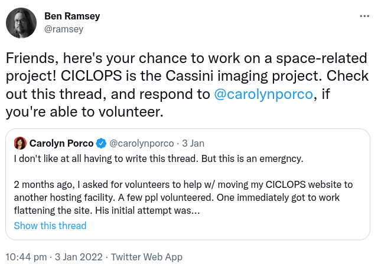
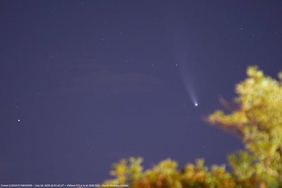
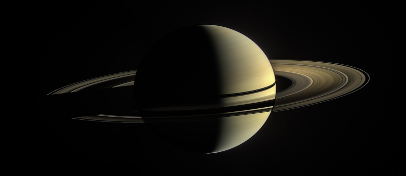

Concerning Cassini
==================

.. articleMetaData::
   :Where: London, UK
   :Date: 2022-03-15 14:30 Europe/London
   :Tags: blog, php
   :Short: ciclops

At the beginning of the year, I saw a tweet by my friend `Ben Ramsey
<https://benramsey.com>`_, where he
quoted `Carolyn Porco's <http://carolynporco.com/>`_ tweet requesting help
saving `CICLOPS <https://ciclops.org>`_, the web site of the Cassini Imaging
Central Laboratory for Operations, which was under threat of disappearing off
the internet.

I have been enthusiastic about space since I was in my early teens, with at
some point expressing the interest to be an astronaut. I never pursued that,
but I have continued to express great interest in space exploration. 

I have dabbled in some astrophotography, having some mediocre successes with
last year's comet NEOWISE. I never got into the field of astronomy nor
photography. Instead I started doing web technology, including PHP, which how
I know Ben.

Tech is cool too, but I always hoped to do something for, and with, space
exploration.

So when I saw Ben's tweet, I thought this would be something I could help
with, so I reached out to Carolyn via DM. 

The task at hand at that time seemed to create a static copy of the existing
CICLOPS website, but after some twitter to-and-fro, an additional ask seemed
to be to create a functionally equivalent static search.

Over night, Ben had mirrored the CICLOPS website with ``wget`` and I took his
copy to make some improvements, and started doing some research into how to do
a static search. I had quite some experience with SOLR as well as full text
search in general and with `MongoDB </mongodb-and-solr.html>`_. The problem
was that all of these needed something to run on, which would create
complications and costs, beyond just hosting a static site on something like
S3.

After some research through DuckDuckGo, I found a neat JavaScript library,
called `Lunr <https://lunrjs.com/>`_, which looked perfect for a
quick-and-dirty static search engine. Like most other more complex search
engines, Lunr creates a reverse index that maps every word back to a location
in a document, with some clever maths to rank more specific words higher in
the results.

I started writing a script to extract the text from the crawled CICLOPS site to
pick out the actual descriptions of each post and media item, and then made
that index into Lunr's full text search index. With that, I set up a static
site on S3 as a demo. This demo could have become a crude final result, and
would have saved all the original content and images of the Cassini space
probe.

That was the easy part.

In the course of several weeks, I worked with `Ben <https://benramsey.com/>`_,
`Carolyn <http://carolynporco.com/>`_, `Jakub
<https://www.linkedin.com/in/jakubkonecki/>`_ and `David
<https://www.linkedin.com/in/davidkavanagh/>`_ to refine the search index,
split it into several different categories (the one with the `images
<http://ciclops.org/ir_index_main/Cassini.html>`_ is my favourite!), added
pagination, phrase searching, and a ton of other tweaks to make the static
CICLOPS site an excellent simile of the original dynamic site, which turned
out to be written in PHP!

To be honest, this took a lot more work than I originally had thought, with
many hours spend on my side, all in the name of science.

The resulting site is something to be proud of. The search is faster
and more capable: `look at the instructions
<http://ciclops.org/group_caption.php%3Fstatic=search.html>`_! I finally
managed to do something space related—and that all for my favourite planet!

I would explore you to have a `search <http://ciclops.org/search.php.html>`_
through the rich set of images that is available on the CICLOPS site, and let
me know what's your favourite!

`CICLOPS lives! <https://twitter.com/carolynporco/status/1498708491325767681>`_
