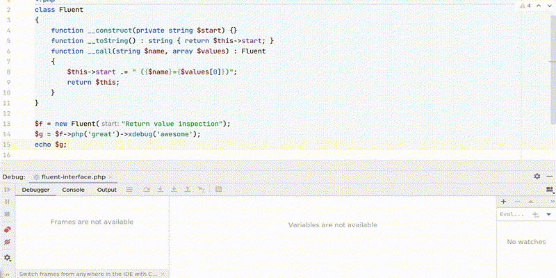

Xdebug Update: May 2022
=======================

.. articleMetaData::
   :Where: London, UK
   :Date: 2022-06-07 09:13 Europe/London
   :Tags: blog, php, xdebug
   :Short: xdebug-22may

In this monthly update I explain what happened with Xdebug development in this
past month. These are normally published on the first Tuesday on or after the
5th of each month.

`Patreon <https://www.patreon.com/derickr>`_ and `GitHub
<https://github.com/sponsors/derickr/>`_ supporters will get it earlier,
around the first of each month.

You can `become a patron <https://www.patreon.com/bePatron?u=7864328>`_ or
support me through `GitHub Sponsors <https://github.com/sponsors/derickr>`_.
I am currently 46% towards my $2,500 per month goal.
If you are leading a team or company, then it is also possible to support
Xdebug through `a subscription <https://xdebug.org/support>`_.

In May, I spend 25 hours on Xdebug, with 27 hours funded.

Development
-----------

I continued my exploration of different set-ups that developers use, and have
now merged the branch that adds support for the "pseudo-hosts"
``xdebug://gateway`` and ``xdebug://nameserver``, which can be used with the
``xdebug.client_host`` setting instead of, and in addition to the Docker
specific ``host.docker.internal``. This pseudo-host automatically evaluates to
the network gateway address, or name server as defined in
``/etc/resolv.conf``, in the container, which will then allow Xdebug to
connect to an IDE on the host machine.

I have not figured out how to do it will all different set-ups, so if you have
extra information, or if I am still missing set-ups, feel free to comment on
the `Google Doc
<https://docs.google.com/document/d/1W-NzNtExf5C4eOu3rRQm1WlWnbW44u3ANDDA49d3FD4/edit?usp=sharing>`_.

In the more complicated set-ups, it would likely be easier to use `Xdebug
Cloud <https://xdebug.cloud>`_ as it has none of these networking
complications.

The other big feature that I have worked on is the introduction of the capture
of return values while debugging. This feature allows you to step 
into the "return value from function" phase, where PHP returns a value 
to the caller function. In this step, there will only be one variable 
available, which is the return value of that function.

Right now IDEs will have to opt into this new feature, with PhpStorm and the
VS Code Plug-in teams confirming that they will make changes for this.

In this GIF you can see how this is useful with fluent interfaces:

Course
------

I have now recorded the first lesson of the course, and I am editing it with
the plan to release this in the next few weeks. It will take a little time, as
I need to get into the flow of editing and producing them; and of course, a
new web site needs to be constructed as well. Stay tuned!

For further lessons I have started to draft outlines, and they are in
different states of completion.

If you want to make sure that the course covers specific tasks that you find
hard to do, or what you would like explained, please drop me an email, or
leave a comment.

Xdebug Cloud
------------

Xdebug Cloud is the *Proxy As A Service* platform to allow for debugging in
more scenarios, where it is hard, or impossible, to have Xdebug make a
connection to the IDE. It is continuing to operate as Beta release.
Packages start at £49/month.

If you want to be kept up to date with Xdebug Cloud, please sign up to the
`mailinglist <https://xdebug.cloud/newsletter>`_, which I will use to send out
an update not more than once a month.

Xdebug Videos
-------------

I have published one new video this month:

- `Xdebug 3: Debugging with Atom <https://www.youtube.com/watch?v=oeHs17vaELU>`_

You can find all previous videos on my `YouTube channel
<https://www.youtube.com/playlist?list=PLg9Kjjye-m1g_eXpdaifUqLqALLqZqKd4>`_.

Business Supporter Scheme and Funding
-------------------------------------

In May, no new business supporters signed up.

If you, or your company, would also like to support Xdebug, head over to the
`support <https://xdebug.org/support>`_ page!

Besides business support, I also maintain a `Patreon
<https://www.patreon.com/derickr>`_ page and a profile on `GitHub sponsors
<https://github.com/sponsors/derickr>`_.
