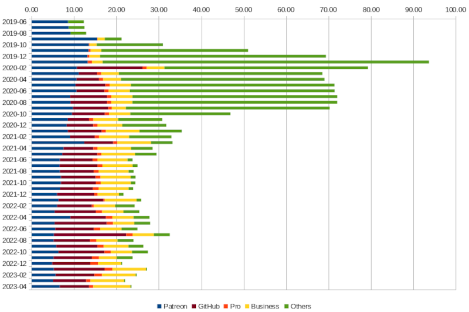

Xdebug at 21
============

.. articleMetaData::
   :Where: London, UK
   :Date: 2023-05-08 21:30 Europe/London
   :Tags: php, xdebug
   :Short: xdebug21

Today Xdebug turned 21.

Over these last twenty-one years `Xdebug <https://xdebug.org>`_ grew from a
little hack to make sure PHP wouldn't segfault when having infinite recursion,
to a tool that is used by tens of thousands, if not hundreds of thousands, PHP
developers.

This has mostly been the work by myself, with very few external contributions.
That makes sense, as it hard to both understand the PHP engine well enough, as
well as programming in C. Especially because lots of PHP internals are not
actually documented.

Xdebug was developed on a mostly voluntary basis, with more recently through
some sponsorship via `Patreon <https://www.patreon.com/bePatron?u=7864328>`_
and `GitHub Sponsors <https://github.com/sponsors/derickr>`_, and through
funding from `Pro and Business supporters <https://xdebug.org/support>`_.

Beyond a brief period in `early 2020 <https://xdebug.org/log>`_ when I was
rewriting Xdebug to version 3, this amounts to funding for about 25 hours a
month, with a steady decline.

Twenty-five hours a month is about the minimum needed to **maintain** Xdebug
for newer versions of PHP, including support for new features, as well as
triaging and fixing bugs.

If you have been following my monthly reports, you probably have noticed that
there is less activity, including in creating the reports and work logs.

But there are plenty of things that should be done, and several that would
make Xdebug even more powerful in streamlining debugging and improving your
applications. These are also things I would **like** to work on.

Current features that (in my opinion) need improvement are:

Profiling

	The profiler is old code, and fairly messy. It is only possible to start
	the profiler for the whole of the request, and not only a part of it.

	There are also bugs with cycle detection (function A calls function B
	calls function A) that need investigating.

	It should be rewritten, which is luckily easier to do after Xdebug's new
	modes architecture.

Code Coverage

	The current code coverage feature keeps static information about which
	functions have lines and paths in the same data structure as the dynamic
	data collection that is recorded when the script runs. This causes
	problems.

	I have a `fix <https://github.com/xdebug/xdebug/pull/774>`_, but
	it slows down coverage by 50%. Before I can merge it, that needs
	addressing.

Among the new features that I like to contribute to Xdebug are:

Native Path Mappings

	Currently Xdebug does not map paths between local files, and
	remote and/or generated files. There are some frameworks which rewrite
	developer-written-classes to a new version with additional functionality,
	but as a different file name.

	Similarly Xdebug can not translate between local and remote paths, which
	causes confusion such as in this `PhpStorm ticket
	<https://youtrack.jetbrains.com/issue/WI-69488/IDE-Remote-Control-Use-PHP-Server-mappings-to-open-file-links>`_.

	Introducing native path mapping would address both these issues.

	An implementation could also make it possible to debug generated PHP
	files, say from templates. Although PhpStorm has some capabilities for
	this for `Twig and Blade templates
	<https://blog.jetbrains.com/phpstorm/2019/05/twig-and-blade-templates-debugging-2/>`_,
	it is not supported for other template systems.

	A native implementation in Xdebug also could make this working better and
	faster for what PhpStorm already does.

Time Travel Debugging

	My tongue-in-cheek `April Fools' post <https://xdebug.org/ai>`_ hinted at
	this already.

	Time Travel Debugging would allow somebody that runs a PHP request (either
	you as developer, or a customer running your on-premise application) to
	record its whole execution, including all intermediate states
	(variable contents, etc.), and source files.

	By having this available in one file, a wrapper could then play this back
	pretending it was running a live request, through already existing
	debugging front-ends, such as the one in PhpStorm, the PHP Debug Adapter
	for Visual Studio Code, and many others.

	Besides being able to step forwards, it would also support stepping back,
	and even seeking to every possible state in the request.

All four of these ideas require a large amount of work, and hence, time. I can
not currently dedicate that time as there is not enough support for me to work
on Xdebug.

I am highly appreciative of my Patreon patrons and GitHub sponsors, but I feel
that support for Xdebug (and other Open Source) should come from **companies**
who's developers make use it, and not the individual developers themselves.

Xdebug currently has a few Pro, and eight `Business supporters
<https://xdebug.org/#business_supporters>`_. But there are currently only
eight, where the ideal number would be around forty.

If you, or ideally your company, uses Xdebug often, or would like to see the
above mentioned features in Xdebug, then I would implore to ask your company
to `sign up for Business support <https://xdebug.org/support>`_. I
will gladly sit down with you and your team for an hour as well to discuss
problems and answer questions. Feel free to `contact me </who.html>`_ with any
questions.

In the past 21 years I have enjoyed working on Xdebug immensely, and I hope to
be able to do this for another 21 years. Happy Birthday!

