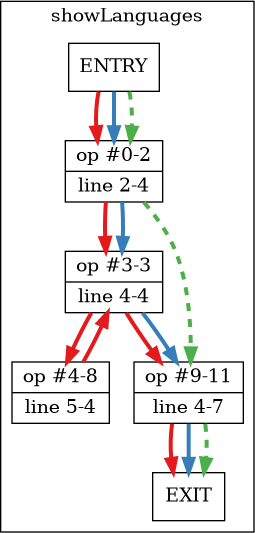
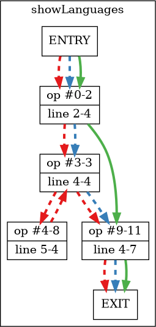

Figuring Out Foreach
====================

..
articleMetaData::
   :Where: London, UK
   :Date: 2025-01-14 17:40 Europe/London
   :Tags: blog, php
   :Short: fidgety-forach

For a while I have been aware of some odd behaviour when you use
branch coverage with PHP's foreach language construct. Usually with
PHPUnit.

Take for example this bit of code::

    <?php
    function showLanguages(array $languages): void
    {
        foreach ($languages as $language) {
            echo $language, "\n";
        }
    }

It seems that in order to cover all paths by test cases to pass in an
array without any elements, and one with at least one element.

But no, when you run the analysis, you will see that there only two
out of the three paths are covered:

Let's first actually analyse which opcodes, PHP's internal execution units,
are generated by the engine::

    line      #* E I O op          return  operands
    ------------------------------------------------
        2     0  E >   RECV        !0      
        4     1        EXT_STMT            
              2      > FE_RESET_R  $2      !0, ->9
              3    > > FE_FETCH_R          $2, !1, ->9
        5     4    >   EXT_STMT            
              5        ECHO                !1
              6        EXT_STMT            
              7        ECHO                '%0A'
        4     8      > JMP                 ->3
              9    >   FE_FREE             $2
        7    10        EXT_STMT            
             11      > RETURN              null

This output from `VLD <https://derickrethans.nl/projects.html#vld>`_ shows on
line 4, two relevant opcodes: ``FE_RESET_R`` and ``FE_FETCH_R``. Both of them
can either followed by the next opcode on the list, or they can jump (``->9``)
to opcode ``9``, which marks the end of the loop.

However from the diagram above, we don't see that path (the green one) being
taken. Only the two paths that both continue with the next opcode (the red and
blue lines). It seems that the emptiness of a normal array is checked by the
``FE_FETCH_R`` opcode.

Now the question is how to trigger the *other* path, so that 100% path (and
branch) coverage can be reached.

This turns out harder than it is. I originally thought that this would be
possible by trying to create a broken iterator — for example one where you
inherit from an internal class with a custom one, and not call the original
constructor. But this creates an exception which pre-empts the engine from even
running the rest of the function.

The only situation where I managed to do this was by creating an iterator that
after a correct initialisation, had no items to return. An example of such as
case is a ``DatePeriod`` iterator where the start date of the iterator is
behind the end date::

    $i1 = new DatePeriod(
        new DateTimeImmutable("2025-01-14"),
        DateInterval::createFromDateString("+1 day"),
        new DateTimeImmutable("2025-01-01")
    );

I had to change the definition of ``showLanguages`` too so that it accepts
``DatePeriod`` besides just ``array``. But with that done, this specific
iterator now lights up the green path:

There is currently an `open bug <https://bugs.xdebug.org/2150>`_ in Xdebug's
issue tracker to merge the branch analysis information for the two subsequent
opcodes (``FE_RESET_R`` and ``FE_FETCH_R``). 

I think I will now rather hide the jump away from the ``FE_RESET_R`` (and
``FE_RESET_RW``) opcode.

But at last I now have an explanation as to where this phantom path came from.
