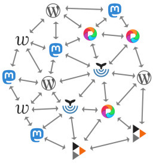

Own Your Content
================

.. articleMetaData::
   :Where: London, UK
   :Date: 2025-06-12 16:15 Europe/London
   :Tags: blog, php
   :Short: own-your-content

Before MySpace (2003), Orkut (2004-2014), Facebook (2004), Instagram (2010),
and Twitter (2006), the only way to have an online community presence was to
host it yourself, or use Geocities (1994-2009).

For messaging there was AOL Instant messenger (1997-2017), ICQ (1996-2010),
and MSN messenger (1999-2012), which got later get gobbled up by Skype
(2003-2025).

I am sure many of you have set up a `PHP BB bulletin board
<https://www.phpbb.com/>`_, or one of the many various alternative online
forum software packages.

For showing your photos you would use something like a PHP Gallery and host it
yourself. These things became a little easier to self host when WordPress got
released in 2003.

These tools required hosting your own content, on your own server. That also
meant that you had full control over your own content. You could, within the
law, publish anything that you wanted, and decide which comments you would
allow to be posted under with content.

This content became discoverable through search engines: Yahoo!, Altavista,
and later Google. They would only rank the search results through an algorithm
that focussed on popularity and content only, using fancy maths.

Alternative content discovery came through Webrings, Blogrolls, and when
podcasts became a thing: `RSS <https://en.wikipedia.org/wiki/RSS>`_. RSS
wasn't only **for** podcasts though, and many web sites and services would
publish new articles and product updates through this protocol. Many,
`including the BBC <https://feeds.bbci.co.uk/news/rss.xml>`_, and `this site
<https://derickrethans.nl/feed.xml>`_, still do.

Over the years, people shifted away from hosting their own content to the big
American tech firms. Facebook for keeping up with your family and friends,
"news", and discussion boards for your local cycling group. Twitter for short
message communication, and Instagram of sharing your perfect life with the
wider world.

As you don't pay for these products, they monetise you, and the interactions
you have on these platforms. They are built to create dopamine hits so that
you stay longer on these sites, and see more advertising. Instead of seeing
the content you **choose** to follow, they feed you with information that they
think that you will be engaging with. In fact, the content that you would be
engaging with, is often created to induce anger.

Some platforms that used to be great at what they did in the past, now have
been `enshittified <https://en.wikipedia.org/wiki/Enshittification>`_ to be
able to save your more ads, and now also AI slop. You can't honestly say that
Google is a great search engine any more for example.

In the open source ecosystem, the proliferation of using "big tech" is also
proliferating, with many communities adopting Slack or Discourse as their
project's discussions groups.

Using Slack moves content away from the public into a proprietary environment.
For example, if you don't pay, you only have access to a certain amount of
history. And contributors and users need to have a login to participate,
turning them into walled gardens.

And let's not forget about GitHub. A proprietary platform, now owned by
Microsoft, is almost universally used by Open Source and closed source
projects to host Git repositories. Git ironically being a version control
system specifically designed to be decentralised.

GitHub was first for just the code, but now many Open Source projects and
companies have given up control over their other project related content as
well.

It's not uncommon to see GitHub used as an issue tracker and security report
tracker, for project planning, and to test and deploy libraries, tools,
and applications through GitHub Actions.

Because this auxiliary content is no longer owned by you or your project,
platforms hosting this content can decide to ban or limit your account. This
is not just theory, as `it happened to OrganicMaps
<https://mastodon.social/@organicmaps/114155428924741370>`_. Although you can
easily relocate the code repository, you can not do that for this adjacent
content.

`PHP <https://www.php.net>`_ is also at risk here, as it uses many of these
proprietary GitHub features, and the PHP Foundation uses Slack for its
internal communications.

There are also more extreme tales, where Microsoft withdrew access to
Office365 for some users. For example, they decided to ban the chief
prosecutor of the International Criminal Court (ICC), which `ended up
impacting several prosecutions
<https://www.euronews.com/2025/05/15/trumps-sanctions-on-icc-halt-tribunals-work-staffers-claim>`_
due to sanctions imposed by the Trump government.

A few people are still holding out using their own self-hosted forums and
issue trackers. This is made harder for them due to regulations, like
the onerous Online Safety Act in the UK. This act will likely push more
operators to use the big tech variants in the future, as `has already happened
<https://alecmuffett.com/article/112834>`_.

Some countries are luckily starting to realise that `depending on US owned big
tech is a bad idea
<https://nltimes.nl/2025/05/20/microsofts-icc-email-block-triggers-dutch-concerns-dependence-us-tech>`_.

Luckily, there are still some decentralised communication systems alive and well.

Perhaps the most well known one is e-mail, through the open `SMTP protocol
<https://datatracker.ietf.org/doc/html/rfc5321>`_. Open protocols are protocols
that can be understood and implemented by anyone.

Another example is Internal Relay Chat (IRC), which is perhaps not so flashy
as Slack, but still alive — having been build on `an open protocol
<https://datatracker.ietf.org/doc/html/rfc1459>`_ introduced in 1988.

The curious thing about email is, is that it is a decentralised protocol,
where everybody can technically set up an SMTP server on their own hardware
with their own domain name. But fewer people or companies now do so. Instead,
they use big centralised providers, such as Gmail and Outlook. These platforms
often require extra requirements for accepting email, on top of what the
SMTP protocol stipulates.

As an example, when we moved the php.net e-mail infrastructure to a new server
it took Gmail weeks to trust our new IP enough to accept most of our email
again on the first delivery attempt.

And can you or your company handle Google cancelling your Gmail account? Not
only would you lose access to your email, you will also likely lose access to
your Google Drive documents, calender, and potentially logins to many
websites as you have used Gmail as login provider.

At this current time, most content is now hosted by third parties at their
behest: Journalists and blogs on Medium, Blogger, or other third party
platforms; newsletters on Substack; code, issue tracking, security reports,
and CI pipelines on GitHub; email on Gmail or Outlook; open source project
discussions on Slack; pictures on Instagram; community forums on Facebook;
videos on YouTube, and short messages on X/Twitter.

The companies hosting these services can go out of business, decide to not
like you any more, or decide to steal your content to train their AI
models—and then sell you back the content that you and others created.

Or worse, they can decide to remove or block your accounts, so that you lose
your readers, content, project's issues, e-mail, community, images, followers
and interactions, and messaging.

The authors, including you, have no control over any of this.

But there is an alternative to many of these services.

**There is a way to take back control.**

----

Lets focus on the ActivityPub protocol. This open protocol, introduced in 2018
by the World Wide Web Consortium (W3C) can be used as that basis for
publishing content, interacting with this content, and integrating this with
existing publishing services.

It is the basis of the Fediverse, a network of ActivityPub servers that can
communicate with each other, even though there are many different
implementations, serving different types of content.

Some implementations focus on short messages, such as `Mastodon
<https://joinmastodon.org/>`_ or `Misskey <https://misskey-hub.net/en/>`_, but
others focus on forum-type exchanges (`Lemmy <https://join-lemmy.org/>`_,
`mbin <https://joinmbin.org/>`_), image sharing (`Pixelfed
<https://pixelfed.org/>`_), video sharing (`Peertube
<https://joinpeertube.org/>`_, Loops), and many many others.

These software packages are written in different languages, and can often be
self-hosted. Most of them are open source. And because the protocol is open,
you can also create your own implementation, or integrate with already
existing software.

Each server that contains content is called an instance. Instances
implementing the same service can easily interact, but crucially instances of
*different* services can also do this.

Instances are hosted by individuals, specific-interest
groups, language communities, or be "generic" instances. The instances are
decentralized, and users can pick the instance of the service they want to
use, while still being able to interact with other instances and services.

Users can therefore pick the instance that aligns with their interests, or one
where they agree with the community guidelines of that instance. And if they
can't find a matching instance and don't want any moderation of what they create,
users can set up and self-host their own single-user instance as well.

For example, I am a user of the Mastodon service and use the `phpc.social
<https://phpc.social/about>`_ instance. But I also have an account on the
Pixelfed service instance `pixelfed.social <https://pixelfed.social/i/web>`_.
I can interact with posts on my ``@derickr@pixelfed.social`` Pixelfed account
with my ``@derickr@phpc.social`` Mastodon account. I can reply, like, and
forward posts between accounts.

This is very much like e-mail, where users can chose their e-mail
provider, and still e-mail users on other servers, although ActivityPub extends
this by also being to interact with *other* services.

----

The protocol is extensive, and I don't have time to go into every detail, but
I am hoping to provide a reasonable overview here.

ActivityPub operates with three main data types: Actors, which represent
content owners; Objects, which describe data; and Activities, which represent
operations. ActivityPub itself is based on top of ActivityStreams, which
`defines many different object types
<https://www.w3.org/ns/activitystreams>`_, activity types, and standard
properties.

.. image:: images/fediverse-parts.jpg

An `Actor <https://www.w3.org/TR/activitystreams-vocabulary/#actor-types>`_
can send data to other Actors by creating an `Activity
<https://www.w3.org/TR/activitystreams-vocabulary/#activity-types>`_ (such as
`Create <https://www.w3.org/TR/activitystreams-vocabulary/#dfn-create>`_) that
wraps a data Object, and place it in their Outbox.

The ActivityPub server then takes this Activity and posts it (with HTTP POST)
to the Inboxes listed in the Activity's to/bto/cc/bcc fields.

A receiving server then takes the Activity from the Inbox and acts upon this,
according to what the Activity represents. The receiving server then sends an `Accept
<https://www.w3.org/TR/activitystreams-vocabulary/#dfn-accept>`_ (or
`Reject <https://www.w3.org/TR/activitystreams-vocabulary/#dfn-reject>`_)
Activity to the originating server.

The same would apply to a `Follow
<https://www.w3.org/TR/activitystreams-vocabulary/#dfn-follow>`_ Activity,
where a receiving server (with, or without user interaction) might ``Accept``
or ``Reject`` the follow request.

Let's have a look at an example.

To create a short message and deliver it to followers, an Actor
first creates an Object. Objects have types. For example a `Note
<https://www.w3.org/TR/activitystreams-vocabulary/#dfn-note>`_ Object
represents a short text, and an `Article
<https://www.w3.org/TR/activitystreams-vocabulary/#dfn-article>`_ a
multi-paragraph written work of some sort. There are many `more
<https://www.w3.org/TR/activitystreams-vocabulary/#activity-types>`_ types.

Different services will understand different types of objects, although
``Note`` Objects are fairly commonly understood.

The data format used with ActivityPub is `JSON-LD <https://en.wikipedia.org/wiki/JSON-LD>`_. An object representing a
blog post looks something like::

  {
    "@context": [
      "https://www.w3.org/ns/activitystreams",
      {
        "Hashtag": "https://www.w3.org/ns/activitystreams#Hashtag"
      }
    ],
    "id": "https://social.derickrethans.nl/@fridaynightdinners/posts/dakota-jgf.json",
    "type": "Note",
    "published": "2025-05-23T18:30:00+01:00",
    "attributedTo": "https://social.derickrethans.nl/@fridaynightdinners",
    "content": "<b><a href='https://dakotahotels.co.uk/leeds/grill/'>Dakota</a></b> 
…
",
    "to": [
      "https://www.w3.org/ns/activitystreams#Public"
    ],
    "location": {
      "name": "Dakota, 8 Russell Street, LS1 5RN, Leeds",
      "type": "Place"
    },
    "tag": [
      {
        "type": "Hashtag",
        "name": "#FridayNightDinners"
      }
    ],
    "attachment": [
      {
        "type": "Image",
        "mediaType": "image/jpeg",
        "url": "https://s3.drck.me/derickrethans-blog-photos.s3.eu-west-2.amazonaws.com/friday-night-dinners/dakota-1.jpg",
        "name": "Bread with Cheesy Tomato Sauce"
      }
    ]
  }

The context describes the namespaces for elements. The default one is listed
first (``https://www.w3.org/ns/activitystreams``) and other namespaces are
created in an associative array. The ``"Hashtag":
"https://www.w3.org/ns/activitystreams#Hashtag"`` line defines the ``Hashtag``
namespace, which is later used to add the ``#FridayNightDinners`` tag to the
post.

The ``id`` contains the unique identifier for this object. The ``id`` can be
references in later activities, such as ``Like``, ``Delete``, ``Announce``
(re-post), ``Flag`` (report), etc.

The ``type`` defines the object's data type, in this case, ``Note``: a short text.

Actually, in this implementation I slightly misuse the ``Note`` type, as I
also use it for full articles, which ostensibly should rather be an
``Article`` or `Page <https://www.w3.org/TR/activitystreams-vocabulary/#dfn-page>`_.
The reason for this is, is that Mastodon does not support ``Article`` or
``Page`` objects.

The `published
<https://www.w3.org/TR/activitystreams-vocabulary/#dfn-published>`_ property
describes the date and time at which the object was published — not
necessarily when an Activity is created for it.

The `content <https://www.w3.org/TR/activitystreams-vocabulary/#dfn-content>`_
property contains the Object's content — by default this is HTML encoded as
JSON. It is also possible to use other MIME media types through the `mediaType
<https://www.w3.org/TR/activitystreams-vocabulary/#dfn-mediatype>`_ property.
You can see this used in the sub-object in the ``attachment``.

The `to <https://www.w3.org/TR/activitystreams-vocabulary/#dfn-to>`_ and `cc
<https://www.w3.org/TR/activitystreams-vocabulary/#dfn-cc>`_ properties are
used to instruct a receiving server where to direct the activity to. In this
example, it is just sending it to the Public realm, but it is more common to
use ``to`` it to the followers of this Actor, and ``cc`` to the Public realm::

  "to" : [
    "https://fosstodon.org/users/php/followers"
  ],
  "cc" : [
    "https://www.w3.org/ns/activitystreams#Public"
  ]

`location <https://www.w3.org/TR/activitystreams-vocabulary/#dfn-location>`_
indicates a physical or logical location that is associated with this object.
This property is not always understood by every ActivityPub implementation,
for example, Mastodon does not support it.

And then lastly, we have the `tag
<https://www.w3.org/TR/activitystreams-vocabulary/#dfn-tag>`_ and `attachment
<https://www.w3.org/TR/activitystreams-vocabulary/#dfn-attachment>`_
properties that associate other information with this Object. Tags are
prominently used for hashtags, and attachments for linking in additional
objects that need special handling, such as this Image object.

In order to deliver this ``Note`` to an Actor's followers, the implementation
needs to wrap this in an Activity::

  {
    "@context": [
      "https://www.w3.org/ns/activitystreams",
    ],
    "id": "https://social.derickrethans.nl/@fridaynightdinners/posts/a7c1b1fd04884a2e4c7f2c86743f5df9#Create",
    "type": "Create",
    "actor": "https://social.derickrethans.nl/@fridaynightdinners",
    "to" : [
      "https://fosstodon.org/users/php/followers"
    ],
    "cc" : [
      "https://www.w3.org/ns/activitystreams#Public"
    ]
    "object": …
  }

The contents of the ``object`` property in the case of the ``Create`` Activity
would be the Object from above, with the ``to`` and ``cc`` fields copied
from that Object. The ``id`` is also often similar to the embedded Object's
``id`` — in this implementation ``#Create`` is added to the end of it.

When a server receives this ``Create`` activity in its inbox, it first needs
to make sure that the activity is in fact sent by the Actor mentioned in the
Activity — you wouldn't want impersonations.

The server can do that, because with the ``POST`` request, the sending server also
includes cryptographic hashes in its HTTP headers.

For each message that it sends, it:

- Creates a ``sha256`` digest of the text representing the JSON payload.
- Formats a signing key: ``(request-target): post {$path}\nhost:
  {$targetHost}\ndate: {$date}\ndigest: SHA-256={$digest}`` which includes the URL
  of the inbox it POSTs to (``$path``), the host, the current date in the
  format ``D, d M Y H:i:s \G\M\T``, as well as the ``$digest`` it has just created.
- Retrieves the private key from the Actor.
- Uses this private key to sign the signature.
- Encodes this signature in base 64 and formats it again with a different
  format: ``'keyId="' . $keyId .
  '",algorithm="rsa-sha256",headers="(request-target) host date
  digest",signature="' . $signature . '"'``.
- And then includes the host, date, payload digest, and this newly formatted
  signature in the HTTP headers.

This signing algorithm was probably the hardest part of my implementation.

Retrieving the private key from the Actor is achieved by requesting the
Actor's JSON object from the ``actor`` property
(``https://social.derickrethans.nl/@fridaynightdinners``), which looks like this::

  {
    "@context": [
      "https://www.w3.org/ns/activitystreams",
      "https://w3id.org/security/v1"
    ],
    "id": "https://social.derickrethans.nl/@fridaynightdinners",
    "type": "Person",
    "following": "https://social.derickrethans.nl/@fridaynightdinners/following",
    "followers": "https://social.derickrethans.nl/@fridaynightdinners/followers",
    "inbox": "https://social.derickrethans.nl/@fridaynightdinners/inbox",
    "outbox": "https://social.derickrethans.nl/@fridaynightdinners/outbox",
    "preferredUsername": "fridaynightdinners",
    "name": "Friday Night Dinners",
    "summary": "Hi! We are …",
    "url": "https://social.derickrethans.nl/@fridaynightdinners",
    "manuallyApprovesFollowers": false,
    "discoverable": true,
    "indexable": true,
    "published": "2024-02-05T18:59:09Z",
    "icon": {
      "type": "Image",
      "mediaType": "image/jpeg",
      "url": "https://media.phpc.social/cache/accounts/avatars/111/851/729/954/932/528/original/196af8039f5c41bb.jpg"
    },
    "image": {
      "type": "Image",
      "mediaType": "image/jpeg",
      "url": "https://media.phpc.social/cache/accounts/headers/111/851/729/954/932/528/original/a85d3e0b1408f0c9.jpg"
    },
    "publicKey": {
      "id": "https://social.derickrethans.nl/@fridaynightdinners#main-key",
      "owner": "https://social.derickrethans.nl/@fridaynightdinners",
      "publicKeyPem": "-----BEGIN PUBLIC KEY-----\nMIIBIjANBgkqhkiG9w…JOc\nHwIDAQAB\n-----END PUBLIC KEY-----\n"
    },
    "endpoints": {
      "sharedInbox": "https://social.derickrethans.nl/@fridaynightdinners/inbox"
    }
  }

The relevant property to look at for signing is the ``publicKey`` property. It
includes the key-id
(``https://social.derickrethans.nl/@fridaynightdinners#main-key``), the owner
(this Actor), and the public key to use by the receiving server to check the
signature that the sending server has created with the secret part of this
key.

The public and private key pair are created when an Actor is created.

The ``Person`` object also includes the Inbox and Outbox URLs, and URLs for
retrieving the followers and which Actors this Actor is following.

The user name (``preferredUsername``, textual user name (``name``),
description (``summary``), and some images (``icon`` and ``image``), are also
present.

A service can find this Actor JSON document by using `Webfinger
<https://en.wikipedia.org/wiki/WebFinger>`_, a protocol specified by the IETF
to allow for the discovery of information about people defined by a URI.

Services that implement Webfinger would request the following URL on the
accompanying domain. To find the actor for my blog's ActivityPub presence, a
service would GET the following URL::

  https://social.derickrethans.nl/.well-known/webfinger?resource=acct:blog@social.derickrethans.nl

This returns the following JSON document::

  {
    "subject": "acct:blog@social.derickrethans.nl",
    "links": [
      {
        "rel": "self",
        "type": "application/activity+json",
        "href": "https://social.derickrethans.nl/@blog"
      }
    ]
  }

The service then uses the ``href`` property from this document
(``https://social.derickrethans.nl/@blog``) to retrieve the Actor description.

These four parts is what makes the Fediverse tick.

This is just a quick overview of what goes on technically, but it is perhaps
more interesting to see what you can do with it.

I was originally interested in sharing the restaurant reviews that my wife and
I write for our `Friday Night Dinners <https://friday-night-dinners.co.uk/>`_
website with my Mastodon followers.

For that to work, I had to do a few things.

First I had to create a website (https://social.derickrethans.nl) with routes
that would accept `Follow
<https://www.w3.org/TR/activitystreams-vocabulary/#dfn-follow>`_ Activities to
add Actors to send reviews to. Secondly, I had to create a script 
to send each review (as ``Note``) to these followers.

After a few initial hacks, I settled on implementing library that implements
an API that would act on Activities posted to the ``inbox`` that an Actor
description provided. 

Since then, it also accepts GET requests for the Actor, the ``following`` and
``followers`` collections, the ``outbox`` containing all posted Notes, and a
route to return the data of each Note itself.

For the inbox, I first implemented the ``Follow`` and ``Undo/Follow``
Activities to manage followers. I then followed that up with the ``Like`` and
``Undo/Like`` Activities to store and collect which users had liked each post.

This information is shared with my blogging system, which shows these likes
under each article.

The last handler for the ``inbox`` that I added is for the ``Create``
Activity, so that I can also capture Fediverse replies to each post. This is
still fairly primitive as it can't handle replies to replies just yet. But it
does allow me to integrate first-level replies to ActivityPub posts with my
blogging software through a callback.

The implementation of this is available at https://github.com/derickr/activitypub

After integrating sharing posts through ActivityPub for Friday Night Dinners,
I also added an integration with my actual blog, https://derickrethans.nl.

The article on `Unicode Collation Sorting
<https://derickrethans.nl/unicode-collation-sorting.html>`_ can be found as
ActivityPub document at https://social.derickrethans.nl/@blog/posts/7ec0d8e4fb538b5b4534bad5e4e13ad6

As there were likes and replies, they now appear under the article as well:
https://derickrethans.nl/unicode-collation-sorting.html#likes

----

My website is not the only ActivityPub integration.

`Terrence Eden <https://shkspr.mobi/blog/>`_ has created an ActivityPub Server
in `a single page <https://gitlab.com/edent/activitypub-single-php-file/>`_ —
he **insists** that this is not for production use.

WordPress has a `plugin <https://wordpress.org/plugins/activitypub/>`_ to make
all articles available to the Fediverse. 404media also makes their articles
available through their Flipboard user https://flipboard.com/@404media.

And if you don't want to create an integration but use already existing
software, it is also possible to self-host a Mastodon instance, or use an
existing "shared hosting" provider where it costs around £10/month.

Or you can join an instance for your community, such as phpc.social. The
benefits from using a larger instance is that you get a moderation team for
free. They will action on user reports and apply their own moderation rules.
In some cases, they will need to block users, mostly from other instances, or
block full instances in case these are violating the community's rules.
Blocking other instances is called "de-federation", and this is a decision
that instance owners can independently make.

Some instances for example have de-federated with Threads, Meta's short
message social media website that is Fediverse enabled. Others have decided
not to do so, or not so yet.

Whichever option you pick, you will have full control over your output, but
also on what you see. The Fediverse has a strong mantra to also not use
algorithms to decide what you can see, or what you see first; nor is it
particularly keen on any sort of tracking or non-organic advertising. `Unlike
big-tech apps <https://www.zeropartydata.es/p/localhost-tracking-explained-it-could>_`,
the apps for the Fediverse have the fewest amount of permissions they can get
away with. And even if one of them would request more, you can always select
another one.

There is also the opportunity of instances or services to require payments for
access to the content. You would only be able to "follow" users when you have
an ongoing subscription. Of course, that does rely on instances not sharing
these private Notes or Articles with the wider world.

If in the future, a service, or instance, starts injecting ads into the stream
of content that you see, you can move your user account to another instance.

As an example, if Meta's Threads service starts publishing ads to random
followers, it will certainly get de-federated.

The power of the Fediverse is to give you control over your content. You can
publish it through many different channels, and they can all interact. 

As `JA Westenberg said <https://mastodon.social/@Daojoan/114587431688413845>`_:

   RSS never tracked you.

   Email never throttled you.

   Blogs never begged for dopamine.

   The old web wasn't perfect.

   But it was yours.

Just like the web used to be before the algorithms, the advertising, the
tracking, and corporations selling your data to shady data-brokers.

*Instead of being the product, with ActivityPub and the Fediverse, you're back
in control.*
