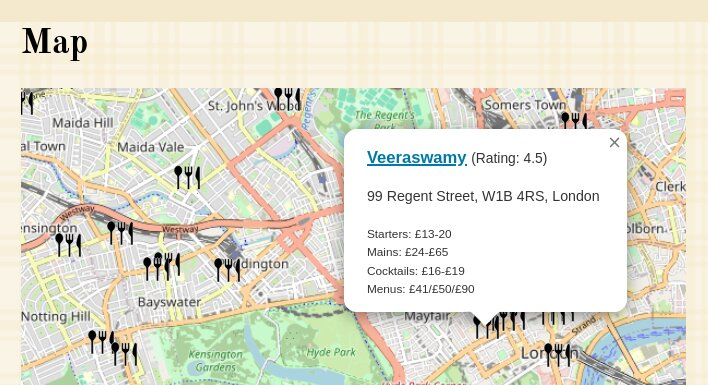

Mapping Munchies
================

.. articleMetaData::
   :Where: London, UK
   :Date: 2025-09-02 12:50 Europe/London
   :Tags: blog, php, openstreetmap, maps
   :Short: fndmap

My wife and I run a `blog <https://friday-night-dinners.co.uk/>`_ where we
review the restaurants we go to when we go out for dinner on Friday evenings.

And on this website you can look at all the reviews, but it is a bit difficult
to see as to where the restaurants are.

So I decided that I wanted to add a map to our website.

We have already recorded the addresses for this, but not quite yet the
coordinates.

So in order to show a map we needed to convert the addresses to coordinates,
and there are several ways of doing so.

You can roll something yourself with a Nominatim, which is part of the
OpenStreetMap project. But I decided to try a different service, called
`OpenCageData <https://opencagedata.com/>`_, which provides a geocoding
service. I didn't want to maintain a geocoder myself.

After signing up and creating API keys, I used `their PHP library
<https://opencagedata.com/tutorials/geocode-in-php>`_ (handily recommended
during the on boarding process) to convert
all my addresses to latitude/longitude pairs. This required a bit of fiddling,
as it was fairly picky about what it would accept. Although we mostly go to
places in London, it really didn't like geocoding places with "The
Netherlands" as address, and instead insisted on my using "Netherlands". I
`updated the source material <https://github.com/derickr/derickrethans-articles/commit/b043e6eeb5e862f01fceef2797dc58ecc2e0f860>`_ to cope with this.

With the finicky bits out of the way, I changed my blog's software to add a
coordinate pair whenever it sees a new entry and address. But to start, I had
to go through all of the reviews of restaurants that we already had, and pass
their addresses through the geocoder::

  <?php
  $geocoder = new \OpenCage\Geocoder\Geocoder($OpenCageKey);

  $location = "{$entry['title']}, {$entry['location']}";
  $geocoded = $geocoder->geocode( $location );

  if ( count( $geocoded['results'] ) > 1 )
  {
    foreach ( $geocoded['results'] as $result )
    {
      if ( $result['components']['_category'] === 'commerce' )
      {
        $finalResult = $result;
      }
    }
  }

Of course, for that to work, you need to have the ``$OpenCageKey`` set to your
API key.

The geocoder then gives me a coordinate pair in latitude and longitude. Often
there are multiple results. Although each result has a confidence level
attached to it, the result for just the postcode is higher than the actual
accurate point of interest for the restaurant, even though I also pass in its
name as part of the ``$location``.

Because of this, is have to loop over the results and pick the right one (with
lower confidence level), if an actual ``commerce`` place, indicating a
restaurant, was found.

I store these pairs in the database, and then I can use them for generating a
map with all the restaurants that we have reviewed.

After I had created these coordinate pairs, upon a page load, my blog software
creates a big GeoJSON file with all the features. I embed this into my rendered
web page to prevent extra round-trips to the server. I wouldn't suggest to do
this if the data updates frequently, or if you have a lot of locations to
display.

An example of the generated code looks like, after formatting it for easy viewing::

  var geojsonFeatures = [
    {
      "type":"Feature",
      "properties": {
        "name": "Spicy Grill",
        "rating": "4",
        "popupContent":
          "<h3><a href=\"\/spicy-grill-jkb\">Spicy Grill<\/a> <small style=\"font-weight: normal\">(Rating: 4)<\/small><\/h3>"
          "
122 Golders Green Road, London NW11 8HB<\/p>"
          "<small>Starters: \u00a33.00-\u00a37.50<br\/>Mains: \u00a39.50-\u00a313.50<\/small>"
      },
      "geometry": {
        "type": "Point",
        "coordinates": [-0.2007587,51.5739245]
      }
    },
    …
  ];
   

I then use a JavaScript library called Leaflet, a library that I've used many
times for many of my other side projects to render these restaurants on the
map. The code for this is fairly simple too.

The ``id="map"`` div is where Leaflet renders the map, which you create in
JavaScript with::

  

I then configure the `OpenStreetMap <https://openstreetmap.org>`_ map layer
URL, attribution, and some configuration options for Leaflet::

  

Finally I add the map to the div element ``map`` by instantiating ``L.Map``,
and prevent zoom controls from showing::

  var map = new L.Map('map', {zoomControl: false});

To see the full code, you can do "view source" on the `page that shows our
mapped restaurants <https://friday-night-dinners.co.uk/map>`_.

When you click on an icon, you get a pop up with the title and a link to the
review, with some useful information such as our rating, the address, and a
cost indication:

This actually didn't take me a lot of time to do, but mostly because I'm always
relatively familiar with Leaflet.

I enjoyed working on this project to add a map to the website.

And when `I now look at it <https://friday-night-dinners.co.uk/map>`_, I can
see all the lovely places, and sometimes less lovely places where we had our
Friday night dinners. If you zoom out far enough, you can also see the far
away places we enjoyed our meals at. Let us know if you make it to one of
them!
