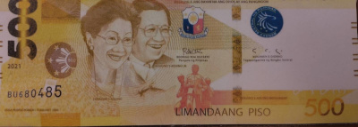

PHP 500
=======

.. articleMetaData::
   :Where: London, UK
   :Date: 2025-12-09 12:50 Europe/London
   :Tags: php, conference
   :Short: php500

Two weeks ago, I was on a plane from Leeds, where I had given a "What's New in
PHP 8.5" talk at the Leeds PHP user group, on the way to Amsterdam. Later that
day, I would give a similar talk for the Rotterdam PHP user group, hosted by
my friend Damien Seguy. My `list of talks
<https://derickrethans.nl/talks.html>`_ indicated that that would be my 500th
talk I would ever give.

Damien and I have known each other for quite some time. When we met at the
International PHP Conference in Munich earlier this year, we were reminiscing
about this. I thought we had met at that same conference, but back in 2002.

Damien insisted that it was a year earlier, and he had a t-shirt to
prove it. But then, if I would have been at that 2001 conference, I would
likely have given at talk there too. But it wasn't in my list.

After digging around with the Wayback Machine, eventually I found `evidence <https://web.archive.org/web/20041018163947/http://www.phpconference.com/2001/index.php>`_ of
this — the conference's website doesn't go back far enough either.

I could not really find the whole slide deck though — not even the Wayback
machine had all PDF pages archived.

This did however mean that the talk that I was going to give in Rotterdam
would be my 501st talk. I was reluctant to tell Damien, as he indicated that
he would try to make a thing out of it.

So I did tell him, that no, my 500th talk was "last night in Leeds", and not
tonight. Despite his grave disappointment, he still thought it be nice to at
least mark the occasion — with a badly photocopied PHP $500 bank note.

It wasn't a *fake image*, as there are actually PHP $500 banknotes, as PHP is
the PHilippine Peso. He did promise to do better, and a week or so later, an
envelope arrived with an actual PHP $500 note in it to celebrate. It's going
to go up framed on my wall. For the first time I was actually paid **in** PHP!

Thanks Damien, and the PHP community to have listened to my 500^W 501
talks!
