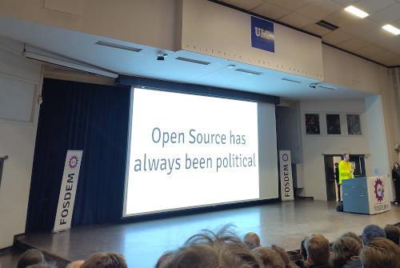
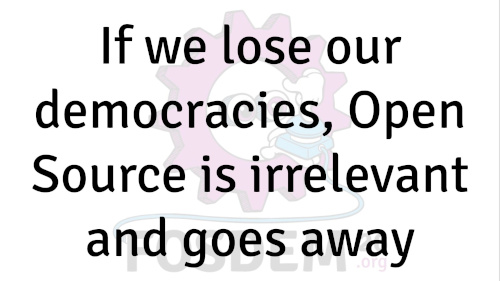

FOSDEM 2026 Reflections
=======================

.. articleMetaData::
   :Date: 2026-02-03 11:45 Europe/London
   :Tags: politics, conference, FOSDEM, opensource
   :Short: fosdem26

Last weekend, I attended FOSDEM, the largest Open Source conference in Europe.
The last time that I attended was exactly a decade ago, and I had forgotten
what it was really about. 

But this became instantly obvious when (nearly) the first slide during the
Opening Remarks shouted loudly: "Open Source has always been political". The
emotional introduction instantly brought home what Open Source is really
about: Activism to break the chains of "big tech". Although big tech wasn't so
big when they started the conference over 25 years ago, it is now more
required than ever.

As I remembered that it can be really hard to get into the rooms where talks
are held — FOSDEM can be really busy — I had made a plan to divide my two days
up in roughly four blocks to follow talks in the same room. I also made sure I
showed up a talk (or two before), to have a better chance of having a seat in
the talks I wanted to attend.

I spend most of Saturday following talks in the Geospatial and Legal & Policy
tracks. Although Geospatial, mostly through OpenStreetMap, is my fun open data
involvement, the Legal & Policy tracks were good to see.

In `From Policy To Practice; Open Source in The Dutch
Government
<https://fosdem.org/2026/schedule/event/BNPJ7P-from-policy-to-practice-open-source-in-gov/>`_,
I learned from `Gina Plat
<https://fosdem.org/2026/schedule/speaker/gina_plat/>`_ how the (old and
new) Dutch governments are now pushing ahead with Open Source. With the more
volatile situation in the USA, where constant threats of tariffs and other
economic measure, they seem to now have understood, that it is vital to build
up their own stacks. Although there have been policy and plans before, there
is now also funding available to reduce the liability on US big tech stacks
and software. It's not perfect, but there is certainly progress.

After more geo fun in the afternoon, I attended `Neil Brown
<https://fosdem.org/2026/schedule/speaker/neil_brown/>`_'s `"Online
Safety" laws: reflections for FOSS
projects
<https://fosdem.org/2026/schedule/event/EAVFF3-online-safety-laws-and-foss-projects/>`_
(`video
<https://video.fosdem.org/2026/ub5230/EAVFF3-online-safety-laws-and-foss-projects.av1.webm>`_).
Although I am familiar with the topic, and have `written about this before to
my MP <https://derickrethans.nl/online-safety-act.html>`_, it was good to see
Neil explain how this affects open source projects specifically. The main
take-away here was that although you can follow the law(s) to the latter, it
is likely going to be more important to check what risk there actually is for
users, and for the project itself, when the regulator comes knocking on the
door.

Talks on regulations, mostly in the EU form, is what my piqued my interest
next, and I spend most of my Sunday morning in the Open Source & EU Policy
track.

I arrived early enough to catch the `Digital Omnibus: is the EU's tech
simplification a Risk or Opportunity from Open
Source
<https://fosdem.org/2026/schedule/event/GM7FZW-digital_omnibus_is_the_eus_tech_simplification_a_risk_or_opportunity_for_open_so/>`_.
How EU Policy is created is often complicated. This talk critically explored
the challenges that policymakers have to make the regulatory burden on EU
projects and products lighter. At the same time, regulation should not get in
the way of innovation and competitiveness, but also not be so light that the
general protections towards user privacy and control are watered down too far. 

I was mainly aiming to see "The Fediverse and the EU's Digital Service Act".
`Jordan Maris <https://fosdem.org/2026/schedule/speaker/jordan_maris/>`_
moderated this panel discussion, with `Sandra
Barthel <https://fosdem.org/2026/schedule/speaker/sandra_barthel/>`_, `Alexandra
Geese <https://fosdem.org/2026/schedule/speaker/alexandra_geese/>`_ (MEP for the
Greens/EFA group), and `Felix
Hlatky <https://fosdem.org/2026/schedule/speaker/felix_hlatky/>`_ (executive
director of Mastodon GmbH), answering questions. The whole discussion was
interesting, my main takeaways were the explanations by Alexandra on the DSA.

The provisions under the DSA are frequently derided by the American tech bros
and their government allies as "censorship". Alexandra eloquently argued that
the provisions in the DSA are explicitly meant to do the opposite. The DSA
requires large operators to explain what their algorithms do, and how they
work, to (try to) prevent the doom-spiral towards hate speech and othering.
These algorithms have been designed to keep users engaged so that they see
more advertisements. And the best way to keep users on your platform is to
make them feel angry about something — usually vulnerable groups of people.

While listening to the panel, the though occurred to me that the approach by
the EU is very different from the approach across the ocean. Where there the
mentality is "work fast and break things", with no regulation to protect
people's rights succinctly, in the EU the approach is strong regulation to
prevent harm.

But that does require that the provisions are properly enforced, with enough
resources, and sometimes with enough political will to not kowtow to the
Americans with their tantrums. I suspect that we will see more of these
tantrums in a short while, now that the EU is more keen to show its fangs as
well.

On this side of the pond all is not well either. The UK's Online
Safety Act is already a sad state of affairs, especially now there are rumours
that they are considering banning age gating VPNs as well. But Age
Verification as a measure to "save the children" is popping up in many
jurisdictions. Age Verification and Assurance are antithetical to the open
nature of the Web and free expression, and will not work regardless.

Where the focus now mainly is on websites themselves, there is a distinct
possibility that regulators will want to enforce age on service level (app
stores/package managers), on browser level, and on operating system level.
These all conflict with open source variants (F-droid, Firefox, Linux), unless
you withdraw the freedom that users have on what to run on their devices.

Nobody has any idea how a wide roll-out of Age Verification and Assurance will
work out. It's like going straight to a release without beta testing.
Preventing the broadening of Age Verification and Assurance is where the next
fight for the open web and freedom of expression now must be. 

We don't have the luxury of sitting on our hands, and as the opening slides of
FOSDEM indicated that "Open Source has always been political", the closing
remarks were equally pungent: We can't afford to not be politically active,
and that's why we must engage with politicians. FOSDEM has fanned the flames
in me for doing more again. Stay tuned\!

And remember: "If we lose our democracies, Open Source is irrelevant and goes
away".
