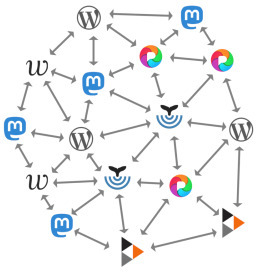
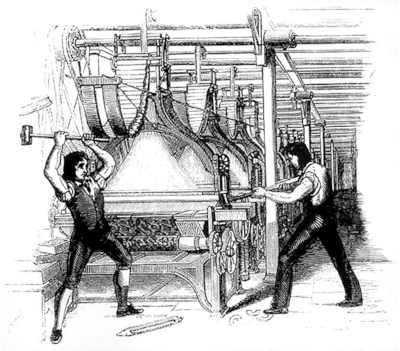
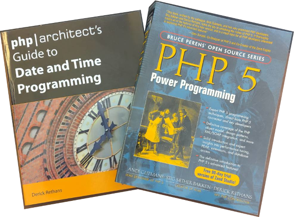
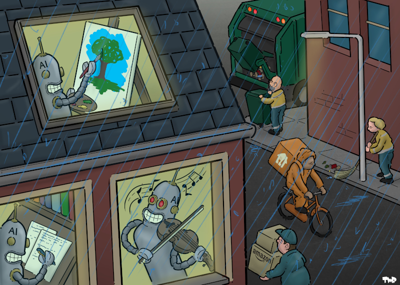

Human Creations
===============

.. articleMetaData::
   :Date: 2026-03-23 10:45 Europe/London
   :Tags: ai, politics, php
   :Short: human-creations

`Last year I wrote about </own-your-content.html>`_ how you can use
ActivityPub, through the Fediverse to publish your own content, and being in
control of it.

As part of a recent keynote that I gave at the `Dutch PHP Conference
<https://phpconference.nl>`_ I returned to this subject, but also reflected
on what happens with the content you publish, and your rights over it.

Because in the last year, it has become clear, that lots of large and wealthy
companies, don't really care about the latter.

What I mean by this becomes clear with the following examples.

When Gary Gale one day went to visit his `Vaguely Rude Places Map
<https://www.vaguelyrudeplacesmap.com/>`_ site, he found that `(AI) bots had eaten
through his map tile allowance
<https://www.vicchi.org/2026/02/21/ai-bots-ate-my-map-tiles/>`_. He now hosts
his site behind Cloudflare, being beholded to a Big Tech™ company again.

When I look at the web server logs for the php.net sites, I see that most of
the uncached requests come from bots.

This also happens to other large sites, such as `OpenStreetMap
<https://OpenStreetMap.org>`_, which got hit by AI DDos Scraper Bots
requesting an extreme amount of content from 100,000+ IP addresses; or
Fediverse instances, such as `infosec.exchange <https://infosec.exchange>`_,
which had to deal with more load.

All this scraping comes at a cost, but **not** to the scrapers, nor the users
of these tools.

Although the content is freely available, the services hosting content still
need to be funded. Instead of you giving up your privacy, you will need to pay
for those with actual money for them to thrive, and exist.

But AI impacts content in other ways as well.

I need to be clear of what I mean with AI. I don't mean the visual recognition
models to detect cancer faster, sifting through loads of data to find
patterns, fraud detection, speech recognition, translation services, or
deciphering my terrible handwriting.

I specifically mean Generative AI through LLMs — for articles, source code,
and "art".

I have no beef with the actual technology either, only the exploitative nature
of how these currently are created and hyped up.

Just like the Luddites weren't against new technology, but how this technology
was used to exploit them.

I have written two books in my life, many years ago. The material in them has
been slurped up into the LLMs, and one of them was originally part of the
Anthropic law suit where they settled for using pirated copies of the books.

Mind you, not for using the book as training material.

Although `the settlement was for 1.5 billion dollars
<https://www.bbc.co.uk/news/articles/c5y4jpg922qo>`_, I still ended up getting
nothing, as only American authors were compensated.

There are similarities with the code that I, and many others, have written.

Code, published under an open license. But these licenses often require
attribution. How much attribution is now given when one of your chat bots
produces parts of my code?

Nothing.

Which means that these tools are in breach of the licences under which
the original code was published, and hence shouldn't exist.

Unfortunately, some governments, like mine in the UK, are less concerned about
AI companies stealing content, although there are some indications that
they've `changed their tune
<https://filmstories.co.uk/news/uk-government-scraps-plans-to-allow-ai-firms-to-steal-copyrighted-work/>`_.

I never gave permission for any of my content, be it books, code, nor photos,
to be used by these tools, but they're still making money of it.

As a matter of fact, they are not only making money of it, but also making it
a lot harder to host things ourselves by driving up `costs for CPUs, GPUs,
memory, and storage
<https://www.theregister.com/2026/02/26/memory_price_hikes/>`_.

They are literally stealing things to sell back to us, whilst at the same
time making sure we have to use their services as it is becoming too costly to
have a decent set up in our homes and offices.

------

But lets get back to content. I like writing. I am not great at it, but I find
it pleasing to show others what I have worked on, and the adventures I have
had. 

I write for humans, and therefore, I also expect that when I read something,
it is also written by *humans*. I prefer to be able to see the writing style
of specific authors, as that is part of the experience. They own their voice.

In my case, that has always been including em-dashes wherever I can.

What I do not like to read is generic and bland text. Text that has
no weird grammarisms, flair, or emotions.

That is text that comes out of LLMs: *Generic slop*.

I feel the same about AI "Art".

Over-polished generic images and logos, that you see more
and more on signs in front of shops, the Web, and in presentations at conferences.

Not only do I find them boring, it is also taking work away from actual
artists. I thought that computers were around to do the boring monotonous
work?

This cartoon, by `Tjeerd Royaards <https://www.tjeerdroyaards.com/>`_, nails it on the head.

Unlike AI companies slurping up all content on the Internet, I asked the
author for permission to include this into my presentation.

He said **no**. — *"I don't allow the free use of my work, as I depend on my
drawing to make a living"*

So I went and `purchased a digital license <https://www.cartoonmovement.com/cartoon/ai-takeover>`_.

And this makes perfect sense.

Quality content created by artists, authors, and software professionals is
worth something important. And these creators need to be rewarded for their
creative work.

Unlike the AI slop generators, I value **original art**: Writing, photos,
images, and source code.

**Content by humans, for humans.**
